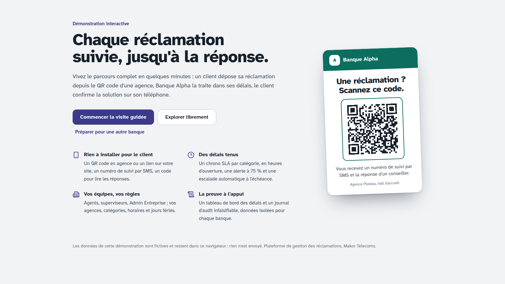
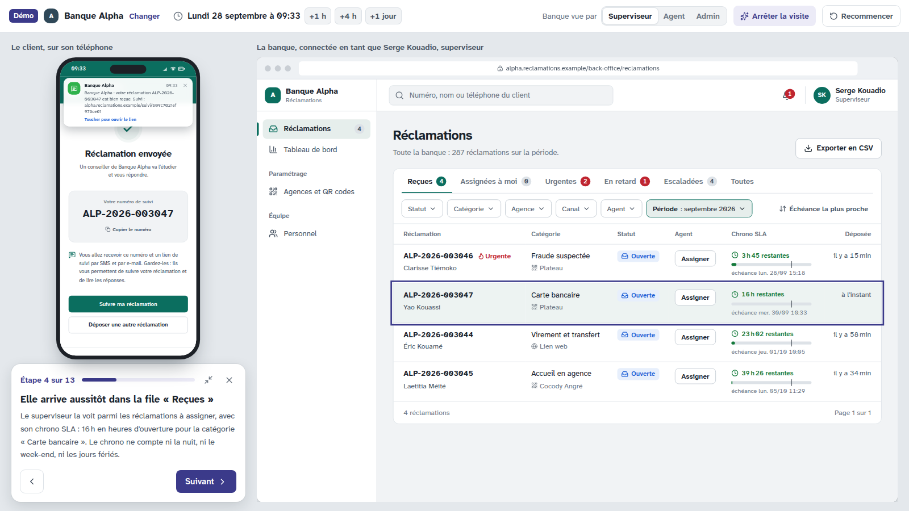
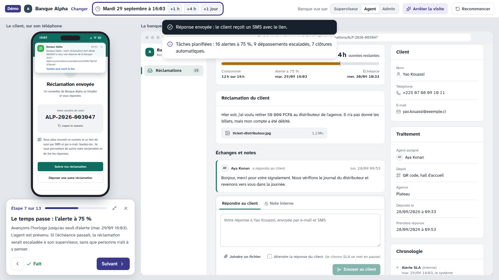
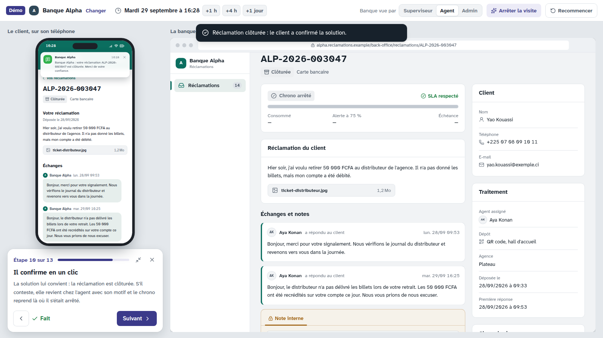
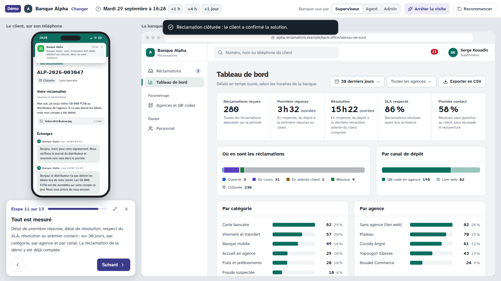

# Démo cliquable pour les rendez-vous commerciaux

Plateforme de gestion des réclamations · Makor Telecoms · Solution 1
Version du 28/09/2026 · outil de présentation, livré avec l'étape 6 (hors étapes du cahier des charges)

La maquette de l'étape 6 est devenue une démonstration qu'on présente à une banque. Le prospect voit, en quelques minutes, le parcours complet d'une réclamation : côté client sur un téléphone, côté banque dans le back-office, les deux à l'écran en même temps.

Deux façons de l'ouvrir :

- **en ligne** : la page privée « Démo Réclamations Makor » publiée sur claude.ai. Elle est privée tant que vous ne la partagez pas (menu Partager de la page) ;
- **hors ligne** : [`docs/demo/index.html`](demo/index.html), une seule page de 632 Ko avec les polices et les scripts. Elle s'ouvre dans Chrome, Edge ou Firefox sans serveur ni connexion, ce qui est utile dans une salle de réunion sans Wi-Fi.



## 1. En bref

| Point | Choix |
|---|---|
| Parcours | Démo vivante : chaque clic change réellement l'état (dépôt, file, fiche, notifications, indicateurs, journal) |
| Présentation | Visite guidée en 13 étapes, puis mode libre ; on peut quitter la visite à tout moment et la reprendre |
| Marque | Nom, couleur, logo et contact de la banque prospectée, réglés avant le rendez-vous |
| Données | Fictives, calculées dans le navigateur ; rien n'est envoyé, aucun serveur |
| Règles métier | Celles du backend, pas une copie : machine d'états, calcul du SLA en temps ouvré, normalisation des contacts (étape 4) |
| Réponses affichées | Conformes au contrat d'API de l'étape 5, vérifié par les tests |
| Écrans | Ceux des maquettes de l'étape 6, rendus cliquables ; l'étape 8 les branchera sur la vraie API |
| Largeur | Écran de réunion (1280 à 1920 px) ; utilisable sur téléphone, en une colonne |

## 2. Préparer le rendez-vous

Sur l'écran d'ouverture, **Préparer pour une autre banque** (ou **Changer** dans la barre du haut) :

| Réglage | Effet |
|---|---|
| Nom de la banque | Portail, affiche QR, back-office, SMS. Le préfixe des numéros et l'adresse en sont tirés : « Société Ivoirienne de Banque » donne `SIB-2026-000123` et `societe-ivoirienne.reclamations.example` |
| Couleur principale | Huit couleurs proposées ou n'importe laquelle. Le texte posé dessus (blanc ou foncé) est choisi automatiquement pour rester lisible (décision E2) |
| Logo (facultatif) | PNG, SVG, JPEG ou WebP, lu dans le navigateur. Sans logo, les initiales s'affichent |
| Contact (facultatif) | Votre nom, e-mail ou téléphone, affiché à la dernière étape de la visite |

Ces réglages restent dans le navigateur de la personne qui présente, et nulle part ailleurs. **Revenir à l'exemple** remet la Banque Alpha.

Conseil : préparez la démo la veille, sur l'ordinateur qui servira au rendez-vous, puis ouvrez-la une fois pour vérifier le logo.

## 3. La visite guidée

**Commencer la visite guidée**. Chaque étape met en évidence l'élément dont elle parle. Un bouton « … pour moi » fait l'action à votre place ; vous pouvez aussi cliquer vous-même dans le téléphone ou le back-office. **Suivant** reste disponible tant que l'étape n'attend pas une action.

| N° | Étape | Côté | Ce qui se passe |
|---|---|---|---|
| 1 | Le client scanne le QR code de l'agence | Client | Le formulaire de dépôt s'ouvre, aux couleurs de la banque, avec l'agence déjà connue |
| 2 | Il décrit son problème en une minute | Client | **Envoyer pour moi** remplit et envoie une réclamation (retrait au distributeur, pièce jointe) |
| 3 | Il reçoit son numéro par SMS | Client | Accusé de réception à l'écran, SMS qui arrive en haut du téléphone |
| 4 | Elle arrive aussitôt dans la file « Reçues » | Banque | La réclamation est en tête de la file du superviseur, chrono SLA lancé |
| 5 | Le superviseur l'assigne à un agent | Banque | **Assigner à Aya Konan** ; l'agente est notifiée |
| 6 | L'agent répond au client | Banque | **Envoyer la réponse** ; première réponse mesurée ; SMS au client |
| 7 | Le temps passe : l'alerte à 75 % | Banque | **Avancer jusqu'à l'alerte** : l'horloge saute à l'instant exact du seuil, en temps ouvré (pauses et soirs exclus) |
| 8 | L'agent résout la réclamation | Banque | **Résoudre pour moi** ; SMS au client avec le lien de suivi |
| 9 | Le client lit la réponse, protégée par un code | Client | Lien de suivi, code à 6 chiffres reçu par SMS, espace client |
| 10 | Il confirme en un clic | Client | **Confirmer pour moi** : réclamation clôturée, SLA respecté |
| 11 | Tout est mesuré | Banque | Tableau de bord sur 30 jours, la réclamation de la démo déjà comptée |
| 12 | Tout est tracé | Banque | Journal d'audit chaîné, vérification d'intégrité, vue Admin Entreprise |
| 13 | Prêt pour [la banque] ? | Banque | Ce qui sera paramétré pour elle, votre contact |

Durée : environ 5 minutes en commentant. La carte de la visite se réduit (flèches en haut à droite) pour libérer l'écran.

| File « Reçues » (étape 4) | Alerte à 75 % (étape 7) |
|---|---|
|  |  |

| Confirmation par le client (étape 10) | Tableau de bord (étape 11) |
|---|---|
|  |  |

## 4. Le mode libre

Après la visite, ou directement avec **Explorer librement**, le prospect peut tout essayer. La barre du haut offre trois commandes :

- **l'horloge** : +1 h, +4 h, +1 jour, toujours en temps simulé. Les tâches planifiées de l'étape 4 se déclenchent à leur instant exact : alerte à 75 %, dépassement de l'échéance avec escalade au superviseur, clôture automatique 5 jours après la résolution ;
- **Banque vue par** : Superviseur, Agent ou Admin Entreprise. Menus, files et boutons changent selon le rôle, comme dans l'application ;
- **Recommencer** : repart d'une démo neuve.

À essayer devant le prospect :

- déposer une deuxième réclamation soi-même, avec une erreur de saisie : le message d'erreur suit le format du contrat ;
- **poser une question au client** : le chrono se met en pause (hachures), puis reprend à sa réponse ;
- **laisser passer l'échéance** avec +1 jour : la réclamation passe « en retard » et le superviseur est prévenu ;
- **contester** une résolution côté client : la réclamation revient chez l'agent avec le motif ;
- en Admin Entreprise, **Banque et apparence** : changer la couleur recolore tout, portail compris ;
- ouvrir la **cloche** : les notifications mènent à la fiche.

Au démarrage, 30 jours d'activité ont déjà été rejoués. La file contient des réclamations à assigner (dont une urgente), une en retard et escaladée, une au seuil d'alerte. Les indicateurs sont réalistes : SLA respecté autour de 80 %, résolution au premier contact autour de 45 %.

## 5. Ce qui est réel, ce qui est simulé

| Réel (le code de l'application) | Simulé (propre à la démo) |
|---|---|
| Machine d'états : chaque bouton affiché et chaque refus viennent de `backend/src/domaine/reclamation/machine.ts` | Le serveur : un moteur en mémoire dans la page remplace l'API, PostgreSQL et Redis |
| Calcul du SLA en temps ouvré : échéance, seuil d'alerte, pause, reprise (`sla.ts`, `calendrier.ts`) | L'horloge, qu'on avance à la main |
| Normalisation du téléphone et de l'e-mail (`contact.ts`) | SMS et e-mails : affichés sur le téléphone, jamais envoyés |
| Écrans de l'étape 6, types du contrat, format des erreurs (RFC 9457) | Connexion : pas de mot de passe, on change de rôle d'un clic |
| | Export CSV : un message explique ce qu'il fera dans la version installée |
| | Paramétrage (catégories, agences, horaires, personnel) : consultable, non modifiable, sauf la couleur |

La démo ne peut donc pas promettre ce que l'application ne fera pas : si une règle change dans le backend, la démo change avec elle.

## 6. Ce que vérifient les tests

`frontend/tests/demo.test.ts` (10 tests, dans les 122 du frontend) :

- ouverture un jour ouvré, 30 jours d'historique rejoués en moins de 2 secondes ;
- files de départ : réclamations à assigner, une en retard et escaladée, une au seuil d'alerte ;
- indicateurs plausibles (SLA respecté entre 75 et 95 %) ;
- **toutes les réponses du moteur validées contre le contrat** (formulaire, accusé, suivi, files, fiche, indicateurs, notifications, journal), en mode strict ;
- le parcours de la visite de bout en bout : dépôt, assignation, réponse, alerte à 75 %, résolution, confirmation, puis l'ordre des lignes du journal d'audit ;
- échéance dépassée : signalement et escalade au superviseur ;
- question au client : pause puis reprise du chrono ;
- contestation, puis clôture automatique 5 jours après la nouvelle résolution ;
- refus conformes à la machine d'états et au format RFC 9457 ;
- préfixe des numéros et adresse tirés du nom de la banque, aux formats du contrat.

La visite a aussi été rejouée automatiquement dans Chromium en 1600 × 900 et 1920 × 1080 : 13 étapes sur 13, aucune erreur dans la console. Sur un téléphone de 390 px, aucun défilement horizontal.

## 7. Reconstruire la démo

Avec Docker (tests puis reconstruction des maquettes et de la démo) :

```bash
docker compose run --rm maquettes
```

Sans Docker, avec Node.js 22 :

```bash
cd frontend
npm install
npm run dev:demo      # démo en direct : http://localhost:5173
npm run build:demo    # reconstruit docs/demo/index.html
npm run build         # maquettes et démo
```

Le code est dans [`frontend/src/demo/`](../frontend/src/demo/) : `moteur.ts` (l'API simulée), `historique.ts` (les 30 jours rejoués), `Visite.tsx` (les 13 étapes, textes modifiables), `Personnalisation.tsx`, `Demo.tsx` (la mise en page).

## 8. À savoir avant de la diffuser

- **Lien privé** : la page en ligne ne s'ouvre que pour vous et les personnes avec qui vous la partagez. Pour un prospect, envoyez plutôt le fichier `docs/demo/index.html`, ou présentez-la vous-même.
- **Données fictives** : noms, numéros et montants sont inventés. Si vous mettez le nom et le logo d'une vraie banque, gardez la démo pour le rendez-vous avec elle.
- **Adresses** : `<slug>.reclamations.example` en attendant le vrai nom de domaine (point ouvert de l'étape 6).
