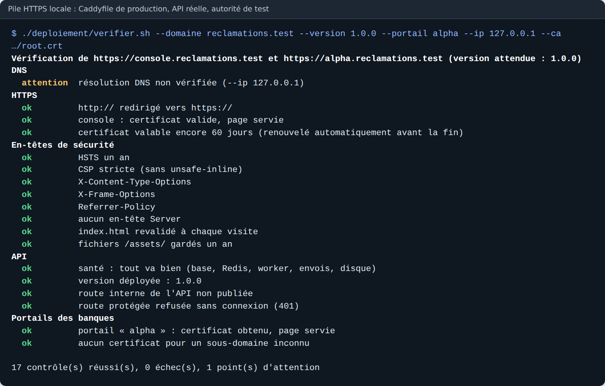
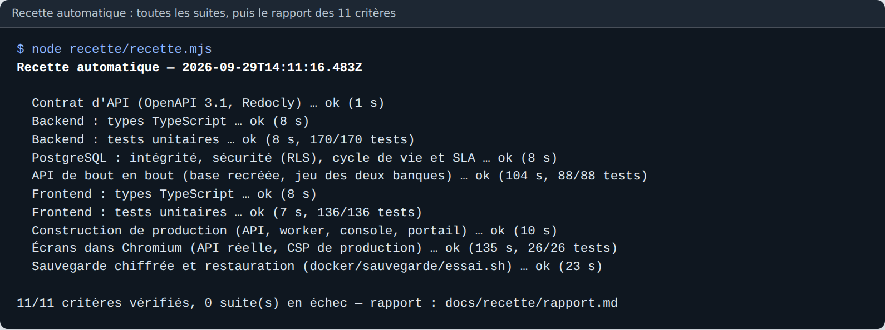
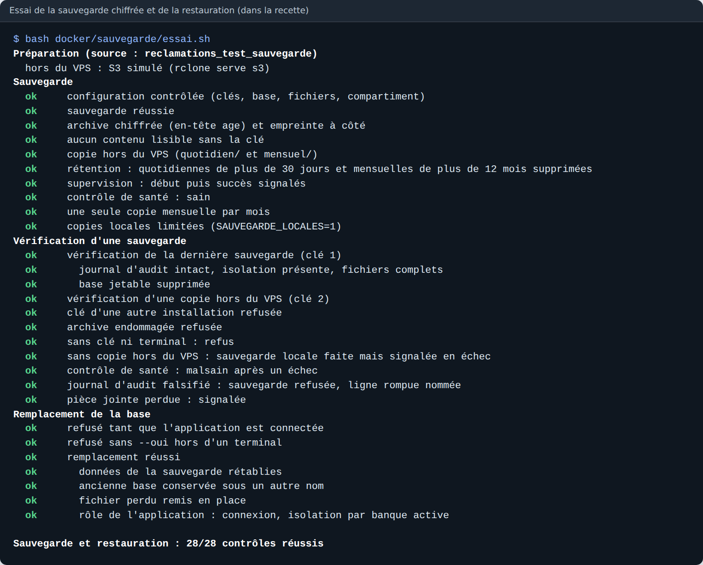

# Étape 10 — Tests et déploiement

Plateforme de gestion des réclamations · Makor Telecoms · Solution 1
Version du 30/09/2026 · **Statut : validé le 30/09/2026** (décisions P1 à P10 retenues telles que proposées).

Livrables :

- [`recette/recette.mjs`](../recette/recette.mjs) : la **recette automatique**. Une commande (`docker compose run --rm recette`) relance toutes les suites, puis écrit le [rapport des 11 critères](recette/rapport.md) de la section 10, preuve par preuve ;
- [`docs/recette/cahier-de-recette.md`](recette/cahier-de-recette.md) : la **recette contractuelle** à faire sur l'environnement de démonstration avec les deux banques. Pour chaque critère : les gestes, le résultat attendu, la preuve automatique ; le procès-verbal suit ;
- [`docker/sauvegarde/`](../docker/sauvegarde/) : le service de **sauvegarde chiffrée**, copiée chaque nuit hors du VPS, et la **restauration vérifiée** ;
- [`deploiement/`](../deploiement/) : les outils de la mise en production :
  - génération des secrets ;
  - contrôle d'un déploiement ;
  - mise à jour et retour arrière ;
  - remise à zéro de la démonstration ;
- [`docker-compose.demo.yml`](../docker-compose.demo.yml) : l'**environnement de démonstration**, sur un second serveur ;
- une **santé de l'API** enrichie pour la supervision : worker, envois, disque ;
- [`docs/exploitation.md`](exploitation.md) : le **guide d'exploitation**. Il couvre la préparation et le durcissement du VPS, le DNS, la première installation, la démonstration, les sauvegardes, la supervision, les mises à jour, la restauration et le dépannage.

## 1. En bref

| Contrôle | Résultat |
|---|---|
| Critères de la section 10 vérifiés automatiquement | **11 / 11**, 420 tests réussis sur 420 ([rapport](recette/rapport.md)) |
| Suites de la recette automatique | 10 / 10 : contrat, types, tests unitaires, vérifications PostgreSQL, API de bout en bout, construction, navigateur, sauvegarde. Elles tournent en 5 minutes. |
| Tests unitaires | backend **170 / 170** (+8 : santé, démonstration) ; frontend 136 / 136 |
| Tests de bout en bout de l'API | 88 / 88. Deux sont complétés : la santé détecte le worker absent et les envois en retard ; le worker écrit son battement. |
| Vérifications sur PostgreSQL | 32, 62 et 45 réussies, 0 en échec |
| Tests dans Chromium, sur la vraie API | 26 / 26 |
| Sauvegarde et restauration | **28 / 28 contrôles** : chiffrement, copie hors du VPS, rétention, restauration vérifiée, remplacement de la base. Deux défauts volontaires sont bien détectés : un journal falsifié et une pièce jointe perdue. |
| Contrôle d'un déploiement HTTPS | **17 / 17** sur une pile locale : Caddyfile de production, API réelle, certificats d'une autorité de test ([capture](#9-captures)). Ce contrôle a révélé que le certificat de la console n'était jamais obtenu (P7). |
| Critère 10 : moins d'une seconde sur 1 000 réclamations | p95 de 25 à 140 ms selon l'opération |
| Image de l'application | dépendances réduites de 386 à 137 Mo. La CLI Prisma en est retirée, avec les 4 vulnérabilités « élevées » signalées par `npm audit` (P8). |

## 2. Décisions à valider

| N° | Sujet | Proposition |
|---|---|---|
| P1 | Recette en deux temps | **Automatique** : `docker compose run --rm recette` relance toutes les suites. Le rapport relie chaque critère à ses tests, avec le nombre réussi sur le nombre trouvé. Un critère sans test trouvé est en échec. Les mesures du critère 10 sont reprises telles quelles. **Contractuelle** : sur l'environnement de démonstration, avec le [cahier de recette](recette/cahier-de-recette.md) (11 fiches, contrôles d'exploitation, procès-verbal signé). Les critères qui demandent du temps sont rendus praticables sur place : catégorie de 8 minutes pour l'alerte à 75 % et l'escalade, délai de clôture d'un jour. |
| P2 | Sauvegarde | Chaque nuit à 02:30 UTC. L'archive contient la base (`pg_dump`, instantané cohérent), les rôles, les pièces jointes et les logos, un manifeste et les empreintes SHA-256. Elle est chiffrée avec **age** pour deux clés publiques (exploitation et secours). **Les clés privées ne vont jamais sur le VPS** : qui prend le serveur ne peut pas lire les copies. Rétention : 7 copies sur le VPS ; sur Contabo Object Storage, de préférence dans une autre région, 30 quotidiennes et 12 mensuelles. Chaque exécution s'annonce à healthchecks.io, qui alerte aussi en cas de silence. Le conteneur devient « malsain » après un échec. Tant que la copie hors du VPS n'est pas configurée, chaque sauvegarde est signalée en échec, même si la copie locale est faite. |
| P3 | Restauration | **Toujours vérifier avant de remplacer.** L'archive est d'abord restaurée dans une base jetable, puis contrôlée : empreintes, chaînes du journal d'audit de chaque banque, politiques d'isolation présentes, chaque pièce jointe avec la bonne empreinte. Le remplacement bascule ensuite les noms, l'API et le worker arrêtés. La base actuelle est conservée (`reclamations_avant_<date>`) et jamais supprimée par le script. Les fichiers de l'archive sont ajoutés sans écraser. La clé privée est saisie au clavier et reste en mémoire le temps de l'opération. Un exercice de vérification est prévu chaque mois. |
| P4 | Supervision | La santé publiée (`/api/v1/sante`) ajoute **worker**, **envois** et **disque**. Worker : un battement dans Redis, écrit à chaque travail terminé et valable 2 minutes. Envois : alerte si un e-mail ou un SMS attend depuis plus de 10 minutes. Disque : alerte sous 5 % ou 2 Gio libres. Ces défauts donnent `"statut":"degrade"` avec HTTP 200 : le moniteur externe alerte sur le mot-clé, sans que Docker ne coupe le site. Seules une base ou un Redis injoignables répondent 503. Le worker a désormais son contrôle de santé Docker (même battement). Les journaux de **tous** les conteneurs tournent sur 5 fichiers de 20 Mo. |
| P5 | Déploiement | [`generer-env.sh`](../deploiement/generer-env.sh) crée `.env.production` avec des secrets **hexadécimaux**. En base64, comme le conseillait le fichier d'exemple, un « / » ou un « + » cassait l'adresse de connexion PostgreSQL. [`verifier.sh`](../deploiement/verifier.sh) enchaîne 17 contrôles de l'extérieur, et plus avec `--local` (conteneurs, ports, UFW, disque, sauvegarde). [`mettre-a-jour.sh`](../deploiement/mettre-a-jour.sh) enchaîne les étapes suivantes. La version est gravée dans l'image et publiée par la santé ; les paquets passent en 1.0.0. |
| P6 | Environnement de démonstration | **Second serveur, jamais celui de la production** : pas de données fictives et publiques à côté de celles des banques, un seul Caddy par serveur. Il reprend les images et la configuration de production, avec une surcharge : `DEMONSTRATION=1`, pas de sauvegarde, SMS en journal par défaut. Le mot de passe des comptes et la graine de leurs secrets TOTP sont **propres à l'installation** (`DEMO_MOT_DE_PASSE`, `DEMO_GRAINE_TOTP`) : ceux du dépôt sont refusés. Remise à zéro chaque nuit, avec 60 jours d'historique jusqu'au jour même. La remise à zéro refuse tout autre environnement (double garde-fou). Le jeu de démonstration reste refusé en production réelle. |
| P7 | Correction : certificat de la console | À côté du site `*.<domaine>` en mode « à la demande », Caddy 2.11 n'obtenait **jamais** le certificat de `console.<domaine>` : la console aurait été injoignable en HTTPS dès le premier jour. Ni les tests HTTP de l'étape 8 ni une lecture du fichier ne pouvaient le voir. La console passe elle aussi en « à la demande » : le nom est approuvé par l'API, le certificat est obtenu en quelques secondes à la première visite. |
| P8 | Image de l'application | `npm prune` gardait la CLI Prisma et TypeScript, pairs facultatifs de `@prisma/client` : 386 Mo de dépendances. Parmi elles, les 4 vulnérabilités « élevées » de `npm audit` : `mysql2` et `deepmerge-ts`, jamais chargés par l'application. Les paquets marqués « dev ou optionnels » sont retirés après la compilation : il reste 137 Mo. L'API et le worker ont été lancés et essayés sur cet arbre réduit (santé, connexion, travaux planifiés). L'image des migrations garde la CLI pour `prisma migrate deploy`. Aucune version 7.x corrigée n'existe à ce jour : point ouvert mineur. |
| P9 | VPS | Durcissement décrit pas à pas dans le guide : compte d'exploitation, SSH par clé seulement sans root, pare-feu UFW (22, 80, 443), mises à jour de sécurité automatiques, fail2ban, heure UTC. Seul Caddy publie des ports ; `verifier.sh --local` le contrôle. |
| P10 | Ce qui reste hors de l'étape | Choix et commande du VPS et du compartiment, nom de domaine, prestataire d'e-mail, format de la passerelle SMS, autorisation de l'ARTCI : points ouverts du cahier des charges, qui ne bloquent pas la livraison. Le guide indique où chacun se branche. |

Déroulé de `mettre-a-jour.sh` (P5) :

1. il liste les migrations que la version applique ;
2. il fait une sauvegarde immédiate et s'arrête si elle échoue ;
3. il construit les images de la nouvelle version pendant que l'ancienne tourne encore (`--pull` pour les correctifs des images de base) ;
4. il change `VERSION`, redémarre et contrôle le déploiement ;
5. `--retour` relance les images précédentes, gardées sur le serveur. Si la version annulée avait migré la base, le script rappelle la sauvegarde à restaurer.

## 3. Mise en production

Le [guide d'exploitation](exploitation.md) donne chaque commande. En résumé, sur le VPS :

```bash
./deploiement/generer-env.sh --domaine <domaine> --acme <adresse>    # puis SMTP, clés publiques age, compartiment
docker compose -f docker-compose.prod.yml --env-file .env.production up -d --build
docker compose -f docker-compose.prod.yml --env-file .env.production run --rm api node dist/scripts/creer-super-admin.js <e-mail> <prénom> <nom>
./deploiement/verifier.sh --local
docker compose -f docker-compose.prod.yml --env-file .env.production exec sauvegarde sauvegarder
docker compose -f docker-compose.prod.yml --env-file .env.production run --rm restauration restaurer derniere
```

Nouveau dans [`docker-compose.prod.yml`](../docker-compose.prod.yml) :

- les services `sauvegarde` (planifié, lecture seule sur les fichiers) et `restauration` (outil lancé à la main, jamais par `up`) ;
- le contrôle de santé du worker ;
- la rotation des journaux de tous les services ;
- l'étiquette de version passée à la construction.

## 4. Sauvegardes et restauration

| Commande (service `sauvegarde` ou `restauration`) | Effet |
|---|---|
| `sauvegarder` | une sauvegarde maintenant ; `--controler` vérifie clés, base, fichiers et compartiment |
| `restaurer liste` | archives du VPS et du compartiment, avec leur taille |
| `restaurer derniere` | vérifie la plus récente dans une base jetable, puis la supprime |
| `restaurer distant:quotidien/<archive>` | idem, depuis le compartiment |
| `restaurer --remplacer <archive>` | vérifie, puis remplace la base de production (confirmation `REMPLACER`) |

L'essai [`docker/sauvegarde/essai.sh`](../docker/sauvegarde/essai.sh) rejoue tout hors production. Il simule le compartiment avec `rclone serve s3`, ou un simple dossier si rclone est ancien, et la supervision avec un petit serveur. Il vérifie en particulier :

- que l'archive est illisible sans la clé ;
- que la rétention supprime les copies trop anciennes ;
- qu'une clé étrangère et une archive endommagée sont refusées ;
- qu'une archive au journal d'audit falsifié est refusée, avec le numéro de la ligne rompue ;
- qu'une pièce jointe perdue est signalée ;
- qu'un remplacement pendant que l'application est connectée est refusé ;
- qu'un remplacement réussi remet les données et les fichiers ;
- que le rôle de l'application se connecte ensuite, isolation par banque active.

## 5. Supervision

```json
{"statut":"degrade","base":"ok","redis":"ok","worker":"absent","envois":"en_retard","disque":"ok","version":"1.0.0"}
```

| Moniteur | Réglage |
|---|---|
| Site et services | HTTP(S) sur `https://console.<domaine>/api/v1/sante`, mot-clé `"statut":"ok"`, toutes les 5 minutes, expiration du certificat à 14 jours |
| Sauvegardes | healthchecks.io, période 1 jour, tolérance 2 heures |
| Serveur | `docker compose … ps` : api, worker, postgres, redis et sauvegarde « healthy » |

Le contrat d'API gagne trois champs dans `Sante` et la description de `lireSante`. Il n'y a pas de rupture : un client existant lit toujours `statut`, `base`, `redis` et `version`. Il compte toujours 83 opérations ; types et documentation hors ligne sont régénérés.

## 6. Environnement de démonstration

```bash
./deploiement/generer-env.sh --demo --domaine demo.<domaine> --acme <adresse>
docker compose -f docker-compose.prod.yml -f docker-compose.demo.yml --env-file .env.demo up -d --build
./deploiement/reinitialiser-demo.sh && sudo ./deploiement/reinitialiser-demo.sh --installer-cron
```

La remise à zéro dure une à deux minutes :

1. arrêt de l'API et du worker ;
2. base recréée avec le même tri français ;
3. Redis et pièces jointes vidés ;
4. migrations appliquées par la CLI Prisma, comme en production ;
5. jeu de démonstration semé ;
6. redémarrage et attente de la santé.

Les téléphones de l'équipe commerciale s'enrôlent une fois (`node dist/scripts/totp.js <e-mail>` dans le conteneur de l'API) et restent valables d'une nuit à l'autre.

Vérifié ici :

- semis compilé en mode production avec `DEMONSTRATION=1` ;
- connexion complète (mot de passe de l'installation, code TOTP issu de la graine) ;
- refus du mot de passe et des secrets du dépôt ;
- refus sans `DEMONSTRATION=1` ;
- enchaînement et garde-fous de la remise à zéro (Docker simulé) ;
- configuration combinée de docker compose.

## 7. Ce que vérifient les nouveaux tests

| Fichier | Contenu |
|---|---|
| `backend/src/modules/sante/sante.test.ts` | états publiés : ok, dégradé en 200 (worker, envois, disque, seuils 5 % et 2 Gio), 503 seulement pour base ou Redis ; espace disque mesuré sur le plus proche dossier existant |
| `backend/scripts/demonstration.test.ts` | valeurs du dépôt en développement ; refus en production réelle ; mot de passe et graine obligatoires et différents du dépôt en démonstration ; secrets des tests inchangés |
| `backend/test/e2e/securite` | santé dégradée sans worker, puis ok avec un battement ; envois en retard avec un e-mail en attente depuis 11 minutes |
| `backend/test/e2e/worker` | le planificateur écrit le battement (expire après 2 minutes) |
| `backend/test/e2e/performance` | ses mesures alimentent le rapport de recette |
| `docker/sauvegarde/essai.sh` | 28 contrôles de sauvegarde et restauration (section 4) |
| `deploiement/*.sh` | essayés sur une pile HTTPS locale (`verifier.sh`, 17 contrôles), et avec un Docker simulé : mise à jour, retour arrière, image absente, sauvegarde en échec, version invalide, confirmation hors terminal, remise à zéro de la démonstration et ses garde-fous, tâche planifiée. Tous passent shellcheck ; les Dockerfile passent hadolint. |

Le service de sauvegarde n'a pas pu être construit ici : Docker Hub est inaccessible depuis cet environnement. Ses scripts ont tourné avec les mêmes outils (PostgreSQL 16, age, rclone), et sa première construction se fera sur votre poste ou sur le VPS avec les autres images.

## 8. Points ouverts

Avec la validation de P2, le point des sauvegardes est tranché : le cahier des charges suit **douze** points ouverts, dont les deux nouveaux ci-dessous. Aucun ne bloque la recette.

- **Nouveau : copie hors du VPS protégée contre l'effacement.** Qui prend le VPS a les clés S3 : il ne peut pas lire les archives, mais il peut les effacer. Deux parades sont à décider : le verrouillage d'objets du compartiment, si Contabo le propose, ou une seconde copie tirée chaque semaine depuis un poste de Makor.
- **Nouveau (mineur) : CLI Prisma.** Suivre la correction de `mysql2` et `deepmerge-ts` dans Prisma 7, dans l'image des migrations seulement (P8).
- **Toujours ouverts :** nom de domaine, prestataire d'e-mail, format de la passerelle SMS, autorisation de l'ARTCI avant les données d'une banque, anti-robot du formulaire public.

## 9. Captures







## 10. Et ensuite

L'étape 10 est la dernière du cahier des charges : les dix étapes sont validées. La suite se passe hors du dépôt :

1. commander le VPS et le compartiment ;
2. installer la production et la démonstration en suivant le guide ;
3. passer la recette contractuelle avec le cahier et signer le procès-verbal ;
4. ouvrir la première banque pilote après l'autorisation de l'ARTCI.
