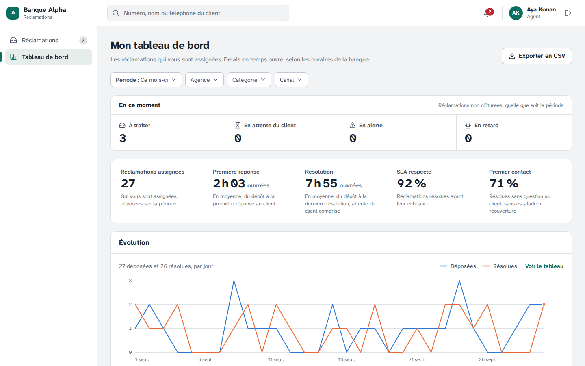
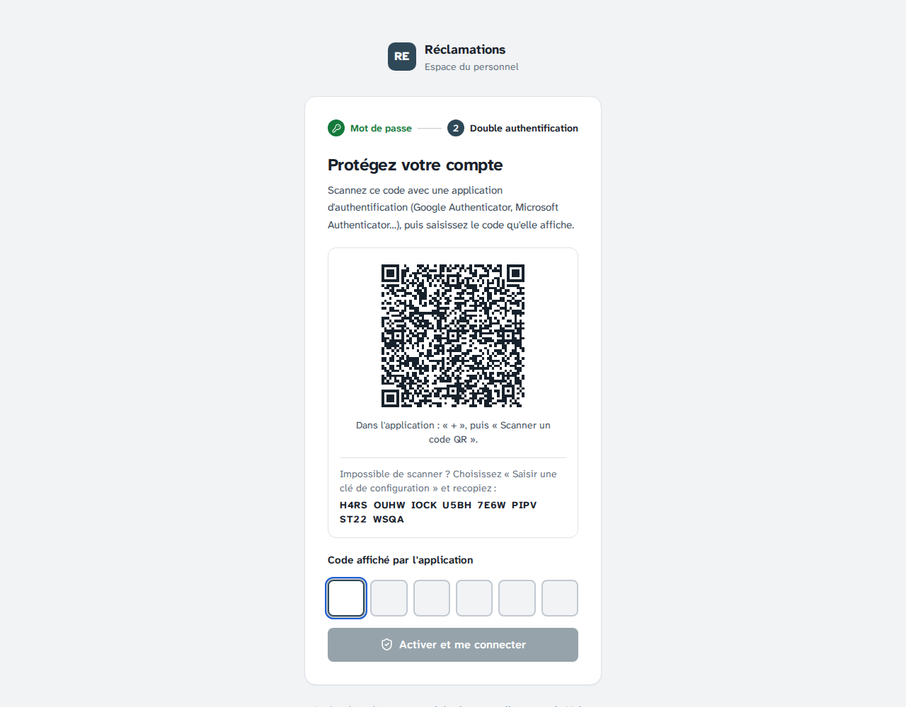
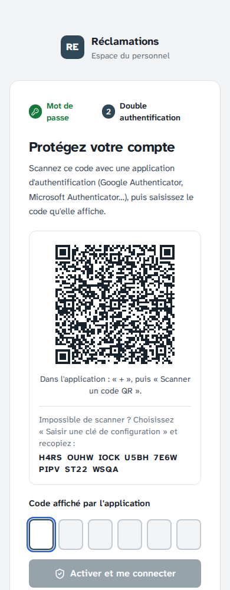
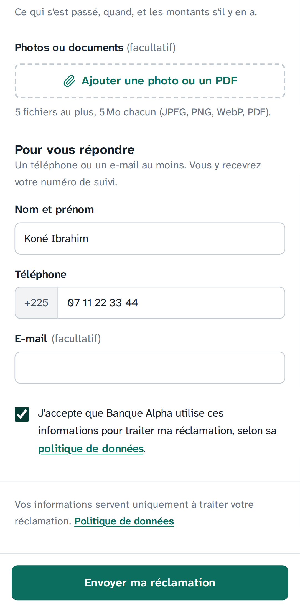
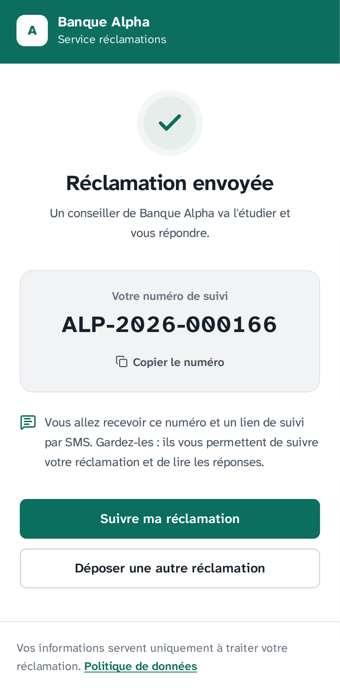
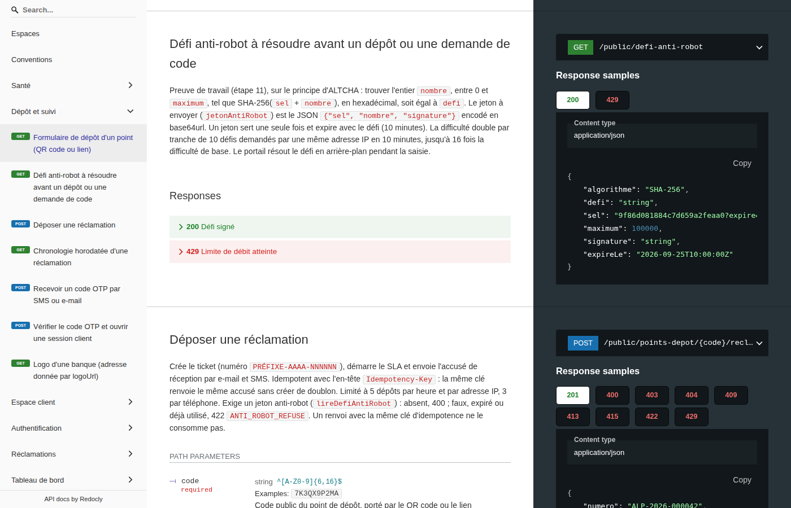

# Étape 11 — Anti-robot, QR code d'activation et tableau de bord de l'agent

Plateforme de gestion des réclamations · Makor Telecoms · Solution 1
Version du 30/09/2026 · **Statut : validé le 30/09/2026** (décisions H1 à H12 retenues telles que proposées).

**Préparation de la mise en production** (la « phase 2 » demandée, à ne pas confondre avec la phase 2 fonctionnelle du cahier des charges : chatbot, WhatsApp…). On termine tout, puis on répète le déploiement en local avant de le faire sur le VPS. Trois étapes :

| N° | Étape | Contenu |
|---|---|---|
| **11** | Anti-robot, QR code d'activation, tableau de bord de l'agent | cette note |
| 12 | Sauvegardes protégées | des copies hors du VPS que personne ne peut effacer avant leur échéance, pas même avec les clés du VPS |
| 13 | Répétition locale du déploiement | sur le PC Windows (Docker Desktop, scripts lancés depuis PowerShell) : HTTPS local, stockage S3 local, sauvegarde et restauration, mise à jour et retour arrière, démonstration, contrôle du déploiement |

Livrables :

- [`backend/src/infrastructure/securite/anti-robot.ts`](../backend/src/infrastructure/securite/anti-robot.ts) : défi, vérification du jeton, usage unique, difficulté qui s'adapte. Le fichier a ses [tests unitaires](../backend/src/infrastructure/securite/anti-robot.test.ts).
- [`contrat/openapi.yaml`](../contrat/openapi.yaml) : nouvelle opération `lireDefiAntiRobot` (`GET /public/defi-anti-robot`) ; `jetonAntiRobot` devient obligatoire pour le dépôt et pour la demande de code.
- [`frontend/src/api/anti-robot.ts`](../frontend/src/api/anti-robot.ts), [`anti-robot-calcul.ts`](../frontend/src/api/anti-robot-calcul.ts) et [`anti-robot.worker.ts`](../frontend/src/api/anti-robot.worker.ts) : la résolution dans le navigateur, branchée sur le [portail](../frontend/src/app/portail/Portail.tsx).
- [`frontend/src/ecrans/connexion/Connexion.tsx`](../frontend/src/ecrans/connexion/Connexion.tsx) : l'écran d'activation de la double authentification, avec un QR code agrandi.
- Variable `ANTI_ROBOT_MAXIMUM`, facultative (`.env.production.example`, `docker-compose.prod.yml`), et un contrôle de plus dans [`deploiement/verifier.sh`](../deploiement/verifier.sh).
- **Ajouté à la demande de Michael** : le **tableau de bord de l'agent** et son export CSV, limités à ses réclamations ([`reporting.controller.ts`](../backend/src/modules/reporting/reporting.controller.ts), [`TableauDeBord.tsx`](../frontend/src/ecrans/back-office/TableauDeBord.tsx)), et un bloc « En ce moment » pour tous les tableaux de bord (partie 2).
- **Environnement de développement.**
  - `docker compose up -d` ne réinstalle plus les dépendances si elles n'ont pas changé.
  - Vite garde ses fichiers préparés hors de `node_modules`. Une réinstallation pendant que les serveurs tournaient donnait une page blanche (erreurs 504 dans Firefox).
  - Sous Windows, les modifications du code sont maintenant détectées : les fichiers sont relus chaque seconde, car Docker Desktop ne signale pas les changements du dossier partagé. Avant, une nouvelle livraison n'apparaissait qu'après un redémarrage des conteneurs. L'API redémarre aussi quand le contrat change.

## 1. La double authentification côté personnel

**Oui, le QR code s'affiche et se scanne.** À sa première connexion, après le choix du mot de passe, chaque membre du personnel voit l'écran « Protégez votre compte ». On y trouve :

- un QR code, à scanner avec Google Authenticator, Microsoft Authenticator ou toute application TOTP ;
- la clé en clair, pour une saisie à la main.

L'application affiche ensuite un code à 6 chiffres, qui change toutes les 30 secondes. On le saisit pour activer le compte, puis à chaque connexion. Le format est celui qu'attend Google Authenticator : `otpauth://totp/…`, SHA-1, 6 chiffres, 30 secondes.

Ce qui change à cette étape :

- **Taille.** Le QR code passe de 132 à 216 pixels et se centre : plus facile à viser avec l'appareil photo d'un téléphone d'entrée de gamme.
- **Consignes.** L'écran dit où appuyer : « + », puis « Scanner un code QR ». Sans appareil photo, il faut choisir « Saisir une clé de configuration ».
- **Clé en clair.** Elle s'affiche en groupes de 4 caractères qui ne sont plus jamais coupés. Avant, la mise en page pouvait couper un groupe en fin de ligne (« V » puis « ZWO »), et le groupe devenait difficile à recopier.
- **Lecteur d'écran.** Il ne lit plus l'adresse `otpauth://` complète, qui contient le secret. Il annonce « QR code d'activation de la double authentification ».
- **Preuve automatique.** Le test dans Chromium photographie le QR code affiché, puis le **décode** comme le ferait un téléphone. Il vérifie :
  - l'adresse `otpauth://totp/` ;
  - le compte ;
  - SHA-1, 6 chiffres, 30 secondes ;
  - que la clé lue est bien celle affichée en clair.

  Il calcule ensuite le code à partir de la clé lue dans le QR code, et le compte s'active avec ce code.

## 2. Le tableau de bord de l'agent

L'agent n'avait ni tableau de bord ni export (décisions R3 et R4 de l'étape 9). **Il a maintenant les deux, limités aux réclamations qui lui sont assignées.** C'est l'API qui applique cette limite, comme pour sa file : un agent ne peut pas obtenir les chiffres d'un collègue, même en forgeant la requête.

- **Menu.** « Tableau de bord » apparaît pour l'agent. La page s'intitule « Mon tableau de bord ». Sa page d'accueil reste sa file de réclamations.
- **Indicateurs.** Ce sont ceux du superviseur, sur ses réclamations : volumes, délai de première réponse, délai de résolution, respect du SLA, résolution au premier contact, courbe d'évolution, répartitions. Les filtres de période, d'agence, de catégorie et de canal sont les mêmes.
- **En ce moment.** Un nouveau bloc, en tête de **tous** les tableaux de bord, compte les réclamations non clôturées à cet instant, quelle que soit la période choisie :
  - à traiter (ouvertes ou en cours) ;
  - en attente du client ;
  - en alerte (seuil d'alerte franchi) ;
  - en retard.

  « En retard » suit la même définition que la file du même nom, qu'il ouvre d'un clic.
- **Export CSV.** Il part de sa file ou de son tableau de bord et ne contient que ses réclamations. Les colonnes sont les mêmes que pour le superviseur, sans donnée du client, et chaque export est inscrit au journal d'audit.

## 3. En bref

| Contrôle | Résultat |
|---|---|
| Recette automatique | **11 / 11 critères**, 439 tests réussis sur 439 (+19), toutes les suites passent en 5 minutes ; sauvegarde et restauration 28 / 28 ([rapport](recette/rapport.md)) |
| Tests unitaires | backend **176 / 176** (+6 : anti-robot) ; frontend **143 / 143** (+7 : calcul, jeton accepté par l'API, second essai, tableau de bord de l'agent dans la démo) |
| Tests de bout en bout de l'API | **94 / 94** (+6) : 4 pour l'anti-robot (jeton absent, faux ou expiré, usage unique, difficulté qui monte). 3 nouveaux pour l'agent (ses chiffres, sa charge, son export) remplacent les 2 refus de l'étape 9. Les 84 opérations du contrat sont appelées. |
| Tests dans Chromium, sur la vraie API | **26 / 26**. Deux tests sont complétés : le défi se résout dans un Web Worker sous la CSP de production et part avec le dépôt ; le QR code d'activation est décodé depuis une capture. Un test change de sens : « l'agent n'a ni tableau de bord ni export » devient « l'agent a son tableau de bord et exporte ses réclamations, et seulement les siennes ». |
| Contrôle d'un déploiement HTTPS | **18 / 18** sur la pile locale de l'étape 10 : Caddyfile de production, API réelle, certificats d'une autorité de test. Un dépôt fait à travers Caddy charge le Web Worker, sans aucune violation de la CSP. |
| Portail | 140 Ko compressés, soit +4 Ko dont le Web Worker ; la console ne change pas |
| Coût pour un visiteur | **63 ms au pire** sur un ordinateur, **0,43 s au pire** sur un téléphone d'entrée de gamme simulé (processeur ralenti 6 fois). La moyenne est la moitié. Le calcul se fait pendant la saisie : rien ne se voit à l'envoi. |
| Formulaire | inchangé pour le client : pas de case à cocher, pas d'image à déchiffrer ([capture](#7-captures)) |

## 4. Décisions à valider

| N° | Sujet | Proposition |
|---|---|---|
| H1 | Mécanisme | **Preuve de travail, sans service tiers.** Le principe est celui d'ALTCHA, un logiciel libre. Le navigateur doit trouver un nombre dont l'empreinte SHA-256 est donnée par l'API. Le client n'a rien à cocher, et l'anti-robot ne pose aucun cookie. Rien ne part chez Google ou Cloudflare, ce qui compte pour l'ARTCI. Aucune image n'est à déchiffrer, ce qui compte pour l'accessibilité. Écartés : reCAPTCHA, hCaptcha et Turnstile, pour deux raisons : les données des clients partent chez un tiers, et le portail dépend d'un service extérieur. Limite assumée : la preuve de travail n'arrête pas un attaquant prêt à payer du calcul. Elle rend l'envoi en masse coûteux. Elle s'ajoute aux limites de débit déjà en place : 5 dépôts par heure et par adresse IP, 3 par téléphone, 3 codes par heure et par réclamation. |
| H2 | Ce qui est protégé | Le **dépôt**, et la **demande de code** : chaque code est un SMS facturé à la banque. Deux opérations ne sont pas protégées, parce que d'autres limites les couvrent déjà : la vérification du code (5 essais par code) et la connexion du personnel (limite par adresse IP, puis TOTP). |
| H3 | Difficulté | Nombre cherché entre 0 et `ANTI_ROBOT_MAXIMUM`, **100 000** par défaut. Elle **double par tranche de 10 défis** demandés par une même adresse IP en 10 minutes, jusqu'à **16 fois**. Un robot qui insiste paie de plus en plus cher. Un client ordinaire en demande quelques-uns (ouverture du formulaire, du suivi, envoi) et reste à la difficulté de base. Point d'attention : beaucoup d'abonnés mobiles partagent une même adresse IP chez leur opérateur. Aux heures de pointe, ils peuvent atteindre le plafond : au pire 7 s de calcul sur un téléphone d'entrée de gamme, en grande partie faites pendant la saisie. On relève la variable en cas d'attaque ; on l'abaisse si des clients se plaignent. |
| H4 | Jeton | Le défi est signé par l'API (HMAC-SHA-256) et **expire après 10 minutes**. Le jeton ne sert **qu'une fois** : il est marqué utilisé dans Redis. La clé de signature est dérivée de `JWT_SECRET` (HKDF), sans nouveau secret à gérer. Changer `JWT_SECRET` annule les défis en cours, sans gêne : le portail en redemande un. |
| H5 | Quand le jeton est consommé | **Dépôt** : vérifié avant tout accès à la base, consommé seulement quand la réclamation est créée. Un formulaire à corriger garde donc son jeton. Un renvoi avec la même `Idempotency-Key`, après une coupure réseau, rend le même accusé sans le redemander. **Demande de code** : consommé dès la demande. |
| H6 | Panne de Redis | Le portail reste ouvert, comme pour les limites de débit : difficulté de base, usage unique non vérifié, incident journalisé. |
| H7 | Dans le navigateur | Le défi est demandé **dès l'ouverture** du formulaire ou du suivi. Il est résolu dans un **Web Worker**, que la CSP de production autorise (`'self'`). Si le Worker est indisponible, le calcul se fait par tranches sur la page. Le SHA-256 est écrit en JavaScript : environ 1,5 million d'essais par seconde, contre quelques dizaines de milliers avec WebCrypto, dont chaque appel est asynchrone. Si l'API refuse le jeton (expiré, déjà servi), l'envoi est refait **une fois** avec un jeton neuf, sans que le client le voie. Le message « La vérification anti-robot a expiré : réessayez » ne s'affiche qu'après deux refus. |
| H8 | Contrat | Une opération de plus : **84** au lieu de 83. `jetonAntiRobot` était prévu, facultatif, depuis l'étape 5 ; il devient **obligatoire**. La demande de code exige désormais un corps. C'est une rupture pour un programme qui appellerait ces deux opérations sans jeton, mais il n'y en a aucun aujourd'hui : seul le portail le fait. Absent, le jeton donne 400 `VALIDATION` ; faux, expiré ou déjà servi, 422 `ANTI_ROBOT_REFUSE` (code prévu dès l'étape 5). Types et documentation hors ligne sont régénérés. |
| H9 | QR code d'activation | 216 pixels au lieu de 132, consignes d'utilisation, clé en groupes jamais coupés, libellé accessible sans le secret (partie 1). |
| H10 | Tableau de bord de l'agent | Mêmes indicateurs que le superviseur, sur les réclamations **qui lui sont assignées**. Une réclamation réassignée passe dans les chiffres du nouvel agent. L'API impose la limite (opération `lireIndicateurs`, ouverte au rôle agent). Révise la décision R3 de l'étape 9, à la demande de Michael. |
| H11 | Charge du moment | Bloc « En ce moment » dans tous les tableaux de bord : à traiter, en attente du client, en alerte, en retard, hors période, filtres appliqués. « En retard » ouvre la file du même nom. Au contrat, un champ `charge` s'ajoute aux indicateurs, sans rupture. Le contrat compte toujours 84 opérations. |
| H12 | Export CSV de l'agent | Depuis sa file ou son tableau de bord, ses réclamations seulement (mêmes règles que sa file). Colonnes sans donnée du client, export inscrit au journal d'audit. Révise la décision R4 de l'étape 9, comme le demande le cahier des charges : « toutes les listes s'exportent en CSV ». |

## 5. Coût du calcul

Mesuré dans Chromium, dans le **pire cas** (le nombre tiré est le maximum) ; en moyenne, c'est la moitié. Le ralentissement du processeur est celui des outils de Chrome : « ÷ 6 » correspond à un téléphone d'entrée de gamme.

| Maximum | Ordinateur | Processeur ÷ 4 | Processeur ÷ 6 |
|---|---|---|---|
| 100 000 (base) | 63 ms | 0,31 s | 0,43 s |
| 800 000 (× 8, plus de 30 défis en 10 minutes) | 0,53 s | 2,4 s | 3,9 s |
| 1 600 000 (× 16, plus de 40 défis en 10 minutes) | 0,98 s | 5,1 s | 7,4 s |

Un robot bien écrit fait plusieurs millions d'essais par seconde : au plafond, un dépôt lui coûte moins d'une seconde. La preuve de travail seule ne l'arrête donc pas. Elle écarte les scripts simples et fait payer chaque envoi. Ce sont les limites de débit qui plafonnent le volume : 5 dépôts par heure et par adresse IP, 3 par téléphone, 3 codes par heure et par réclamation. Pour aller au-delà, un robot doit multiplier les adresses IP et les numéros, et résoudre un défi pour chaque envoi.

## 6. Tests

| Suite | Ce qui est vérifié |
|---|---|
| Unitaires, backend | Un défi se résout ; le jeton se vérifie sans état. Un jeton est refusé dans chacun de ces cas : mauvais nombre, autre clé, expiration repoussée dans le sel, expiré, illisible. Les autres tests couvrent les paliers de difficulté, l'usage unique, une adresse IP qui insiste face à une autre, et Redis en panne. |
| Unitaires, frontend | Le SHA-256 maison donne le même résultat que Node : un bloc, deux blocs, UTF-8. Le jeton du navigateur est accepté **par le code de vérification du backend**. Les autres tests couvrent le jeton préparé à l'avance, puis retiré après usage, le remplacement d'un jeton trop près de l'expiration, et le second essai sur `ANTI_ROBOT_REFUSE`, et seulement sur ce code. |
| Bout en bout | Sans jeton : 400 sur `jetonAntiRobot`, au dépôt comme à la demande de code. Un jeton illisible, avec un mauvais nombre, signé par une autre clé ou expiré donne 422, et rien n'est créé. Pour l'usage unique : un formulaire à corriger ne consomme pas le jeton, un dépôt si ; ce jeton ne sert pas non plus à demander un code. La difficulté double à la 11ᵉ demande d'une adresse IP, pas pour une autre. Le défi n'est jamais mis en cache (`no-store`). Tous les autres tests déposent avec un vrai défi résolu. |
| Chromium | Le défi est demandé dès l'ouverture du formulaire et résolu par `anti-robot.worker` sous la CSP de production. La requête de dépôt contient le jeton. Le QR code d'activation est décodé depuis une capture (partie 1). |
| Contrôle d'un déploiement | `verifier.sh` vérifie que le défi signé est servi : 18 contrôles de l'extérieur, tous réussis sur la pile HTTPS locale. |
| Tableau de bord de l'agent | **Bout en bout.** L'agent voit ses 4 réclamations du scénario sur les 5 de la banque. Il a les mêmes taux que la banque sur celles-ci. Un autre agent n'en voit aucune. La charge compte « à traiter », « en alerte » et « en retard » pour l'agent comme pour la banque. Elle ne dépend pas de la période. Son « en retard » est bien la file « En retard ». L'export de l'agent reprend exactement sa file. Un agent qui demande les réclamations d'un collègue reçoit un fichier vide, et cet export est quand même inscrit au journal. **Démo cliquable.** Les chiffres de l'agent correspondent à ses réclamations et à ses compteurs de file. **Chromium.** L'agent exporte depuis sa file puis depuis son tableau de bord : chaque ligne porte son nom. |

## 7. Captures

Activation de la double authentification, sur un ordinateur et sur un téléphone :

Le dépôt sur un téléphone ne change pas. Le défi a été résolu pendant la saisie, et la réclamation part au premier appui :

La nouvelle opération dans la [documentation hors ligne du contrat](api/index.html) :

## 8. Ce qui ne change pas

- **La démo cliquable** fonctionne sans serveur, sur une API simulée. Elle n'a pas d'anti-robot.
- **L'environnement de démonstration**, sur un vrai serveur, l'a comme la production.
- **Le portail exigeait déjà JavaScript.** Aucun client n'est perdu.
- **Pas de nouveau secret.** Aucune variable n'est obligatoire. Un `.env.production` existant fonctionne tel quel.

## 9. Suite

Étape 12, sauvegardes protégées : [note de l'étape 12](etape-12-sauvegardes-protegees.md).
