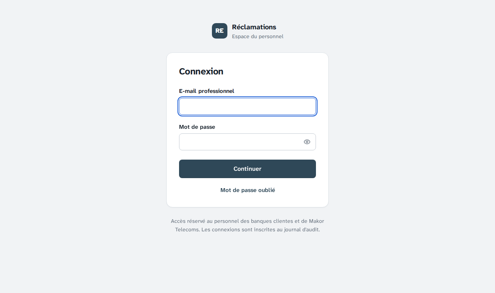
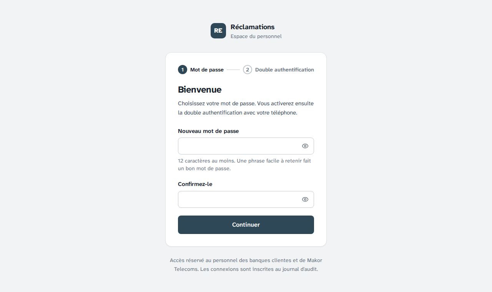
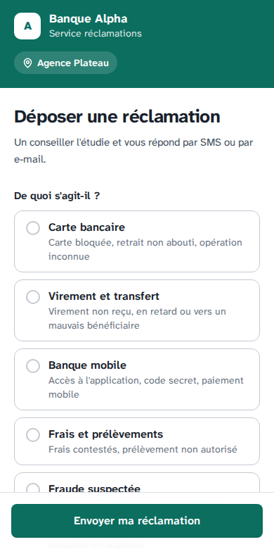

# Étape 13 — Répétition locale complète du déploiement

Plateforme de gestion des réclamations · Makor Telecoms · Solution 1
Version du 01/10/2026 · **Statut : validé le 01/10/2026** (décisions L1 à L8 retenues telles que proposées).

Dernière des trois étapes de la préparation de la mise en production, après l'[étape 11](etape-11-anti-robot-qr-code.md) et l'[étape 12](etape-12-sauvegardes-protegees.md).

**Le but.** Avant de toucher au VPS, on rejoue toute l'installation et l'exploitation sur le PC Windows. On utilise les mêmes images, les mêmes réglages de sécurité et surtout **les mêmes scripts** que sur le serveur. Tout se lance depuis PowerShell, avec Docker Desktop seulement : ni WSL ni Git Bash.

```powershell
Set-ExecutionPolicy -Scope Process Bypass          # si Windows refuse les scripts : cette fenêtre seulement
.\deploiement\repetition.ps1 installer             # 10 à 20 minutes la première fois
```

Livrables :

- [`deploiement/repetition.ps1`](../deploiement/repetition.ps1) : la répétition, commande par commande. Le script ajoute l'autorité locale aux autorités de confiance de Windows, et l'en retire à la fin.
- [`deploiement/repetition.sh`](../deploiement/repetition.sh) : ces commandes en bash. Elles appellent les scripts du VPS et affichent à chaque étape la commande équivalente sur le serveur.
- [`deploiement/outils.ps1`](../deploiement/outils.ps1) et [`deploiement/outils/Dockerfile`](../deploiement/outils/Dockerfile) : le conteneur d'outils, qui lance les scripts bash de `deploiement/` depuis Windows. Il contient bash, docker compose, openssl, curl, jq et age.
- [`docker-compose.repetition.yml`](../docker-compose.repetition.yml) : la surcharge de la production pour le poste. Elle apporte l'autorité locale, Mailpit et un S3 simulé avec verrouillage.
- [`docker/caddy/options-repetition.caddy`](../docker/caddy/options-repetition.caddy) : les certificats de l'autorité locale. En production, `options-production.caddy` est vide.
- [`docker/postgres/Dockerfile`](../docker/postgres/Dockerfile) : PostgreSQL avec le script des rôles. Plus aucun fichier du dépôt n'est monté en production.
- [Guide d'exploitation](exploitation.md) :
  - partie 13 : la répétition ;
  - 5.1 : envoi de l'archive depuis Windows ;
  - 5.2 : clés age depuis PowerShell ;
  - 9 : mises à jour mensuelles ;
  - dépannage.

## 1. En bref

| Contrôle | Résultat |
|---|---|
| Recette automatique | **11 / 11 critères**, 439 tests réussis sur 439, toutes les suites passent en 6 minutes ([rapport](recette/rapport.md)) |
| Parcours complet de la répétition | Rejoué ici sur Docker simulé, avec la vraie API, le vrai Caddy, PostgreSQL, les vrais scripts de sauvegarde et un S3 verrouillé. Toutes les commandes réussissent : **aucun échec** de `verifier.sh` (section 5) |
| HTTPS local | Caddy 2.11.4 et le vrai Caddyfile : certificats de 90 jours, émis par « Reclamations - repetition locale ». Chromium les accepte une fois l'autorité ajoutée. La configuration de production reste identique |
| PowerShell | 0 incompatibilité avec Windows PowerShell 5.1 (PSScriptAnalyzer). Les deux scripts tournent sous PowerShell 7 |
| Défaut corrigé en production | Après chaque mise à jour, `mettre-a-jour.sh` aurait conclu à un échec et proposé un retour arrière. La cause : le conteneur de sauvegarde restait « starting » 5 minutes (L5) |

## 2. Le parcours

Chaque commande renvoie à sa partie du [guide](exploitation.md#13-répétition-locale-sur-un-poste-windows) :

| `.\deploiement\repetition.ps1 …` | Ce qu'on répète |
|---|---|
| `installer` | Installation complète (partie 5). Elle enchaîne 6 étapes : fichier d'environnement et secrets, clé de sauvegarde, construction et démarrage, compartiment verrouillé, premier Super Admin, contrôle. Windows demande ensuite de confirmer l'autorité locale |
| (navigateur) | Le lien d'invitation, la double authentification avec le téléphone, la banque `alpha` et son administrateur, puis un dépôt sur `https://alpha.reclamations.localhost` |
| `verifier --portail alpha` | Contrôle du déploiement (5.4) |
| `sauvegarde` | Sauvegarde, vérification de l'archive, liste des copies (7) |
| `intrusion` | Copies effacées avec les clés du compartiment : refus, alerte, restauration d'une copie masquée, acquittement (7) |
| `mise-a-jour 1.0.1`, puis `retour` | Mise à jour avec sauvegarde préalable, puis retour arrière (9) |
| `restauration` | Remplacement de la base par la dernière sauvegarde (10) |
| `demo` | Démonstration : deux banques fictives, comptes et mot de passe affichés (6) |
| `supprimer` | Tout effacer, et retirer l'autorité de Windows |

Adresses :

- console : `https://console.reclamations.localhost` ;
- portails : `https://<slug>.reclamations.localhost` ;
- e-mails : `http://localhost:8026` (Mailpit).

Les noms en `.localhost` désignent le poste lui-même dans Edge, Chrome et Firefox : il n'y a aucun fichier `hosts` à modifier.

| Console, servie en HTTPS par l'autorité locale | Invitation du premier Super Admin | Portail de la banque Alpha (téléphone) |
|---|---|---|
|  |  |  |

## 3. Décisions à valider

| N° | Sujet | Proposition |
|---|---|---|
| L1 | Scripts | **Les scripts bash du VPS tournent dans un conteneur d'outils**, lancé par PowerShell. Il pilote Docker Desktop par sa socket. On écarte une réécriture en PowerShell : il y aurait deux versions à maintenir, et la répétition ne testerait plus les scripts du serveur. On écarte aussi WSL et Git Bash, qui demandent une installation de plus. Le conteneur se construit à la première commande, puis à chaque modification de son Dockerfile. Les scripts PowerShell sont compatibles avec Windows PowerShell 5.1 et PowerShell 7. Une fenêtre qui refuse les scripts s'ouvre avec `Set-ExecutionPolicy -Scope Process Bypass` : pas de changement permanent du poste |
| L2 | Configuration | **La production, plus une surcharge de trois écarts** : l'autorité locale, Mailpit et un S3 simulé (moto 5.2.3, qui applique le verrouillage). Les projets s'appellent `reclamations-repetition` et `reclamations-demo`, distincts du projet de développement `reclamations`, qui peut tourner en même temps. Tout ce que la répétition crée sur le poste est dans `.repetition\`, exclu des images, des archives et de git |
| L3 | HTTPS local | Les certificats viennent d'**une autorité créée par Caddy**, pour `reclamations.localhost`. Ils durent 90 jours, comme ceux de Let's Encrypt, si bien que `verifier.sh` contrôle leur échéance comme en production. L'autorité va dans le magasin de l'utilisateur : pas de droits d'administrateur, et Windows demande confirmation. `supprimer` l'en retire. On écarte les avertissements acceptés à la main : HSTS les empêche, et le contrôle ne vérifierait plus le certificat |
| L4 | PostgreSQL | **Une image construite avec le script des rôles** (`reclamations-postgres:16`), au lieu d'un fichier monté depuis le dépôt. Depuis le conteneur d'outils, docker compose transmet au moteur des chemins qu'il ne voit pas : le script ne serait jamais monté. En production aussi, plus rien ne dépend des fichiers du dépôt. L'étiquette est fixe : une mise à jour ne redémarre la base que si son image de base a reçu un correctif (construction avec `--pull`). Conséquence pour le guide : `dcp pull postgres` disparaît (partie 9) |
| L5 | Contrôles de santé | Les contrôles de santé tournent toutes les 3 à 5 secondes au démarrage (`--start-interval`), puis à leur rythme habituel. `mettre-a-jour.sh`, `reinitialiser-demo.sh` et la répétition attendent l'API, le worker et la sauvegarde avant de contrôler. **Défaut trouvé en préparant l'étape** : le conteneur de sauvegarde restait « starting » 5 minutes après chaque démarrage. `verifier.sh --local`, lancé aussitôt par `mettre-a-jour.sh`, échouait donc après chaque mise à jour et proposait un retour arrière |
| L6 | Contrôle | `verifier.sh` lit `VERIFICATION_IP` et `VERIFICATION_CA` dans le fichier d'environnement : Caddy est joint par le poste (`host.docker.internal`), comme depuis Internet, avec l'autorité locale. Le contrôle des ports publiés ne regarde plus que les services du projet : sur un poste, l'environnement de développement publie les siens |
| L7 | Clé de sauvegarde | En répétition, **la clé privée reste dans `.repetition\production\`**, pour que les vérifications et restaurations se fassent sans saisie. Elle passe au conteneur par l'entrée standard, en mémoire (`/dev/shm`), jamais dans un volume. Sur le VPS, rien ne change : la clé privée n'y va jamais |
| L8 | Production et démonstration | Elles ne peuvent pas tourner ensemble sur le poste : toutes deux utilisent les ports 80 et 443. `demo` arrête la répétition de la production, sans rien effacer ; `demarrer` la relance. Un autre service qui occupe ces ports (IIS, par exemple) arrête l'installation avec un message clair |

## 4. Ce qui change pour la production

| Fichier | Changement | Effet sur le VPS |
|---|---|---|
| `docker-compose.prod.yml` | PostgreSQL construit (L4) ; `start_interval` du worker (L5) | Première construction un peu plus longue ; les données et le volume restent les mêmes |
| `backend/Dockerfile`, `docker/sauvegarde/Dockerfile` | `--start-interval` (L5) | API, worker et sauvegarde sains en quelques secondes |
| `docker/caddy/Caddyfile` | `import options-{$CADDY_OPTIONS:production}.caddy` | Aucun : configuration identique, comparée en JSON |
| `deploiement/commun.sh` | Surcharge de répétition, attente des services sains, lecture tolérante aux fins de ligne Windows | Aucun sans `REPETITION=1` |
| `deploiement/verifier.sh` | `VERIFICATION_IP` et `VERIFICATION_CA` ; ports publiés du projet seulement (L6) | Aucun sans ces variables |
| `deploiement/mettre-a-jour.sh` | Attente des services sains avant le contrôle (L5) | La mise à jour n'échoue plus à tort |

## 5. Tests

**Ce qui a été vérifié ici.** Cet environnement n'a pas de moteur Docker.

1. `docker compose config` de la production seule, de la production avec la surcharge de répétition, et de la démonstration avec cette surcharge :
   - aucun fichier monté ;
   - noms de projets attendus ;
   - Mailpit sur `127.0.0.1:8026` seulement.
2. Caddy 2.11.4, avec le vrai Caddyfile et `CADDY_OPTIONS=repetition`, sur les ports 80 et 443 :
   - autorité locale créée au démarrage ;
   - certificats de 90 jours pour la console et le portail ;
   - poignée de main refusée pour un sous-domaine inconnu.

   Sans cette option, la configuration JSON est identique à celle de l'étape 12.
3. **Le parcours complet**, avec un `docker` simulé. Chaque appel à docker compose est servi par son équivalent sur la machine :
   - l'API et le worker construits, relancés par `up` et `stop` avec la `VERSION` du fichier d'environnement ;
   - PostgreSQL ;
   - Caddy sur 443 ;
   - moto sur `s3:5000` ;
   - les scripts de sauvegarde du dépôt, avec l'environnement que compose donne au conteneur.

   Les contrôles de `verifier.sh`, eux, sont réels : HTTPS, en-têtes, santé, version.

| Commande | Résultat |
|---|---|
| `installer` | 6 étapes ; contrôle : 27 réussis, 0 échec, 4 points d'attention (DNS, portail, pare-feu, aucune sauvegarde encore) |
| `verifier --portail alpha` | 28 réussis, 0 échec : portail en HTTPS, certificat obtenu à la première visite |
| `sauvegarde` | Copies quotidienne et mensuelle verrouillées ; archive vérifiée (journal d'audit intact, isolation, 2 banques, 28 réclamations) |
| `intrusion` | 2 attaques refusées, 2 acceptées sans effacer d'original ; alerte avec les archives à restaurer ; copie masquée vérifiée ; acquittement |
| `restauration` | Refusée sans `--oui` hors d'un terminal ; base remplacée, l'ancienne gardée ; contrôle : 28 réussis, 0 échec |
| `mise-a-jour 1.0.1`, `retour` | Sauvegarde préalable ; version 1.0.1, puis 1.0.0 annoncée par l'API ; 28 réussis, 0 échec chaque fois |
| `demo`, `totp` | Arrêt de la répétition de la production (ports) ; remise à zéro ; contrôle avec le portail alpha : 26 réussis, 0 échec ; code TOTP d'un compte |
| `supprimer`, `etat`, `arreter`, `demarrer` | Comportement attendu, y compris quand rien n'est installé et quand la confirmation manque |

4. PowerShell, avec PSScriptAnalyzer 1.24 et les règles de compatibilité Windows PowerShell 5.1 : 0 problème. Sous PowerShell 7.5, avec le `docker` simulé, on vérifie :
   - la construction du conteneur d'outils quand il manque ;
   - les arguments transmis ;
   - le code de sortie ;
   - le parcours `installer` complet ;
   - l'ajout, le remplacement et le retrait de l'autorité, sur un magasin de certificats d'essai.
5. shellcheck sur tous les scripts, hadolint sur les Dockerfile (seul DL3008 reste, déjà accepté aux étapes 10 et 12).
6. Recette automatique complète : 11 critères sur 11, 439 tests sur 439. L'archive livrée a été testée à froid : extraite, `npm ci`, puis recette complète, 11 sur 11.

L'intrusion, telle que la répétition l'affiche (extrait du parcours ci-dessus) :

```text
==> 2/6 L'intrus efface tout avec les clés du compartiment (rclone, comme sur le VPS)
    refusé   rclone purge (supprimer le compartiment)
    refusé   rclone delete --s3-versions (effacer les versions)
    accepté  faux fichier déposé sous le nom de la dernière mensuelle
    accepté  rclone delete quotidien/ (supprimer les copies)
    Ce que l'intrus voit maintenant dans quotidien/ : 0 copie(s)
    « accepté » ne veut pas dire « effacé » : une copie verrouillée n'est que masquée, ou recouverte
    par une nouvelle version ; l'original reste jusqu'à la fin de son verrou.

==> 3/6 La sauvegarde suivante donne l'alerte (healthchecks.io prévenu, conteneur « unhealthy »)
    ALERTE : des copies hors du VPS ont été masquées ou remplacées en dehors de la rotation (9 trace(s)).
    Archives gardées par le verrou, restaurables telles quelles (restaurer <nom>) :
        distant:mensuel/reclamations-20261001T090412Z.tar-v2026-10-01-090413-000.age
        distant:quotidien/reclamations-20261001T090416Z.tar-v2026-10-01-090416-000.age
```

**Ce qui ne peut être vérifié que sur votre PC** :

- le vrai Docker Desktop : socket, `host.docker.internal`, construction des images depuis le conteneur d'outils ;
- la boîte de dialogue de Windows pour l'autorité ;
- la confiance de Firefox.

C'est l'objet de la répétition : en cas d'échec, envoyez la sortie de la commande.

**Premier passage sur le PC Windows (01/10/2026).** `installer` réussit de bout en bout :
- 27 contrôles réussis, 0 échec ;
- Caddy joint par `host.docker.internal` (192.168.65.254) ;
- certificat valable 89 jours ;
- compartiment simulé créé avec le verrouillage COMPLIANCE ;
- autorité locale ajoutée aux autorités de confiance de Windows.

La connexion a d'abord échoué avec les comptes du développement : la base de la répétition est vide, comme une vraie production. Seul existe le Super Admin, dont le mot de passe se choisit par le lien d'invitation. Le résumé de fin d'installation le dit désormais.

## 6. Ce que la répétition ne couvre pas

- la préparation du VPS, le DNS et le pare-feu (parties 3 et 4 du guide) ;
- l'obtention des certificats Let's Encrypt ;
- le mode COMPLIANCE du vrai compartiment Contabo, vérifié à l'installation par `sauvegarder --preparer` ;
- healthchecks.io, le prestataire d'e-mail et la passerelle SMS.

## 7. Suite

Avec cette étape, le dépôt est prêt pour la mise en production. Restent, hors du dépôt :

1. la fin du parcours de répétition sur le PC (sauvegarde, intrusion, mise à jour, restauration, démonstration) ;
2. l'installation sur le VPS en suivant le [guide](exploitation.md) ;
3. la recette contractuelle sur l'environnement de démonstration ([cahier de recette](recette/cahier-de-recette.md)).

Les fonctions de phase 2 du CDC (chatbot, WhatsApp) viendront ensuite.

Suite : la phase 2 du CDC, en commençant par son [cadrage (étape 14)](etape-14-cadrage-phase-2.md).
