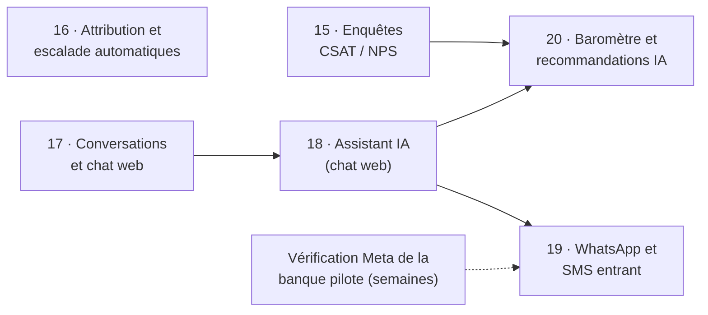

# Étape 14 — Cadrage de la phase 2 : IA et pilotage de l'expérience

Plateforme de gestion des réclamations · Makor Telecoms · Solution 1
Version du 01/10/2026 · **Statut : validé le 01/10/2026** (décisions I1 à I10 retenues telles que proposées).

La phase 1 (MVP, étapes 1 à 13) est terminée et prête pour la mise en production. Le [guide d'exploitation](exploitation.md) permet d'installer le VPS en parallèle de la suite.

La phase 2 du cahier des charges (section 4) ajoute cinq fonctions. Comme l'étape 1 l'a fait pour le MVP, cette étape fixe trois choses avant toute ligne de code :
- leur ordre ;
- les règles communes, surtout pour l'IA ;
- ce qu'il faut lancer tout de suite hors du code, parce que cela prend des semaines (vérification Meta, conformité des banques).

Cette étape ne change pas le code.

## 1. Les cinq fonctions de la phase 2

| Fonction (CDC, section 4) | Pour qui | Dépend de |
|---|---|---|
| Enquêtes CSAT / NPS après clôture | La banque mesure la satisfaction de ses clients | Rien : les canaux e-mail et SMS existent |
| Attribution et escalade automatiques, selon des SLA réglés plus finement | Les superviseurs, qui attribuent aujourd'hui à la main | Rien : la charge des agents existe depuis l'étape 11 |
| Canaux WhatsApp Business, SMS entrant et chat web | Le client, qui écrit là où il est déjà | Meta (WhatsApp), la passerelle de Makor (SMS entrant) |
| Chatbot IA de première ligne, avec bascule vers un agent | Le client, à toute heure ; les agents, déchargés des demandes simples | Un fournisseur d'IA ; un canal de conversation |
| Baromètre d'expérience et recommandations générées par IA | L'Admin Entreprise et les superviseurs | Plusieurs mois de réponses aux enquêtes ; le moteur d'IA |

## 2. Le découpage proposé

| Étape | Contenu | Prestataire extérieur |
|---|---|---|
| 15 | Enquête de satisfaction à la clôture ; CSAT, NPS et taux de réponse au tableau de bord | Aucun |
| 16 | Règles d'attribution par catégorie et agence ; agent disponible le moins chargé ; escalade à plusieurs niveaux | Aucun |
| 17 | Modèle de conversation commun à tous les canaux ; chat web sur le portail ; boîte de réception des agents | Aucun |
| 18 | Assistant IA sur le chat web : il accueille le client, prend le dépôt, répond aux questions fréquentes et passe la main à un agent ; il suggère aussi des réponses aux agents | Fournisseur d'IA, choisi au début de l'étape (I6) |
| 19 | WhatsApp Business et SMS entrant : les mêmes conversations, avec l'assistant | Meta, passerelle de Makor |
| 20 | Baromètre mensuel par banque et recommandations | Fournisseur d'IA de l'étape 18 |

Chaque étape garde le protocole de la phase 1 :
- des décisions à valider ;
- une archive testée à froid ;
- une note avec captures ;
- la recette automatique, étendue à la nouvelle fonction.

## 3. Décisions à valider

| N° | Sujet | Proposition |
|---|---|---|
| I1 | Ordre | **15 enquêtes → 16 attribution → 17 conversations et chat web → 18 assistant IA → 19 WhatsApp et SMS entrant → 20 baromètre.** Les étapes 15 et 16 apportent de la valeur tout de suite, sans prestataire. L'étape 17 pose le modèle de conversation commun à tous les canaux. L'assistant se met au point sur le chat web, que la plateforme maîtrise entièrement, avant d'être ouvert sur WhatsApp. La vérification Meta, qui prend plusieurs semaines, se déroule pendant les étapes 15 à 18. Le baromètre vient en dernier : il a besoin de plusieurs mois de réponses aux enquêtes |
| I2 | Activation | Chaque fonction de la phase 2 **s'active banque par banque**, et reste désactivée par défaut. Le Super Admin l'ouvre selon le plan de la banque ; l'Admin Entreprise la règle. Une nouvelle version ne change donc rien pour une banque qui ne l'a pas activée. L'usage facturable est compté par banque, comme les segments SMS (étape 9), pour être refacturé : messages WhatsApp payants, appels à l'IA |
| I3 | Transparence | **Le client sait toujours qu'il parle à un assistant automatique, et peut toujours parler à un humain.** L'assistant se présente comme tel. Le mot « conseiller » ou « agent », ou un bouton, transfère la conversation. Hors des heures ouvrées, le transfert crée la réclamation, et l'agent répond à la reprise, dans le SLA existant |
| I4 | Rôle de l'IA | **L'IA propose, l'humain décide.** Côté client, l'assistant fait trois choses : il recueille les informations du dépôt (catégorie, agence, description) et dépose la réclamation ; il répond aux questions fréquentes à partir d'une base de réponses écrite et validée par la banque ; il transfère tout le reste. Il ne change jamais un statut, ne promet ni remboursement ni délai, ne clôt rien et ne donne aucun conseil financier. Côté agent, l'IA suggère une catégorie, une priorité ou un brouillon de réponse, et l'agent valide. Ces interdits sont vérifiés par des tests automatiques |
| I5 | Données confiées à l'IA | **Le minimum, et masqué.** Avant tout envoi, la plateforme remplace les numéros de compte et de carte, les IBAN, les téléphones et les e-mails ; ce masquage est testé. Aucune pièce jointe n'est envoyée, ni l'historique d'autres clients. Chez le fournisseur : pas d'entraînement sur ces données, conservation nulle ou courte, contrat de sous-traitance. Le Super Admin n'accède jamais aux conversations (arbitrage 7). Chaque appel à l'IA est journalisé, sans son contenu : banque, finalité, volume |
| I6 | Fournisseur d'IA | Le fournisseur se branche derrière **un adaptateur remplaçable**, comme la passerelle SMS. **Il se choisit au début de l'étape 18, sur un banc d'essai** : 100 échanges fictifs écrits en français d'Abidjan (registre familier, expressions courantes, fautes de frappe), soumis à 2 ou 3 fournisseurs. Critères pondérés : données (hébergement, conservation, entraînement, contrat) 30 % ; respect des interdits de I4 25 % ; qualité en français 20 % ; coût par conversation 15 % ; temps de réponse 10 %. Un modèle hébergé par Makor est écarté sur le VPS actuel, qui n'a pas de carte graphique. Il redeviendrait candidat si une banque exigeait que rien ne sorte de son infrastructure |
| I7 | WhatsApp | **WhatsApp Business Platform de Meta** (l'API hébergée par Meta), derrière un adaptateur. Un fournisseur agréé peut s'y brancher si Makor en a déjà un sous contrat. **Chaque banque a son propre compte WhatsApp Business, à son nom et avec son numéro** : le client voit la marque de sa banque. Makor raccorde ces comptes comme prestataire technique, par l'inscription intégrée de Meta. Tarification de Meta, à reconfirmer à l'étape 19 sur sa grille : les réponses dans les 24 heures qui suivent un message du client ne sont pas facturées ; les notifications envoyées hors de cette fenêtre sont des modèles facturés à l'unité, refacturés à la banque. Depuis le 15 janvier 2026, Meta interdit sur WhatsApp les assistants IA généralistes. Un assistant limité au service client d'une banque reste permis : à revérifier aussi au début de l'étape 19 |
| I8 | Chat web | Le chat est **intégré au portail de la banque** : même domaine, même politique de sécurité du contenu, aucun service ni script tiers. Le client s'identifie comme aujourd'hui (lien de suivi, code à usage unique). Une conversation se rattache à une réclamation. Les messages restent dans la base, isolés par banque comme le reste |
| I9 | Enquêtes | **Une seule enquête par réclamation, à la clôture** (confirmée ou automatique). Le lien part dans le message de clôture : pas de SMS de plus. Deux questions : la satisfaction sur le traitement (CSAT, de 1 à 5) et la recommandation de la banque (NPS, de 0 à 10), plus un commentaire facultatif. Le client peut répondre pendant 7 jours. Les résultats s'affichent au tableau de bord par agence, catégorie et agent ; l'agent voit les siens (comme à l'étape 11) ; le Super Admin ne voit que des totaux par banque |
| I10 | Attribution automatique | L'Admin Entreprise associe chaque catégorie et chaque agence à un **groupe d'agents**. Une nouvelle réclamation va à **l'agent disponible le moins chargé** du groupe, selon la charge calculée depuis l'étape 11. Un agent absent ou hors de ses heures n'en reçoit pas. Sans agent disponible, la réclamation va dans la file du superviseur, comme aujourd'hui. Une banque peut préférer le mode « suggestion », où le superviseur valide chaque attribution. **Escalade** : des niveaux réglables (superviseur, puis Admin Entreprise), avec des seuils par catégorie et priorité. Les alertes à 75 % et au dépassement restent |

## 4. À lancer dès la validation, hors du code

Ces démarches prennent des semaines. Elles se font pendant les étapes 15 à 18 :

| Action | Qui | Pour l'étape |
|---|---|---|
| Choisir la banque pilote de la phase 2 | Makor | 15 à 20 |
| WhatsApp : la banque pilote fait vérifier son portefeuille Meta Business, réserve un numéro dédié (pas déjà utilisé sur WhatsApp) et fait approuver son nom affiché | Banque pilote, avec Makor | 19 |
| WhatsApp : Makor ouvre son compte développeur Meta et demande le statut de prestataire technique ; ou bien Makor indique le fournisseur agréé avec qui il travaille déjà | Makor | 19 |
| SMS entrant : la passerelle de Makor sait-elle transmettre les SMS reçus ? Il faut une adresse de rappel, un format, et savoir si le numéro est court ou long, par banque | Makor | 19 |
| Conformité : chaque banque valide le traitement de ses conversations par un fournisseur d'IA (sous-traitance, pays d'hébergement). La déclaration à l'ARTCI est complétée ; la plateforme de conformité CERTINUM est ouverte depuis juillet 2026 | Banques, Makor | 18 |
| Plans commerciaux : quelles fonctions de phase 2 dans quel plan, avec quels volumes inclus | Makor | 15 |

## 5. Ce qui ne change pas

Les sept arbitrages de l'étape 1 restent valables pour la phase 2 :
- le client final, séparé du personnel et identifié par un code à usage unique ;
- l'isolation de chaque banque, dans le code et dans PostgreSQL ;
- les agences ;
- le SLA en heures ouvrées ;
- la clôture sur confirmation ou automatique ;
- la résolution au premier contact ;
- le Super Admin limité aux métadonnées, qui n'accède donc jamais aux conversations ni aux commentaires des enquêtes.

La plateforme reste hébergée sur le VPS Contabo, et les sauvegardes protégées des étapes 10 et 12 couvrent les nouvelles données.

## 6. Points ouverts

- **Fournisseur du moteur IA** : il reste ouvert, et se tranchera au début de l'étape 18 par le banc d'essai (I6).
- **WhatsApp** (nouveau) : la banque pilote, son compte Meta Business vérifié et son numéro ; le prestataire, entre l'API de Meta en direct et un fournisseur agréé déjà sous contrat chez Makor.
- **Passerelle SMS de Makor** : la réception des SMS entrants s'ajoute aux questions déjà ouvertes.
- **Transfert hors de Côte d'Ivoire** : il s'étend au traitement des conversations par un fournisseur d'IA.

## 7. Suite

Suite : [étape 15, enquêtes de satisfaction CSAT et NPS après clôture](etape-15-enquetes-satisfaction.md).

Sources :
- [Meta, tarification de la WhatsApp Business Platform](https://developers.facebook.com/documentation/business-messaging/whatsapp/pricing) ;
- [Meta, inscription intégrée pour les prestataires techniques](https://developers.facebook.com/documentation/business-messaging/whatsapp/embedded-signup/onboarding-customers-as-a-tech-provider) ;
- [respond.io, interdiction des assistants IA généralistes sur WhatsApp (2026)](https://respond.io/blog/whatsapp-general-purpose-chatbots-ban) ;
- [Droit Médias Finance, l'ARTCI lance CERTINUM](https://www.droitmediasfinance.com/index.php/actualites/droit-tech-fintech/1355-cote-divoire-lartci-lance-certinum-la-plateforme-nationale-de-conformite-en-protection-des-donnees-personnelles).

Ces pages n'ont été vérifiées que par leur titre lors de cette étape. Les montants et les règles se reconfirment sur les pages officielles au début des étapes 18 et 19.
