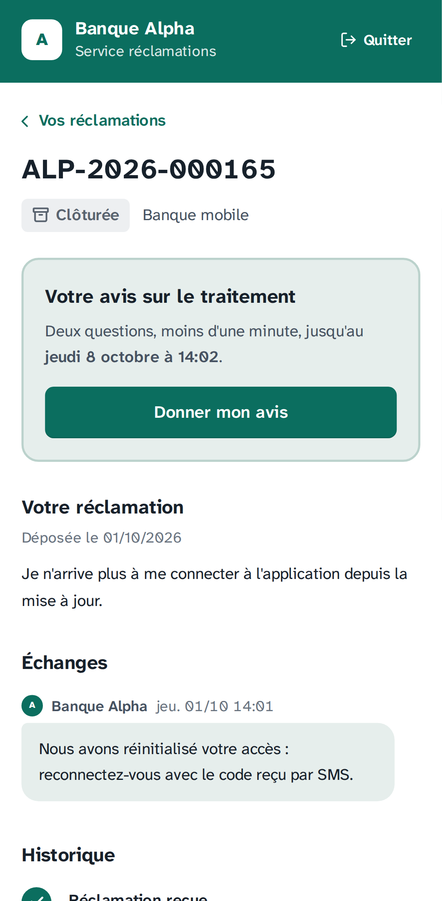
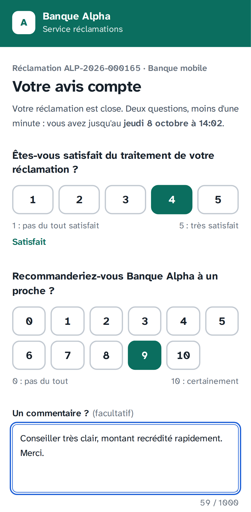
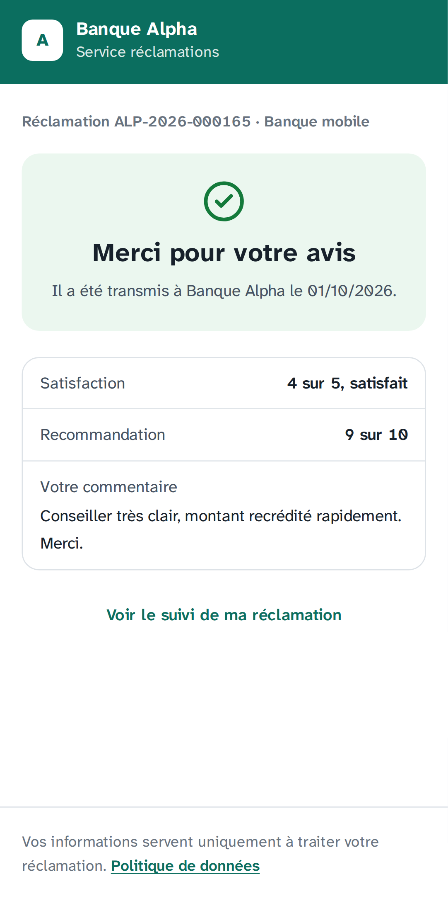
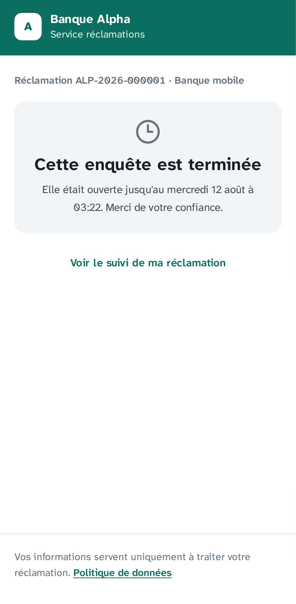
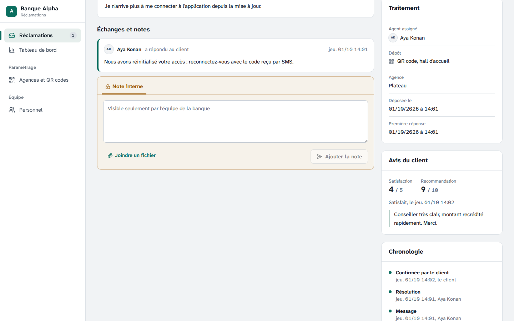
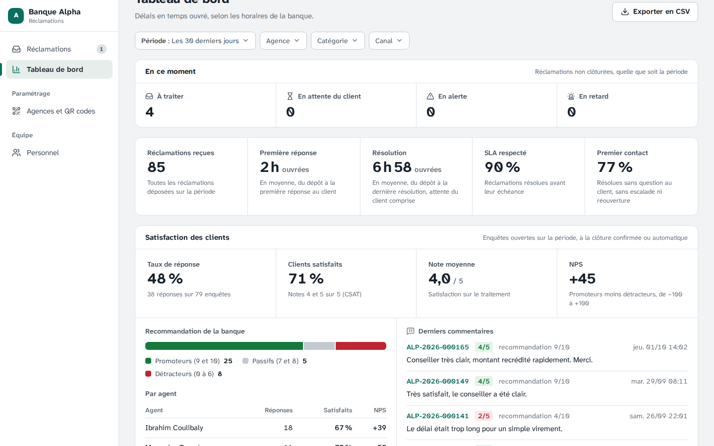
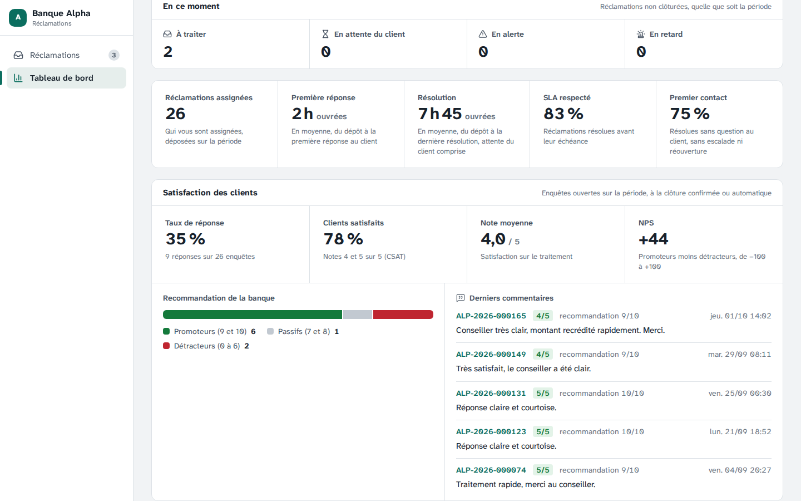
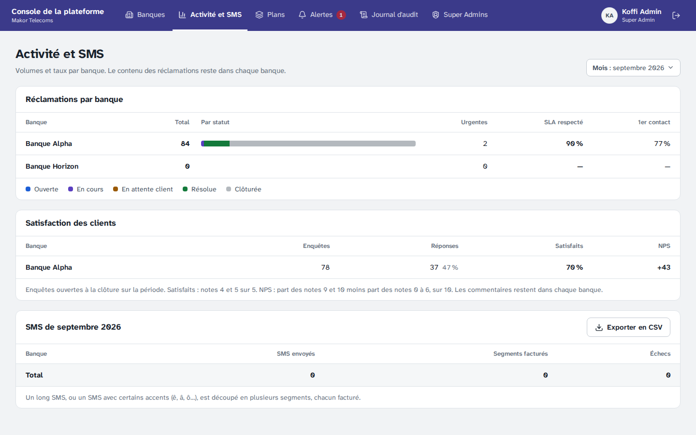
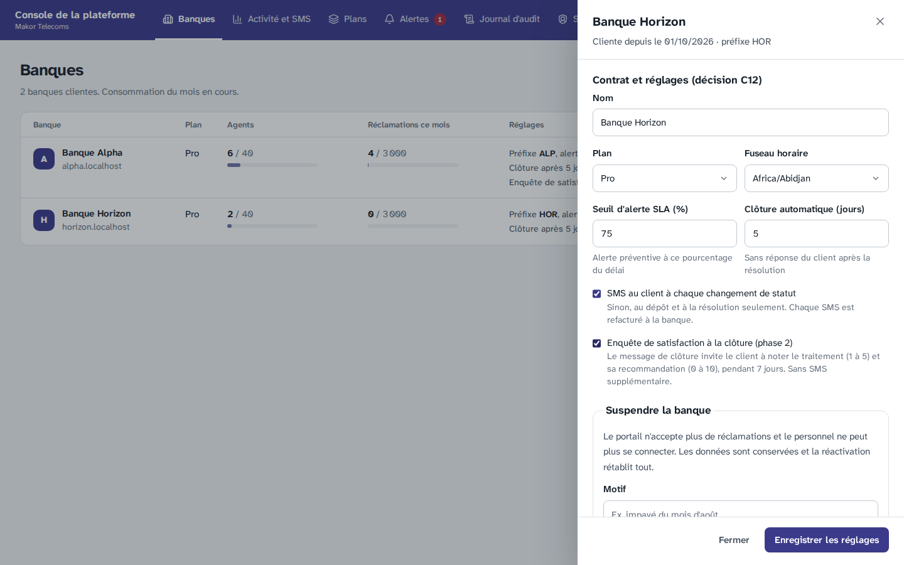

# Étape 15 — Enquêtes de satisfaction (CSAT et NPS) après la clôture

Plateforme de gestion des réclamations · Makor Telecoms · Solution 1
Version du 02/10/2026 · **Statut : validé le 02/10/2026** (décisions Q1 à Q12 retenues telles que proposées).

C'est la première fonction de la phase 2, cadrée à l'étape 14 (décision I9). À la clôture d'une réclamation, le client reçoit le lien d'une enquête courte. La banque suit sa satisfaction au tableau de bord : taux de réponse, clients satisfaits, note moyenne et NPS, par agent, avec les derniers commentaires.

**Rien ne change pour une banque qui ne l'a pas activée.** L'enquête est désactivée par défaut, et le Super Admin l'active banque par banque (décision I2).

Livrables :

- **Base de données.** Migration [`20261001120000_enquetes_satisfaction`](../backend/prisma/migrations/20261001120000_enquetes_satisfaction/migration.sql) :
  - nouvelle table `enquete_satisfaction` et réglage `banque.enquete_satisfaction` ;
  - contraintes et trigger : une seule réponse, rien après 7 jours ;
  - isolation par banque, et colonnes autorisées à chaque rôle.
- **Règles.** [`backend/src/domaine/satisfaction.ts`](../backend/src/domaine/satisfaction.ts) : durée, modes de clôture, catégories du NPS, satisfaits. Le fichier est partagé avec la démo cliquable.
- **Contrat.** [`contrat/openapi.yaml`](../contrat/openapi.yaml) passe à **86 opérations** :
  - `lireAvis` et `donnerAvis` (`/public/suivi/{jetonSuivi}/avis`) ;
  - les champs `avis`, `satisfaction` et `enqueteSatisfaction` ;
  - deux codes d'erreur : `AVIS_DEJA_DONNE` (409) et `ENQUETE_TERMINEE` (422).
- **API.**
  - L'enquête s'ouvre à la clôture, dans la même transaction ([`satisfaction.ts`](../backend/src/application/reclamations/satisfaction.ts), [`cycle-de-vie.ts`](../backend/src/application/reclamations/cycle-de-vie.ts), [`taches-sla.ts`](../backend/src/application/reclamations/taches-sla.ts)).
  - Le message de clôture porte le lien ([`notifications.ts`](../backend/src/application/reclamations/notifications.ts)).
  - Réponse publique : [`public.service.ts`](../backend/src/modules/public/public.service.ts).
  - Indicateurs et export : [`indicateurs.ts`](../backend/src/modules/reporting/indicateurs.ts), [`reporting.controller.ts`](../backend/src/modules/reporting/reporting.controller.ts).
- **Écrans.**
  - Page d'avis du portail : [`Avis.tsx`](../frontend/src/ecrans/portail/Avis.tsx), adresse `/suivi/<jeton>/avis`.
  - Invitation à donner son avis, sur le suivi et dans l'espace client.
  - Bloc « Satisfaction des clients » au [tableau de bord](../frontend/src/ecrans/back-office/TableauDeBord.tsx).
  - Panneau « Avis du client » sur la [fiche](../frontend/src/ecrans/back-office/Ticket.tsx).
  - Réglage de la banque, et totaux par banque dans la [console de la plateforme](../frontend/src/ecrans/plateforme/Activite.tsx).
- **Démo, maquettes et jeu de démonstration.**
  - [Démo cliquable](demo/index.html) : la banque de démonstration a l'enquête, et le SMS de clôture ouvre la page d'avis sur le téléphone.
  - [Maquettes](maquettes/index.html) : nouvel écran « Enquête de satisfaction », en trois états.
  - Jeu de démonstration : enquête activée pour la Banque Alpha, et un client sur deux répond dans son historique.
- **Recette.** Une section « Critères de la phase 2 » s'ajoute au [rapport](recette/rapport.md), avec un critère pour cette étape.

## 1. Le parcours du client

1. **Clôture.** Le client confirme la solution, ou la réclamation se clôt d'elle-même 5 jours après la résolution. L'enquête s'ouvre alors pour 7 jours.
2. **Message de clôture.** Il porte le lien de l'enquête. Il n'y a pas d'envoi de plus.
   - SMS : `Banque Alpha : réclamation ALP-2026-000165 close. Votre avis : https://alpha.<domaine>/suivi/<jeton>/avis` ;
   - e-mail : objet « Réclamation … clôturée : votre avis », avec la date limite.
3. **Page d'avis.** Le lien l'ouvre sans code. Elle pose deux questions :
   - « Êtes-vous satisfait du traitement de votre réclamation ? », de 1 à 5 ;
   - « Recommanderiez-vous Banque Alpha à un proche ? », de 0 à 10.

   Un commentaire est facultatif. Les notes sont de grands boutons (48 px), faciles à toucher et utilisables au clavier. Le bouton d'envoi reste grisé tant que les deux notes manquent.
4. **Après l'envoi.** « Merci pour votre avis », avec le rappel de la réponse. Elle ne se modifie plus : au rechargement, la page montre la même réponse.
5. **Après 7 jours sans réponse.** « Cette enquête est terminée ».

Le suivi public et l'espace client affichent l'invitation « Votre avis sur le traitement », tant que l'enquête est ouverte. Une fois l'avis donné, ils affichent « Merci, votre avis a bien été transmis à la banque ».

## 2. Ce que voit la banque

- **Tableau de bord** (superviseurs et Admin Entreprise) : un bloc « Satisfaction des clients ». Il suit la période et les filtres du tableau de bord (agence, catégorie, canal). Il contient :
  - le taux de réponse ;
  - les clients satisfaits (notes 4 et 5, le CSAT) ;
  - la note moyenne ;
  - le NPS, avec la répartition entre promoteurs, passifs et détracteurs ;
  - un tableau par agent ;
  - les 10 derniers commentaires, dont le numéro ouvre la fiche.
- **Tableau de bord de l'agent** : le même bloc, sur ses réclamations seulement, sans le tableau par agent.
- **Fiche d'une réclamation** : le panneau « Avis du client ». Il montre les deux notes, la date et le commentaire, ou l'état de l'enquête (« en attente de réponse », « sans réponse »).
- **Export CSV** : deux colonnes en fin de ligne, « Satisfaction (1 à 5) » et « Recommandation (0 à 10) », vides sans réponse. Le commentaire n'est jamais exporté.
- **Paramètres de la banque** (Admin Entreprise) : la ligne « Enquête de satisfaction : Oui, à la clôture », en lecture seule, comme les autres réglages du contrat.
- **Journal d'audit** : « Avis du client (enquête) », sans les notes ni le commentaire.

## 3. Ce que voit le Super Admin

- **Banques** : la case « Enquête de satisfaction à la clôture (phase 2) », dans les réglages du contrat de chaque banque, à côté du réglage des SMS.
- **Activité et SMS** : un tableau « Satisfaction des clients » par banque, pour le mois choisi. Il donne les enquêtes, les réponses, les satisfaits et le NPS, **jamais les commentaires** (arbitrage 7). C'est PostgreSQL qui l'impose : le rôle de la plateforme n'a pas le droit de lire la colonne `commentaire`.

## 4. Décisions à valider

| N° | Sujet | Proposition |
|---|---|---|
| Q1 | Activation | **Le Super Admin l'active pour chaque banque**, dans les réglages du contrat, comme les SMS à chaque étape. L'enquête est désactivée par défaut. L'Admin Entreprise voit le réglage sans pouvoir le changer. L'activation vaut pour les clôtures qui suivent. Une désactivation n'ouvre plus d'enquête, mais celles qui sont en cours restent ouvertes jusqu'à leur terme, et leurs résultats restent au tableau de bord |
| Q2 | Quelles clôtures | **Clôture confirmée par le client, ou automatique** (5 jours sans réponse après la résolution). Jamais une clôture forcée : doublon, abus, hors périmètre, où il n'y a pas de traitement à noter. Une seule enquête par réclamation, imposée par la base |
| Q3 | Le lien | **Le lien de suivi, suivi de `/avis`.** Le client y répond sans code à usage unique : il n'a rien à saisir, et un SMS de code coûterait autant que l'enquête. Le lien est aussi privé que celui du suivi. La page ne montre que le numéro, la catégorie et la banque, aucune donnée du client |
| Q4 | Le message | **Le lien part dans le message de clôture, sans SMS de plus** (I9). Le SMS dit « close » plutôt que « clôturée » : le « ô » n'est pas dans l'alphabet GSM et ferait passer le SMS en Unicode, soit 3 segments facturés au lieu d'un. Avec « Banque Alpha » et une adresse en `alpha.reclamations.makortelecoms.com`, le SMS fait 151 caractères : un seul segment. Avec un nom de banque et une adresse beaucoup plus longs, il passe à 2. Une banque qui a désactivé « SMS à chaque étape » n'envoie pas de SMS à la clôture. Le lien part alors par e-mail, et l'invitation reste sur la page de suivi. Depuis la décision du 01/10/2026, le SMS à chaque étape est activé par défaut |
| Q5 | Les questions | Satisfaction sur le traitement, **de 1 à 5** (CSAT), et recommandation de la banque à un proche, **de 0 à 10** (NPS). Un commentaire facultatif de **1 000 caractères** au plus. Les deux notes sont obligatoires. Le texte des questions est le même pour toutes les banques ; un texte propre à chaque banque pourra venir avec le baromètre (étape 20) |
| Q6 | Durée et réponse | **7 jours** à compter de la clôture, fin incluse. **Une seule réponse, qui ne se modifie plus.** L'API répond 409 `AVIS_DEJA_DONNE` à une seconde réponse et 422 `ENQUETE_TERMINEE` après 7 jours. Un trigger PostgreSQL les refuse aussi, même au propriétaire des tables |
| Q7 | Définitions | **Enquêtes de la période** : celles ouvertes pendant la période, donc à la date de clôture, avec les mêmes filtres que les autres indicateurs. **Taux de réponse** : réponses sur enquêtes. **Satisfaits** : notes 4 et 5 sur les réponses. **Note moyenne** : arrondie au dixième. **NPS** : part des notes 9 et 10, moins part des notes 0 à 6, de −100 à +100, arrondi à l'unité. **Par agent** : l'agent assigné à la clôture, pour les agents qui ont au moins une réponse. Le bloc ne s'affiche que si la banque a l'enquête, ou des enquêtes sur la période |
| Q8 | L'agent | Il voit le bloc **sur ses réclamations seulement**, comme le reste de son tableau de bord (étape 11), sans le tableau par agent. Il voit l'avis sur la fiche de ses réclamations |
| Q9 | Export CSV | Les **deux notes** s'ajoutent en fin de ligne, sans changer les colonnes existantes. **Le commentaire n'est pas exporté** : texte libre, il peut contenir des données personnelles, et un fichier CSV circule hors de la plateforme. On le lit sur la fiche et au tableau de bord |
| Q10 | Super Admin | **Des totaux par banque**, jamais un commentaire ni une réponse rattachée à une réclamation (arbitrage 7). C'est la base qui l'impose, par les droits par colonne. Le rôle système (worker, authentification) n'a aucun accès aux enquêtes : l'ouverture se fait dans la transaction de la clôture, au nom de la banque |
| Q11 | Journal d'audit | La réponse s'inscrit au journal (« Avis du client (enquête) »), **sans les notes ni le commentaire**. Le journal ne s'efface jamais, alors qu'un commentaire peut devoir l'être (droit à l'effacement) |
| Q12 | Démonstration | L'enquête est **activée pour la Banque Alpha** dans le jeu de démonstration et dans la démo cliquable. Un client sur deux répond dans les 48 heures, avec des commentaires accordés à sa note. La Banque Horizon reste sans enquête, pour montrer la différence |

## 5. Base de données

- **Table `enquete_satisfaction`.** Une ligne par réclamation close avec enquête :
  - ouverture et fin ;
  - date de la réponse, les deux notes et le commentaire.
- **Contraintes CHECK.**
  - Les notes restent dans leurs bornes.
  - Une réponse est complète (date et deux notes) ou absente.
  - Le commentaire n'est jamais blanc.
  - La fin vient après l'ouverture.
- **Trigger.** Il refuse toute modification d'une réponse donnée, et toute réponse après la fin.
- **Isolation par banque.** La RLS s'applique comme sur les autres tables.
- **Droits par colonne.**
  - Une banque peut lire et créer une enquête, puis n'écrire que les colonnes de la réponse : elle ne peut donc pas repousser la fin.
  - La plateforme lit tout, sauf le commentaire.
  - Le rôle système n'a aucun droit.
- **Vérification de sécurité.** 13 contrôles s'ajoutent à [`verifier-securite.ts`](../backend/scripts/verifier-securite.ts) : isolation, fin non modifiable, réponse figée (même pour le propriétaire), suppression refusée, bornes, commentaire illisible et notes non modifiables pour la plateforme, aucun accès pour le rôle système.

## 6. Contrat

Le contrat passe de 84 à **86 opérations**, toutes dans un nouveau groupe « Satisfaction » :

- `lireAvis` (`GET /public/suivi/{jetonSuivi}/avis`) : 404 sans enquête ;
- `donnerAvis` (`POST`) : 400, 404, 409, 422, et 429 au-delà des limites de débit.

Nouveaux champs :

- `avis` dans le suivi public, dans l'espace client et sur la fiche ;
- `satisfaction` dans les indicateurs de la banque, et par banque dans ceux de la plateforme ;
- `enqueteSatisfaction` dans les paramètres de la banque et dans les banques de la console.

Ces champs sont obligatoires, avec la valeur `null` quand il n'y a pas d'enquête. Seuls le portail et la console appellent ces opérations : aucun programme extérieur n'est touché. La [documentation hors ligne](api/index.html) et les types sont régénérés.

## 7. Tests

| Suite | Ce qui est vérifié |
|---|---|
| Unitaires, backend (180) | Règles : clôtures avec et sans enquête ; 7 jours, fin incluse ; une réponse donnée reste donnée ; normalisation (bornes, commentaire blanc ou trop long) ; catégories du NPS ; calcul du NPS ; bilan d'une liste de réponses |
| Bout en bout (106, dont 12 nouveaux) | Enquête désactivée par défaut : pas d'enquête, pas de lien. Activation par le Super Admin, lue par l'Admin Entreprise. Confirmation : enquête de 7 jours, lien dans le SMS (un segment) et l'e-mail, sur le suivi et dans l'espace client. Réponse unique, commentaire nettoyé, journal sans notes. Refus 400 et 404. Clôture automatique : enquête ; clôture forcée : aucune. Après 7 jours : 422, et le trigger refuse aussi. Tableau de bord sur une catégorie isolée : 3 enquêtes, 2 réponses, taux de réponse 0,6667, satisfaits 0,5, note moyenne 3,5, NPS 0, deux agents, un commentaire. Agent limité à ses réclamations. Pas de bloc sans enquête. Export avec les notes et sans commentaire. Super Admin : totaux sans commentaire |
| Sécurité PostgreSQL (75, dont 13 nouveaux) | Partie 5 |
| Unitaires, frontend (159) | Les données des maquettes sont validées contre le contrat (enquête à donner, donnée, terminée ; suivi d'une réclamation close). Chaque variante de l'écran s'affiche, pour les deux banques. Démo : historique plausible (taux de réponse entre 30 et 70 %, totaux cohérents, agent limité aux siennes), lien dans le SMS de clôture, réponse unique, fin après 7 jours, aucune enquête à une clôture forcée |
| Chromium (6 nouveaux) | Le client confirme sur un téléphone. Le SMS de clôture porte exactement le lien. L'invitation mène au formulaire, utilisable au clavier. La réponse est enregistrée une fois, puis figée au rechargement. Une enquête de plus de 7 jours est terminée. Le superviseur voit l'avis sur la fiche et le bloc au tableau de bord, et le numéro d'un commentaire ouvre la fiche. L'agent n'a pas le tableau par agent. L'Admin Entreprise lit le réglage sans pouvoir le changer. Le Super Admin voit les totaux sans commentaire, et active puis désactive l'enquête de la Banque Horizon |

La [recette automatique](recette/rapport.md) a une nouvelle section, « Critères de la phase 2 ». Le critère 12 y est vérifié par les tests de bout en bout, le test Chromium et les vérifications PostgreSQL. Les 11 critères de la phase 1 restent vérifiés. Le [cahier de recette](recette/cahier-de-recette.md) a la fiche du critère 12, à dérouler sur l'environnement de démonstration et à signer à part de celle du MVP.

### Essai sur le poste Windows (01/10/2026)

Michael a lancé la vérification, les tests Chromium et la recette sur son PC (Docker Desktop). Résultat :
- les 32 tests Chromium passent, dont les 6 de l'enquête ;
- le critère de la phase 2 est vérifié ;
- 12 tests n'ont pas abouti, aucun à cause d'une erreur dans le code : ils ont dépassé leur délai, ou n'ont pas pu démarrer après ce dépassement.

| Suite | Sur le PC | Ici | Ce qui a échoué |
|---|---|---|---|
| Tests unitaires (vérification) | — | 9 s | Le test argon2id (4 calculs de mot de passe) a dépassé 5 s. Au second essai, le 02/10, c'est la génération des types du contrat qui a pris 15 s |
| Vérifications PostgreSQL | 75 s | 10 s | — |
| Bout en bout | 705 s | 107 s | Le dépôt des 1 000 réclamations de mesure a dépassé 5 minutes (critère 10). Trois tests du worker ont dépassé 60 s (critère 6) : ils parcourent toute la base, ces réclamations comprises |
| Chromium | 314 s | 155 s | — |

Ce sont les suites qui écrivent le plus en base qui ralentissent le plus, environ 7 fois. Les autres ralentissent 1,3 à 3 fois. Sous Docker Desktop, chaque validation d'une transaction attend l'écriture sur le disque, et ce disque est lent. Corrections :
- **Bases de test sans attente du disque.** Les bases jetables (bout en bout, vérifications, Chromium, essai de sauvegarde) sont créées avec `synchronous_commit = off`. Une base jetable n'a pas à survivre à une panne de courant. Les règles testées ne changent pas, et la base de développement et la production ne sont pas touchées.
- **Ordre des tests.** Les 1 000 réclamations de mesure sont déposées en avant-dernier, après les tests du worker : ceux-ci passent ici de 22 s à 3,5 s.
- **Délais.** 60 s par test unitaire au lieu de 5 s, au backend comme au frontend. 180 s par test de bout en bout au lieu de 60 s, et 20 minutes pour le dépôt des 1 000 réclamations.

**Troisième essai (02/10/2026).** Les tests de bout en bout passent de 705 s à 243 s, et les 7 autres mesures du critère 10 restent sous la seconde (169 ms au p95 pour le tableau de bord sur un an, par exemple). Un seul test échoue : pendant la mesure de l'export CSV, une requête est coupée par une réinitialisation de connexion (ECONNRESET), avant toute réponse de l'API.

La cause probable : l'API fermait ses connexions inactives après 5 s, le réglage par défaut de Node. Un client qui réutilise une connexion à ce moment-là voit sa requête échouer. En production, le client de l'API est Caddy, qui garde ses connexions jusqu'à 2 minutes : l'utilisateur aurait vu de temps en temps une erreur 502. Corrections :
- l'API garde ses connexions inactives **65 s** (`keepAliveTimeout`, dans [`app.module.ts`](../backend/src/app.module.ts)) ;
- Caddy garde les siennes **30 s** au plus ([`commun.caddy`](../docker/caddy/commun.caddy)). Il ferme donc toujours une connexion avant l'API ;
- les tests de bout en bout affichent les erreurs de l'API. Si une coupure revient, sa cause s'affichera avec elle.

Le seuil du critère 10 ne change pas : moins d'une seconde par opération. Sur un poste lent, il peut ne pas être tenu ; la mesure qui compte se fait sur le serveur de démonstration (cahier de recette, critère 10).

## 8. Captures

Le client, sur un téléphone. Après sa confirmation, l'espace client l'invite à donner son avis :

Le formulaire, avec ses deux questions et le commentaire facultatif :

Après l'envoi :

Et 7 jours passés sans réponse :

La banque. L'avis sur la fiche de la réclamation :

Le tableau de bord du superviseur, sur les 30 derniers jours de l'historique de démonstration :

Celui de l'agent, limité à ses réclamations :

La plateforme. Totaux par banque, sans commentaire :

Activation pour une banque :

## 9. Ce qui ne change pas

- **Une banque sans enquête** garde exactement le même message de clôture, le même tableau de bord et le même export, aux deux colonnes vides près.
- **Le SMS reste facturé de la même façon.** L'enquête ne fait partir aucun message de plus.
- **Pas de nouvelle variable d'environnement, pas de nouveau service.** Pour une installation existante, la mise à jour applique la migration (`deploiement/mettre-a-jour.sh`). Les sauvegardes protégées couvrent la nouvelle table.

## 10. Suite

Suite : [étape 16, attribution et escalade automatiques](etape-16-attribution-escalade.md) (décision I10) : groupes d'agents par catégorie et par agence, attribution à l'agent disponible le moins chargé, escalade à plusieurs niveaux.
