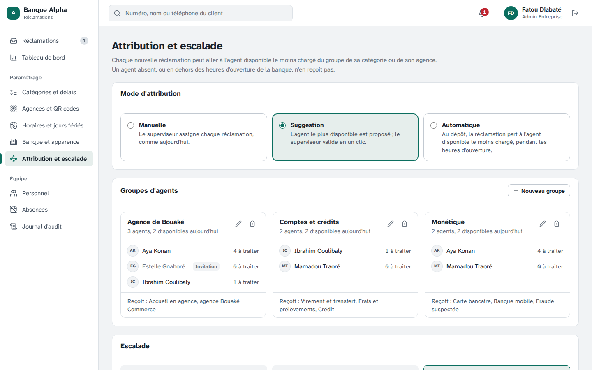
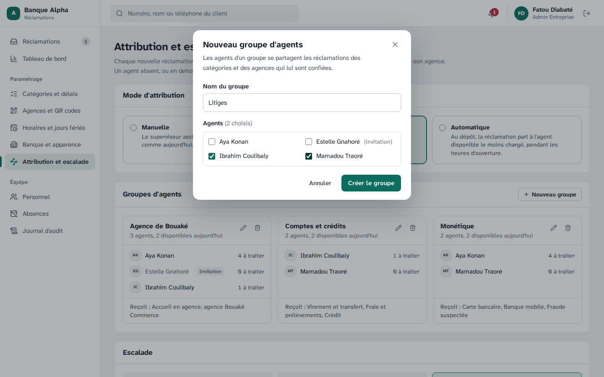
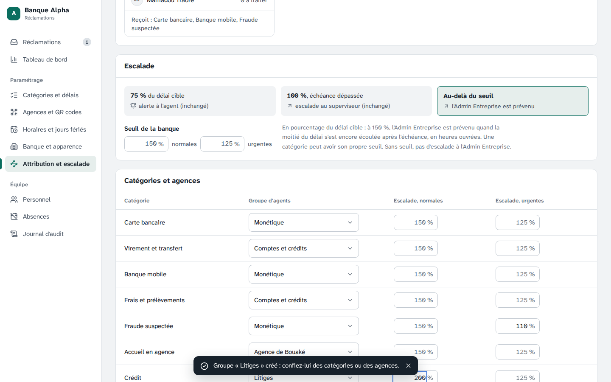
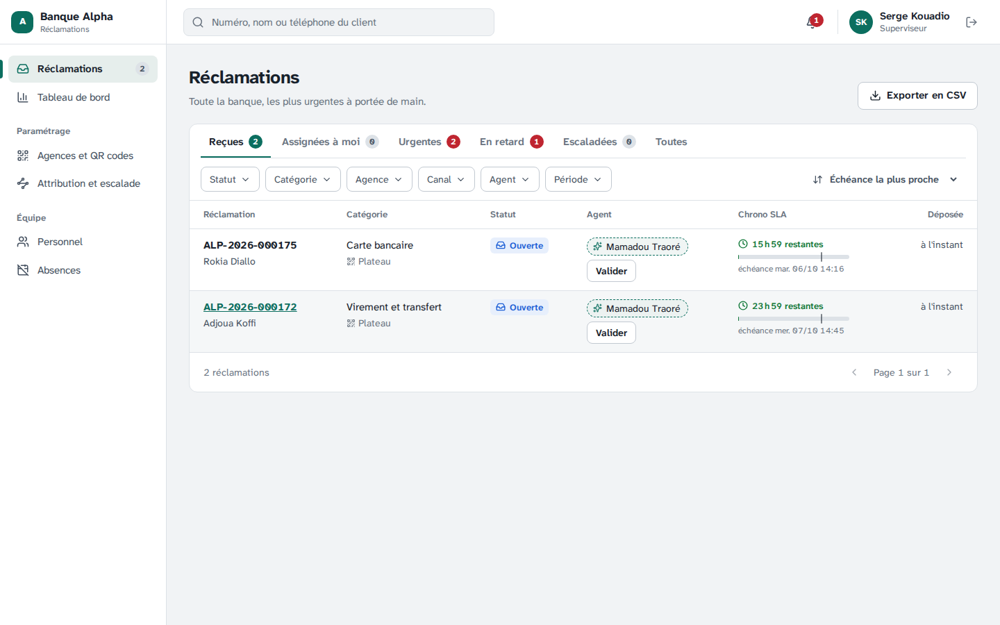
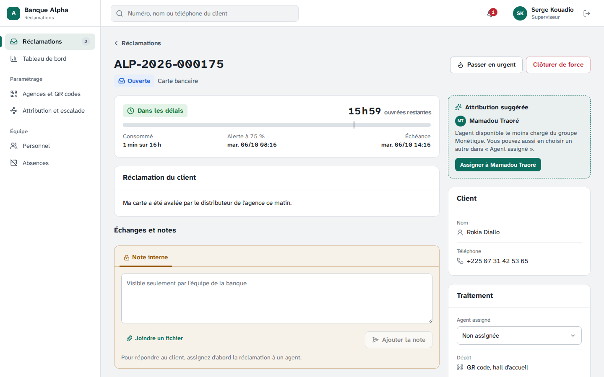
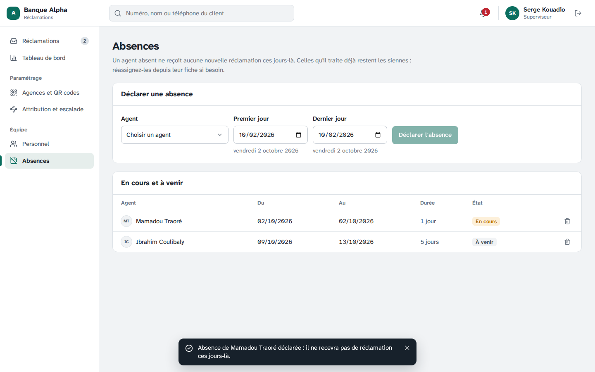
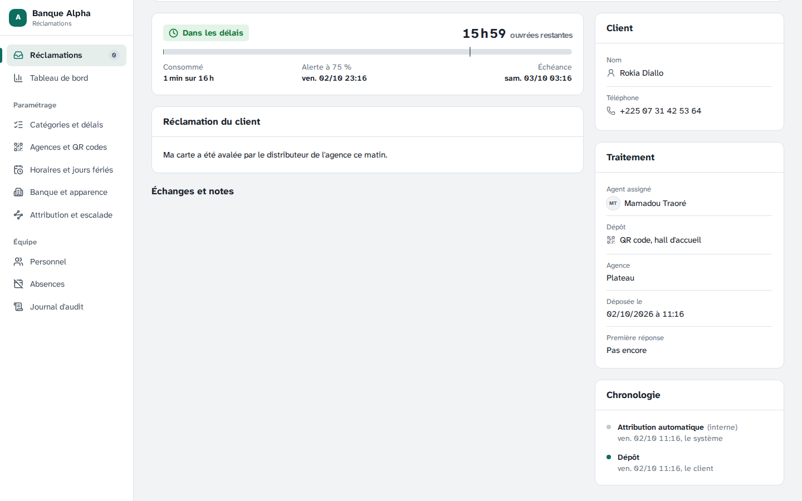
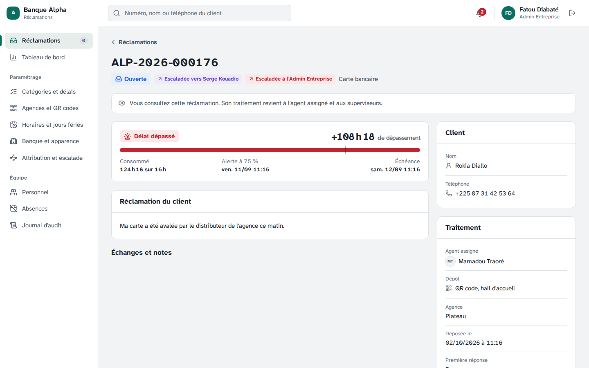
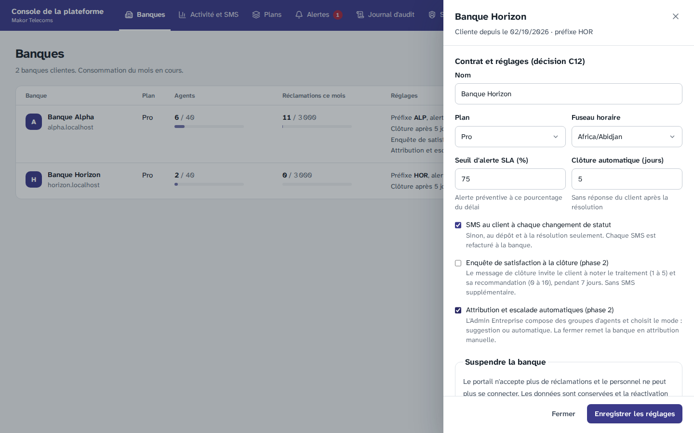

# Étape 16 — Attribution et escalade automatiques

Plateforme de gestion des réclamations · Makor Telecoms · Solution 1
Version du 02/10/2026 · **Statut : validé le 02/10/2026** (décisions T1 à T12 retenues telles que proposées).

C'est la deuxième fonction de la phase 2, cadrée à l'étape 14 (décision I10). L'Admin Entreprise confie chaque catégorie et chaque agence à un **groupe d'agents**. Une nouvelle réclamation va à **l'agent disponible le moins chargé** du groupe : directement (mode automatique), ou sur proposition validée par le superviseur (mode suggestion). Un agent absent, ou en dehors des heures d'ouverture de la banque, ne reçoit rien. Sans agent disponible, la réclamation reste dans la file « Reçues » du superviseur, comme aujourd'hui. **L'escalade gagne un second niveau** : au-delà d'un seuil réglable, l'Admin Entreprise est prévenu. L'alerte à 75 % et l'escalade au superviseur à l'échéance ne changent pas.

**Rien ne change pour une banque qui ne l'a pas activée.** La fonction est fermée par défaut ; le Super Admin l'ouvre banque par banque (décision I2), l'Admin Entreprise la règle.

Livrables :

- **Base de données.** Migration [`20261002120000_attribution_escalade`](../backend/prisma/migrations/20261002120000_attribution_escalade/migration.sql) :
  - trois tables : `groupe_agents`, `groupe_agents_membre`, `absence_agent` ;
  - le mode d'attribution et les seuils de la banque, le groupe et les seuils de chaque catégorie, le groupe de chaque agence ;
  - la date de dernière attribution de chaque agent, la date d'escalade à l'Admin Entreprise de chaque réclamation ;
  - contraintes, isolation par banque et droits par colonne.
- **Règles.** Code pur, partagé avec la démo cliquable :
  - [`domaine/attribution.ts`](../backend/src/domaine/attribution.ts) : groupes candidats, agent le plus disponible, absences ;
  - [`domaine/reclamation/escalade.ts`](../backend/src/domaine/reclamation/escalade.ts) : seuil applicable, instant du second niveau ;
  - [`domaine/temps-ouvre/calendrier.ts`](../backend/src/domaine/temps-ouvre/calendrier.ts) : prochain instant ouvré, date locale.
- **Contrat.** [`contrat/openapi.yaml`](../contrat/openapi.yaml) passe de 86 à **95 opérations**, dans un nouveau groupe « Attribution » (partie 7).
- **API et worker.**
  - Attribution au dépôt, dans la même transaction : [`cycle-de-vie.ts`](../backend/src/application/reclamations/cycle-de-vie.ts), avec [`application/reclamations/attribution.ts`](../backend/src/application/reclamations/attribution.ts) (charge, absences, disponibilité).
  - Suggestion calculée à la lecture des files et de la fiche : [`lecture.ts`](../backend/src/modules/reclamations/lecture.ts).
  - Règles, groupes et absences : [`modules/attribution/`](../backend/src/modules/attribution/attribution.service.ts).
  - Deux tâches du worker, chaque minute : attribution des réclamations en attente, escalade à l'Admin Entreprise ([`taches-sla.ts`](../backend/src/application/reclamations/taches-sla.ts)).
  - Ouverture et fermeture par le Super Admin : [`plateforme.service.ts`](../backend/src/modules/plateforme/plateforme.service.ts).
- **Écrans.**
  - Page « Attribution et escalade » : [`Attribution.tsx`](../frontend/src/ecrans/back-office/Attribution.tsx).
  - Page « Absences » : [`Absences.tsx`](../frontend/src/ecrans/back-office/Absences.tsx).
  - Agent proposé dans la [file](../frontend/src/ecrans/back-office/Files.tsx) et sur la [fiche](../frontend/src/ecrans/back-office/Ticket.tsx), avec l'escalade à l'Admin Entreprise.
  - Réglage de la banque, et case du Super Admin dans la [console de la plateforme](../frontend/src/ecrans/plateforme/Banques.tsx).
- **Démo, maquettes et jeu de démonstration.**
  - [Démo cliquable](demo/index.html) : mode suggestion, groupes et absences de la banque de démonstration ; l'Admin Entreprise peut passer en mode automatique ; escalade à l'Admin Entreprise quand on avance l'horloge.
  - [Maquettes](maquettes/index.html) : trois écrans de plus (« Attribution et escalade », « Absences », « Fiche à assigner, agent suggéré »).
  - Jeu de démonstration : fonction ouverte pour la Banque Alpha, en mode suggestion, avec trois groupes.
- **Recette.** Critère 13 dans la section « Critères de la phase 2 » du [rapport](recette/rapport.md), et sa fiche dans le [cahier de recette](recette/cahier-de-recette.md).
- **Outil.** [`scripts/taches.ts`](../backend/scripts/taches.ts) lance un passage des tâches du worker à la demande (tests Chromium, dépannage).

## 1. Ce que règle l'Admin Entreprise

Page **Paramétrage › Attribution et escalade**, offerte quand Makor a ouvert la fonction :

1. **Le mode d'attribution**, en un clic :
   - **Manuelle** : le superviseur assigne chaque réclamation, comme en phase 1. C'est le mode de départ ;
   - **Suggestion** : l'agent le plus disponible est proposé, le superviseur valide ;
   - **Automatique** : au dépôt, la réclamation part à l'agent disponible le moins chargé, pendant les heures d'ouverture.
2. **Les groupes d'agents.** Chaque groupe a un nom et ses agents. Sa carte montre, pour chaque agent, sa charge (réclamations ouvertes ou en cours), et s'il est absent aujourd'hui ou pas encore inscrit. Elle dit aussi ce que le groupe reçoit. Un agent peut appartenir à plusieurs groupes.
3. **Les catégories et les agences.** Un tableau donne le groupe de chaque catégorie et de chaque agence, et le seuil d'escalade de chaque catégorie.
4. **L'escalade.** Le seuil de la banque, pour les réclamations normales et pour les urgentes. Une catégorie peut avoir le sien.

Le superviseur voit la même page en lecture : il y suit la charge et les absences de chaque groupe.

## 2. Ce que voit le superviseur

- **Mode suggestion.**
  - Dans la file « Reçues », chaque réclamation non assignée montre l'agent proposé, avec un bouton **Valider** qui l'assigne sans ouvrir la fiche.
  - Sur la fiche, l'encadré **Attribution suggérée** donne l'agent, son groupe, et le bouton **Assigner à …**. Le superviseur peut toujours choisir un autre agent dans « Agent assigné ».
- **Absences** (page **Équipe › Absences**, superviseurs et Admin Entreprise) : un agent, un premier et un dernier jour. Un agent absent n'est ni proposé ni attribué ces jours-là.
- **Mode automatique** : la file « Reçues » ne garde que les réclamations sans agent disponible, ou déposées hors des heures d'ouverture.

## 3. Le mode automatique

1. **Au dépôt**, pendant les heures d'ouverture de la banque, la réclamation part à l'agent disponible le moins chargé, dans la transaction du dépôt.
2. L'agent reçoit la notification « … vous est assignée » (e-mail et in-app). Pour une réclamation urgente, l'alerte part à l'agent, à **son** superviseur, aux Admin Entreprise et au Super Admin (sans agent, elle part à tous les superviseurs, comme avant).
3. La chronologie montre « **Attribution automatique** », par le système, invisible du client. Le journal d'audit garde l'agent et le groupe.
4. **Sans agent disponible**, ou **hors des heures d'ouverture**, la réclamation attend dans « Reçues ». Le worker réessaie chaque minute, les plus anciennes d'abord. Une réclamation déposée la nuit part donc à l'ouverture, à l'agent le moins chargé à ce moment-là.

## 4. L'escalade à plusieurs niveaux

| Moment | Qui est prévenu | Depuis |
|---|---|---|
| 75 % du délai cible | l'agent (ou les superviseurs, sans agent) | étape 4, inchangé |
| Échéance dépassée | l'agent et son superviseur ; la réclamation est escaladée au superviseur | étape 4, inchangé |
| Au-delà du seuil, par exemple 150 % | **tous les Admin Entreprise** de la banque, une fois (e-mail et in-app) | étape 16 |

Le seuil est un pourcentage du délai cible : à 150 %, l'Admin Entreprise est prévenu quand la moitié du délai s'est encore écoulée après l'échéance, en minutes ouvrées. Pour une réclamation « Carte bancaire » (16 h ouvrées), c'est 8 h ouvrées après l'échéance.

La fiche porte alors le badge « Escaladée à l'Admin Entreprise », avec la date dans le panneau « Traitement ». La chronologie montre « Escalade à l'Admin Entreprise ». La notification s'intitule « ALP-… : retard important ».

## 5. Décisions à valider

| N° | Sujet | Proposition |
|---|---|---|
| T1 | Activation | **Le Super Admin ouvre la fonction pour chaque banque**, dans les réglages du contrat (case « Attribution et escalade automatiques »), comme l'enquête. Elle est fermée par défaut. Ouverte, la banque reste en **mode manuel** jusqu'au choix de l'Admin Entreprise. Fermée, la banque revient au mode manuel, sans second niveau d'escalade. Ses groupes et ses absences sont conservés pour une réouverture. Les pages « Attribution et escalade » et « Absences » n'apparaissent que si la fonction est ouverte, et l'API répond 403 `FONCTION_NON_OUVERTE` sinon |
| T2 | Groupes | Un groupe a un nom unique et des **agents** : rôle Agent, compte actif ou invité. Un agent invité ou désactivé reste dans son groupe, mais ne reçoit rien. Un agent peut appartenir à plusieurs groupes. Une catégorie, comme une agence, a **au plus un groupe**. Supprimer un groupe libère ses catégories et ses agences ; leurs nouvelles réclamations restent dans la file du superviseur. Les réclamations déjà assignées ne bougent jamais |
| T3 | Ordre des groupes | Quand la catégorie et l'agence ont chacune un groupe : d'abord **les agents des deux groupes**, puis le groupe de la **catégorie** (la spécialité d'abord), puis celui de l'**agence**. Sans groupe, ou sans agent disponible : la file « Reçues » |
| T4 | Le moins chargé | La charge est celle de l'étape 11 : les réclamations **ouvertes ou en cours** de l'agent. Celles en attente du client ne comptent pas : l'agent ne peut rien y faire. À égalité, **celui qui a reçu une réclamation le moins récemment**, assignée à la main ou automatiquement. Puis l'ordre alphabétique |
| T5 | Disponible | Compte actif, rôle Agent, **pas absent le jour du traitement**. Il n'y a pas d'horaires propres à chaque agent : ce sont ceux de la banque. En mode automatique, rien n'est attribué hors des heures d'ouverture : personne n'est prévenu la nuit, et la répartition se fait à l'ouverture sur la charge du moment. En mode suggestion, hors des heures d'ouverture, la proposition vaut pour le prochain jour ouvré |
| T6 | Absences | Déclarées par **le superviseur ou l'Admin Entreprise**, pour tout agent de la banque (un superviseur peut remplacer un collègue). Des journées entières, dans le fuseau de la banque, fin incluse, **un an au plus**, jamais dans le passé. **Pas de motif** : la cause d'une absence (maladie, congé) ne regarde pas l'outil. Une absence se retire et se redéclare ; elle ne se modifie pas. Les réclamations que l'agent traite déjà restent les siennes : le superviseur les réassigne s'il le faut |
| T7 | Suggestion | Montrée **au superviseur seulement**, qui assigne : dans la file et sur la fiche. L'Admin Entreprise ne la voit pas. Elle est calculée à chaque lecture, jamais enregistrée : elle suit la charge et les absences du moment. Deux réclamations lues ensemble peuvent proposer le même agent ; après chaque validation, la file se met à jour |
| T8 | Traçabilité | Une attribution automatique est un événement « Assignation » du système, invisible du client, affiché « Attribution automatique » sur la fiche. Le journal d'audit garde l'agent et le groupe (« Attribution automatique »). Créer, modifier ou supprimer un groupe, changer les règles, déclarer ou retirer une absence s'inscrivent aussi au journal |
| T9 | Seuil d'escalade | En **pourcentage du délai cible**, de 101 à 1000 %, compté en minutes ouvrées après l'échéance. Le seuil de la catégorie l'emporte sur celui de la banque. Une réclamation urgente prend d'abord le seuil urgent de sa catégorie, puis celui de la banque, puis le seuil normal. **Sans seuil nulle part, pas de second niveau.** Une réclamation en attente du client n'est pas escaladée pendant la pause, comme pour les alertes |
| T10 | Second niveau | **Tous les Admin Entreprise actifs** de la banque sont prévenus, une seule fois par réclamation, par e-mail et in-app. La réclamation reste escaladée à son superviseur : l'Admin Entreprise est prévenu, il ne la traite pas. Le Super Admin n'est pas prévenu (arbitrage 7) |
| T11 | Réglages de départ | À l'ouverture : mode manuel, aucun groupe, aucun seuil. L'Admin Entreprise choisit. Proposition pour une banque pilote : seuil de **150 %** pour les réclamations normales, **125 %** pour les urgentes |
| T12 | Démonstration | Fonction **ouverte pour la Banque Alpha**, en **mode suggestion** (jeu de démonstration et démo cliquable). Trois groupes : Monétique (carte, banque mobile, fraude), Comptes et crédits (virement, frais, crédit), Agence de Bouaké (accueil en agence, et l'agence de Bouaké). Seuils de 150 % et 125 %, 110 % pour la fraude urgente. Ibrahim est absent dans une semaine. La Banque Horizon reste fermée, pour montrer la différence |

## 6. Base de données

- **Tables.**
  - `groupe_agents` : un nom unique par banque ;
  - `groupe_agents_membre` : les agents de chaque groupe ;
  - `absence_agent` : un agent, un premier et un dernier jour, sans motif.
- **Colonnes nouvelles.**
  - `banque` : `attribution_automatique` (ouverture par le Super Admin), `mode_attribution`, seuils d'escalade normal et urgent ;
  - `categorie` : groupe et seuils ; `agence` : groupe ;
  - `utilisateur` : date de la dernière attribution (départage) ;
  - `reclamation` : date de l'escalade à l'Admin Entreprise.
- **Clés étrangères par banque.** Un groupe, un membre, une absence, le groupe d'une catégorie ou d'une agence ne peuvent désigner que la même banque : les clés portent sur le couple (banque, identifiant).
- **Contraintes CHECK.**
  - Un mode autre que manuel exige la fonction ouverte.
  - Les seuils restent entre 101 et 1000 %.
  - Un nom de groupe n'est jamais blanc.
  - Une absence finit après avoir commencé et dure un an au plus.
  - Une escalade à l'Admin Entreprise suppose un dépassement déjà signalé.
- **Isolation et droits par colonne.**
  - La RLS s'applique aux trois tables comme aux autres.
  - Une banque gère ses groupes et ses absences ; une absence ne se modifie pas.
  - L'Admin Entreprise peut écrire le mode et les seuils, **jamais** l'ouverture de la fonction, réservée au rôle de la plateforme.
  - La plateforme et le rôle système n'ont aucun accès aux groupes ni aux absences.
- **Vérification de sécurité.** 17 contrôles s'ajoutent à [`verifier-securite.ts`](../backend/scripts/verifier-securite.ts) : isolation, clés étrangères par banque, absence non modifiable, bornes, ouverture réservée au Super Admin, aucun accès pour la plateforme et le rôle système.

## 7. Contrat

Le contrat passe de 86 à **95 opérations**, dans un nouveau groupe « Attribution » :

| Opération | Chemin | Rôles |
|---|---|---|
| `lireReglesTraitement` | `GET /banque/parametres/traitement` | superviseur, Admin Entreprise |
| `modifierReglesTraitement` | `PATCH /banque/parametres/traitement` | Admin Entreprise |
| `listerGroupes` | `GET /banque/groupes` | superviseur, Admin Entreprise |
| `creerGroupe` | `POST /banque/groupes` | Admin Entreprise |
| `modifierGroupe` | `PATCH /banque/groupes/{id}` | Admin Entreprise |
| `supprimerGroupe` | `DELETE /banque/groupes/{id}` | Admin Entreprise |
| `listerAbsences` | `GET /banque/absences` | superviseur, Admin Entreprise |
| `ajouterAbsence` | `POST /banque/absences` | superviseur, Admin Entreprise |
| `supprimerAbsence` | `DELETE /banque/absences/{id}` | superviseur, Admin Entreprise |

Nouveaux champs, obligatoires (`null` quand ils ne s'appliquent pas) :

- `agentSuggere` dans les files, `attributionSuggeree` sur la fiche ;
- `jalons.escaladeeAdminLe` sur la fiche ;
- `attributionAutomatique` et `modeAttribution` dans les paramètres de la banque ; `attributionAutomatique` dans les banques de la console et leur modification.

Un type d'événement (`ESCALADE_ADMIN`) et trois codes d'erreur : `FONCTION_NON_OUVERTE` (403), `GROUPE_INVALIDE` et `ABSENCE_INVALIDE` (422). Seuls le portail et la console appellent ces opérations : aucun programme extérieur n'est touché. La [documentation hors ligne](api/index.html) et les types sont régénérés.

## 8. Tests

| Suite | Ce qui est vérifié |
|---|---|
| Unitaires, backend (190, dont 10 nouveaux) | Ordre des groupes (intersection, catégorie, agence) ; le moins chargé et ses départages ; agents absents ou indisponibles ; absence fin incluse ; seuil applicable selon la priorité, la catégorie et la banque ; instant du second niveau en minutes ouvrées ; prochain instant ouvré et date locale ; énumérations identiques au modèle |
| Bout en bout (126, dont 20 nouveaux) | Fonction fermée par défaut : 403 `FONCTION_NON_OUVERTE`, pas de suggestion. Ouverture par le Super Admin. Groupes : agents seulement, de la même banque, nom unique, modification, suppression qui libère catégories et agences. Règles : groupes inconnus refusés, catégories non citées inchangées, seuils bornés, droits par rôle. Suggestion : au superviseur seulement, conforme à la règle, disparaît à l'assignation, date de dernière attribution mise à jour. Absences : l'agent absent n'est pas proposé, contrôles des dates et de l'agent. Automatique : au dépôt, événement du système, notification, journal ; intersection des groupes ; répartition sur plusieurs dépôts ; alerte urgente à l'agent attribué ; sans agent disponible, attente puis reprise par le worker ; la nuit, rien, puis attribution à l'ouverture. Escalade : superviseur à l'échéance, Admin Entreprise au seuil de 150 % et pas avant, une seule fois ; seuil urgent de la catégorie (110 %) ; sans seuil, rien. Fermeture : retour au mode manuel, groupes conservés |
| Sécurité PostgreSQL (92, dont 17 nouveaux) | Partie 6 |
| Unitaires, frontend (174, dont 15 nouveaux) | Les données des maquettes sont validées contre le contrat (règles, groupes, absences, fiche à assigner) ; la fiche à assigner suit la machine d'états ; chaque nouvel écran s'affiche pour les deux banques. Démo : réponses conformes au contrat, suggestion au superviseur seulement et jamais un absent, mode automatique pendant les heures d'ouverture seulement, escalade à l'Admin Entreprise à 150 %, une fois |
| Chromium (38, dont 6 nouveaux) | L'Admin Entreprise crée un groupe, lui confie une catégorie avec son seuil, le supprime. Le superviseur voit l'agent proposé dans la file et sur la fiche ; une absence change la proposition ; il valide depuis la fiche et depuis la file. En mode automatique, la réclamation déposée sur le portail est assignée, et la chronologie le dit. Après un passage du worker, l'Admin Entreprise reçoit la notification et la fiche porte l'escalade. Le Super Admin ouvre et referme la fonction pour une banque. Fonction fermée : ni page ni réglage ouvert |

Le test Chromium du mode automatique ouvre la Banque Alpha à toute heure le temps du test, puis lui rend ses horaires : il passe donc la nuit comme le jour. Le comportement hors des heures d'ouverture est vérifié par les tests de bout en bout, dont l'horloge est pilotée.

### Essai sur le poste Windows (02/10/2026)

Michael a lancé la recette complète sur son PC (Docker Desktop) : **11 critères sur 11, les 2 critères de la phase 2, toutes les suites passent**, en 18 minutes environ.

| Suite | Sur le PC | Ici |
|---|---|---|
| Tests unitaires (backend, frontend) | 16 s, 12 s | 10 s, 11 s |
| Vérifications PostgreSQL | 55 s | 9 s |
| Bout en bout (126 tests) | 308 s | 138 s |
| Chromium (38 tests) | 356 s | 233 s |
| Sauvegarde et restauration | 228 s | 43 s |

Juste avant, `docker compose up -d` (après `docker compose down -v`) s'est arrêté : Docker Desktop a répondu « 500 Internal Server Error » en démarrant PostgreSQL. C'est une erreur du moteur Docker, pas du projet : PostgreSQL tournait juste après, et la recette l'a utilisé. Il suffit de relancer `docker compose up -d` ; si l'erreur revient, de redémarrer Docker Desktop.

L'avertissement `EBADENGINE` de l'installation est sans effet : l'image Playwright 1.56.0 des tests a Node.js 22.20, et `react-router` 8.4 demande 22.22. Les écrans se construisent et leurs 212 tests passent avec cette version.

Les tests de bout en bout de cette étape déposent leurs réclamations à une date passée (septembre 2026), avec l'horloge pilotée. Pour cela, l'API vérifie maintenant l'expiration des sessions avec sa propre horloge, comme la signature des jetons ; en production, c'est l'heure du serveur, rien ne change.

La [recette automatique](recette/rapport.md) vérifie le critère 13 par les tests de bout en bout, le test Chromium et les vérifications PostgreSQL. Elle passe en 8 minutes : les 11 critères de la phase 1, les 2 de la phase 2, 528 tests sur 528. Le [cahier de recette](recette/cahier-de-recette.md) a la fiche du critère 13, à signer à part de celle du MVP.

## 9. Captures

L'Admin Entreprise : le mode, puis les groupes, avec la charge et les absences de chaque agent.

Un nouveau groupe :

Les seuils d'escalade, et le groupe de chaque catégorie. Les seuils hérités de la banque sont en gris :

Le superviseur, en mode suggestion. Dans la file :

Sur la fiche :

Les absences :

Le mode automatique : la réclamation est assignée au dépôt, par le système.

Le second niveau d'escalade, vu par l'Admin Entreprise :

L'ouverture par le Super Admin :

## 10. Ce qui ne change pas

- **Une banque où la fonction est fermée** garde exactement le même fonctionnement : assignation par le superviseur, alertes à 75 % et escalade au superviseur à l'échéance.
- **Le superviseur garde la main** dans tous les modes : il peut toujours réassigner une réclamation.
- **Aucun message de plus au client.** L'attribution et l'escalade ne concernent que le personnel.
- **Pas de nouvelle variable d'environnement, pas de nouveau service.** Pour une installation existante, la mise à jour applique la migration (`deploiement/mettre-a-jour.sh`). Le worker existant fait les deux nouvelles tâches. Les sauvegardes protégées couvrent les nouvelles tables.

## 11. Suite

Suite : [étape 17, conversations et chat web](etape-17-conversations-chat-web.md) (décision I1) : un modèle de conversation commun à tous les canaux, le chat web sur le portail et la boîte de réception des agents.
