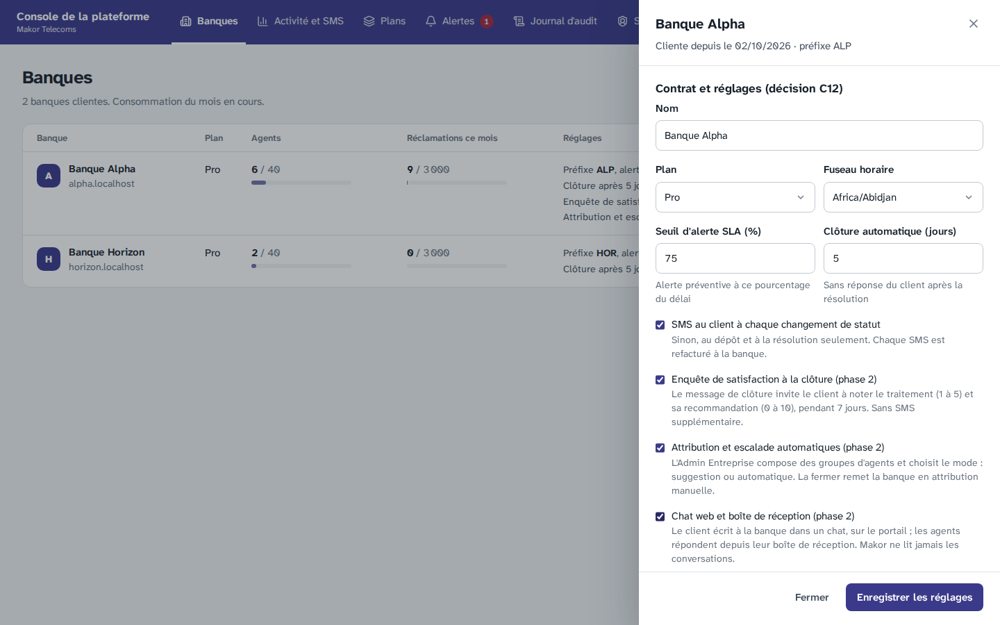
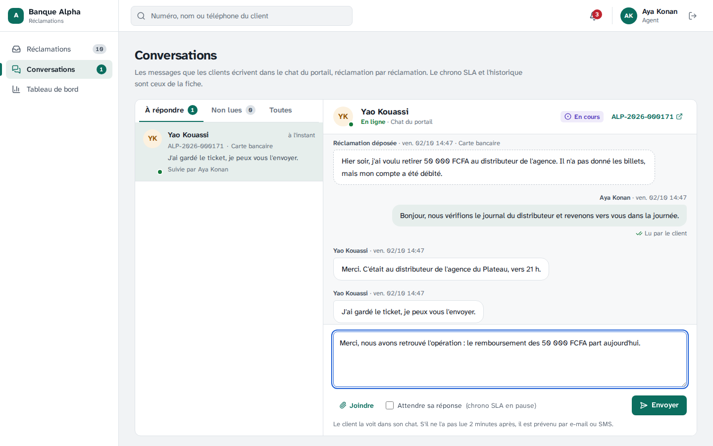
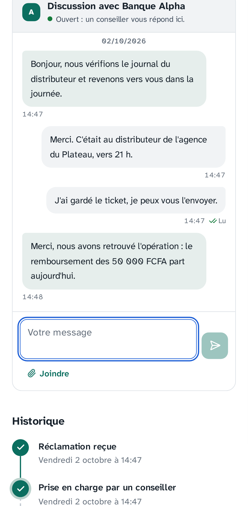
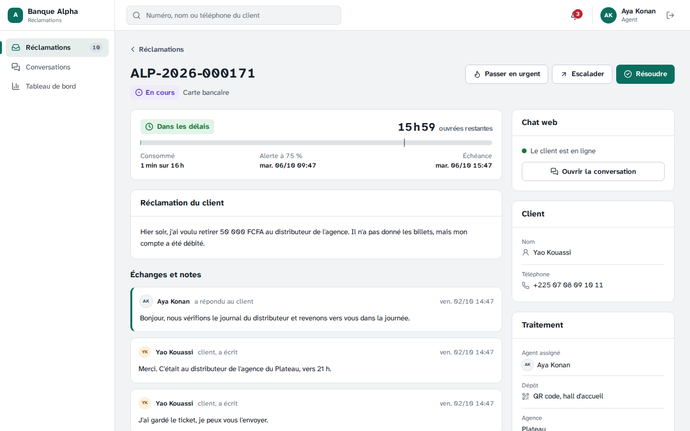
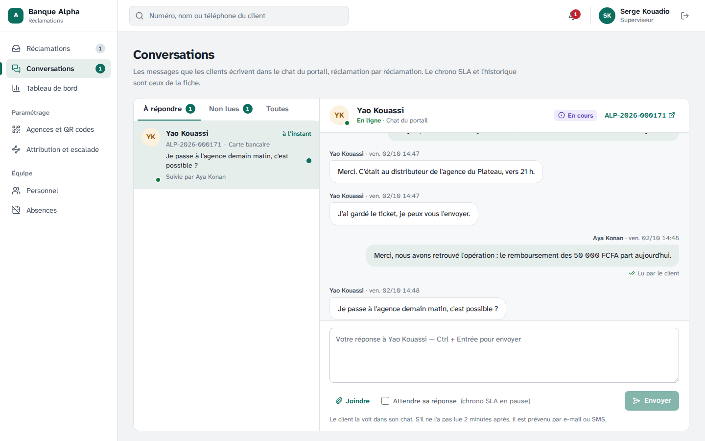

# Étape 17 — Conversations et chat web

Plateforme de gestion des réclamations · Makor Telecoms · Solution 1
Version du 02/10/2026 · **Statut : en attente de validation** (décisions U1 à U13).

C'est la troisième fonction de la phase 2, cadrée à l'étape 14 (décisions I1 et I8). Elle pose **le modèle de conversation commun à tous les canaux** : une conversation par réclamation, que l'assistant (étape 18), WhatsApp et le SMS entrant (étape 19) reprendront. Elle ouvre le premier canal : **le chat web**, intégré au portail de la banque. Le client, identifié comme aujourd'hui par son lien de suivi et son code, écrit à la banque et voit les réponses arriver sans recharger la page. Les agents répondent depuis une **boîte de réception**.

**Rien ne change pour une banque qui ne l'a pas activée.** Le chat est fermé par défaut ; le Super Admin l'ouvre banque par banque (décision I2). Fermé, l'espace client garde son fil « Échanges » de la phase 1.

Livrables :

- **Base de données.** Migration [`20261003120000_conversations_chat_web`](../backend/prisma/migrations/20261003120000_conversations_chat_web/migration.sql) :
  - une table `conversation`, une par réclamation, avec son canal, l'heure du dernier message de chaque côté, les marques de lecture et l'heure du dernier avis ;
  - l'ouverture du chat pour chaque banque (`banque.chat_web`) ;
  - isolation par banque, droits par colonne, aucun droit pour la plateforme.
- **Règles.** Code pur, partagé avec la démo cliquable : [`domaine/conversation.ts`](../backend/src/domaine/conversation.ts) (à répondre, non lue, client en ligne, avis différé, alerte à l'agent, qui marque la lecture, disponibilité de la banque).
- **Contrat.** [`contrat/openapi.yaml`](../contrat/openapi.yaml) passe de 95 à **100 opérations**, dans un nouveau groupe « Conversations » (partie 7).
- **API et worker.**
  - La conversation suit chaque message dans sa transaction : [`application/reclamations/conversations.ts`](../backend/src/application/reclamations/conversations.ts), appelé par le [cycle de vie](../backend/src/application/reclamations/cycle-de-vie.ts).
  - Chat du client : [`modules/client/`](../backend/src/modules/client/client.controller.ts). Boîte de réception : [`modules/conversations/`](../backend/src/modules/conversations/conversations.service.ts).
  - Une tâche de plus pour le worker, chaque minute : les avis des réponses restées non lues ([`taches-sla.ts`](../backend/src/application/reclamations/taches-sla.ts)).
  - Une limite de débit : 30 messages du client par réclamation et par 10 minutes ([`limiteur.ts`](../backend/src/infrastructure/securite/limiteur.ts)).
- **Écrans.**
  - Le chat, dans l'espace client : [`Chat.tsx`](../frontend/src/ecrans/portail/Chat.tsx), relu toutes les 5 secondes par le [portail](../frontend/src/app/portail/Portail.tsx).
  - La boîte de réception : [`Conversations.tsx`](../frontend/src/ecrans/back-office/Conversations.tsx), avec sa pastille dans le menu.
  - Le panneau « Chat web » sur la [fiche](../frontend/src/ecrans/back-office/Ticket.tsx).
  - Le réglage de la banque, et la case du Super Admin dans la [console de la plateforme](../frontend/src/ecrans/plateforme/Banques.tsx).
- **Démo, maquettes et jeu de démonstration.**
  - [Démo cliquable](demo/index.html) : le chat s'ouvre sur le téléphone du client, la boîte de réception dans le back-office ; deux clients attendent une réponse à l'ouverture. Une réponse lue sur le téléphone n'envoie pas de SMS ; sinon le SMS arrive 2 minutes (d'horloge de la démo) plus tard.
  - [Maquettes](maquettes/index.html) : deux écrans de plus (« Chat avec la banque », ouvert ou fermé le soir ; « Boîte de réception », par rôle).
  - Jeu de démonstration : chat ouvert pour la Banque Alpha ; deux clients y ont écrit.
- **Recette.** Critère 14 dans la section « Critères de la phase 2 » du [rapport](recette/rapport.md), et sa fiche dans le [cahier de recette](recette/cahier-de-recette.md).

## 1. Ce que voit le client

Sur la page de sa réclamation, après le lien de suivi et le code, comme aujourd'hui :

1. **La réclamation**, son statut et sa description, puis **« Discussion avec Banque Alpha »** à la place du fil « Échanges ».
2. **La disponibilité de la banque**, en tête : « Ouvert : un conseiller vous répond ici », ou « Fermé : réponse dès la réouverture, lundi 28 septembre à 08:00 ». Elle suit les horaires et les jours fériés de la banque.
3. **Les messages**, du plus ancien au plus récent : ceux d'avant le chat compris. Les réponses sont signées par la banque, **jamais par l'agent**. Sous son dernier message : « Envoyé », puis « Lu » quand la banque l'a lu.
4. **La zone de saisie** : Entrée envoie, Maj + Entrée passe à la ligne ; un trombone pour joindre une image ou un PDF, comme avant.
5. **Les nouveaux messages arrivent seuls**, toutes les 5 secondes tant que la page est à l'écran. Le fil est un journal (`role="log"`) : un lecteur d'écran annonce les nouvelles réponses.

Une fois la réclamation résolue, la zone de saisie laisse la place au rappel « confirmez ou contestez la solution ci-dessus » ; après la clôture, la discussion est fermée. Ce sont les règles de l'étape 4 (`MESSAGE_DU_CLIENT`), inchangées.

## 2. La boîte de réception

Menu **Conversations**, pour l'agent, le superviseur et l'Admin Entreprise, quand le chat est ouvert :

- **À gauche, les conversations** où le client a écrit, en trois onglets :
  - **À répondre** : le client a écrit en dernier, sur une réclamation encore ouverte. La plus longue attente en tête. C'est l'onglet de départ, et le nombre de la pastille du menu ;
  - **Non lues** : un message du client attend la lecture de la banque ;
  - **Toutes** : l'activité la plus récente d'abord.
- Chaque ligne montre le client, la réclamation, l'extrait du dernier message (« Vous : … » pour une réponse de la banque), l'heure, l'agent qui la suit, un point pour « non lue » et un rond vert quand le client a le chat à l'écran.
- **À droite, la conversation** : la description de la réclamation en tête du fil, puis les messages, avec le nom de l'agent qui a répondu. « Lu par le client » sous la dernière réponse. Un lien vers la fiche.
- **La réponse** part avec `repondreAuClient`, comme depuis la fiche : même prise en charge, même première réponse, même case « Attendre sa réponse » (le chrono SLA se met en pause). Les notes internes restent sur la fiche.
- La liste se relit toutes les 10 secondes, la conversation ouverte toutes les 5 secondes.

Sur la **fiche**, le panneau « Chat web » dit si le client est en ligne, quand il a lu pour la dernière fois, et s'il attend une réponse ; « Ouvrir la conversation » mène à la boîte de réception.

## 3. Qui est prévenu, et quand

| Moment | Avant (et banque sans chat) | Avec le chat |
|---|---|---|
| Le client écrit | l'agent reçoit une alerte (e-mail et in-app) à chaque message | une alerte au **premier message non lu** d'une rafale ; une nouvelle après lecture |
| La banque répond, le client a ouvert le chat | e-mail et SMS tout de suite | **rien s'il la lit dans les 2 minutes** ; sinon un e-mail ou SMS, un seul pour plusieurs réponses rapprochées, 2 minutes après la dernière |
| La banque répond, le client n'a jamais ouvert le chat | e-mail et SMS tout de suite | inchangé |
| Résolution, clôture | tout de suite | inchangé |

L'avis différé est le même message qu'aujourd'hui (« nouvelle réponse sur votre réclamation … », ou « une information est nécessaire » si la banque attend sa réponse), avec le lien et sans le texte. Le worker le vérifie chaque minute : il part entre 2 et 3 minutes après la dernière réponse.

## 4. Décisions à valider

| N° | Sujet | Proposition |
|---|---|---|
| U1 | Modèle commun | **Une conversation par réclamation**, tous canaux confondus. Elle porte le canal où le client a écrit en dernier (WEB à cette étape ; WHATSAPP et SMS à l'étape 19 : la réponse partira par ce canal), les heures du dernier message de chaque côté, les lectures et l'heure du dernier avis. **Les messages restent des commentaires de la réclamation** : SLA, chronologie, pièces jointes, immuabilité et notes internes ne changent pas, et la fiche montre tout. La conversation s'ouvre quand le client affiche le chat. À l'étape 18, l'assistant prendra le dépôt : une conversation pourra alors commencer avant la réclamation, et le modèle s'étendra |
| U2 | Activation | Le Super Admin coche **« Chat web et boîte de réception »** dans les réglages de la banque, comme les deux fonctions précédentes. Fermé par défaut. Fermé, l'espace client garde son fil « Échanges », le menu « Conversations » disparaît et l'API répond 403 `FONCTION_NON_OUVERTE`. Rouvert, les conversations sont retrouvées. Rien à régler pour l'Admin Entreprise à cette étape (les réglages de l'assistant viendront à l'étape 18) |
| U3 | Où, et pour qui | Dans l'**espace client**, sur la page de la réclamation, après le lien de suivi et le code (I8). Même domaine que le portail, **même CSP, aucun script ni service tiers**. Session de 30 minutes, inchangée. Pas de chat sans réclamation à cette étape : le client qui n'en a pas dépose d'abord sa réclamation |
| U4 | Temps réel | **Relecture régulière**, seulement quand la page est à l'écran : toutes les 5 secondes pour le client et la conversation ouverte, 10 secondes pour la liste des conversations. Pas de WebSocket ni de flux d'événements : rien à changer à Caddy ni à la CSP (`connect-src 'self'`), et chaque relecture ne rapporte que les nouveaux messages. À revoir si une banque dépasse quelques centaines de chats ouverts en même temps |
| U5 | Ce que voit le client | La banque (nom et logo), **jamais le nom de l'agent**, comme pour les réponses de la phase 1. « Envoyé » puis « Lu » sous son dernier message. La disponibilité de la banque et l'heure de reprise. Pas d'indicateur « en train d'écrire » |
| U6 | Boîte de réception | Le périmètre des réclamations : **l'agent voit les conversations des siennes**, le superviseur et l'Admin Entreprise toutes. Onglets « À répondre » (pastille du menu), « Non lues », « Toutes ». Seules les conversations où le client a écrit. L'Admin Entreprise lit sans répondre. On répond comme depuis la fiche ; les notes internes restent sur la fiche |
| U7 | Lu par la banque | Une conversation est lue quand **l'agent assigné** l'ouvre, ou **un superviseur** si la réclamation n'est pas assignée. Répondre la marque lue aussi. Un superviseur ou l'Admin Entreprise qui regarde la conversation d'un agent ne la marque pas lue à sa place |
| U8 | Avis au client | Le client a ouvert le chat : une réponse **lue dans les 2 minutes** n'envoie ni e-mail ni SMS ; sinon **un seul** avis, 2 minutes après la dernière réponse d'une série. La résolution et la clôture préviennent tout de suite, comme avant. Le client qui n'a jamais ouvert le chat est prévenu tout de suite, comme avant. Moins de SMS, donc moins de frais pour la banque |
| U9 | Alerte à l'agent | Une rafale de messages du client donne **une seule alerte** (e-mail et in-app) ; la suivante part après que l'agent a lu |
| U10 | Client en ligne | « En ligne » : le chat était à l'écran il y a moins de 2 minutes. Le chat le signale à l'ouverture, à chaque nouvelle réponse et chaque minute |
| U11 | Limite | **30 messages du client par réclamation et par 10 minutes** (429, « patientez quelques minutes »), sur l'espace client avec ou sans chat. Pièces jointes comme avant : 5 fichiers de 5 Mo, images et PDF |
| U12 | Confidentialité | Les messages restent dans la base, **isolés par banque** (RLS), comme les commentaires. **Le Super Admin n'accède jamais aux conversations** (arbitrage 7, I5) : il ouvre le chat, sans même pouvoir les compter. Le worker ne lit que des heures. Le journal d'audit n'a jamais le texte d'un message |
| U13 | Démonstration | Chat **ouvert pour la Banque Alpha** (jeu de démonstration et démo cliquable) : deux clients y ont écrit, l'un sur une réclamation en retard, l'autre deux messages d'affilée. Banque Horizon fermée, pour montrer la différence. Pour les tests Chromium, la banque part fermée : le test l'ouvre par la console de la plateforme et la referme |

## 5. Base de données

- **Table `conversation`.**
  - Une par réclamation (unique sur la banque et la réclamation), avec une clé étrangère par banque vers la réclamation.
  - `canal` (`WEB`, `WHATSAPP`, `SMS`), `dernier_message_client_le`, `dernier_message_banque_le`, `lu_client_le`, `lu_banque_le`, `avis_client_le`.
  - Contrainte : un avis suit toujours une réponse de la banque.
- **Colonne `banque.chat_web`**, réglée par la plateforme seulement.
- **Droits.**
  - La banque crée une conversation et met à jour ses heures ; elle ne la supprime pas, ni ne la rattache à une autre réclamation.
  - Le rôle système (worker) ne lit que les colonnes des avis différés ; l'avis s'écrit dans la transaction de la banque.
  - La plateforme n'a **aucun droit** sur la table.
- **Vérification de sécurité.** 14 contrôles s'ajoutent à [`verifier-securite.ts`](../backend/scripts/verifier-securite.ts) : isolation, clé étrangère par banque, une conversation par réclamation, ni suppression ni rattachement, avis sans réponse refusé, ouverture réservée au Super Admin, rien pour la plateforme, lecture limitée pour le worker.

## 6. Contrat

Le contrat passe de 95 à **100 opérations**, dans un nouveau groupe « Conversations » :

| Opération | Chemin | Rôles |
|---|---|---|
| `lireConversationClient` | `GET /client/reclamations/{id}/conversation?apres=` | client |
| `marquerConversationLueClient` | `POST /client/reclamations/{id}/conversation/lecture` | client |
| `listerConversations` | `GET /banque/conversations?filtre=a-repondre\|non-lues\|toutes` | agent, superviseur, Admin Entreprise |
| `lireConversation` | `GET /banque/conversations/{id}` | agent, superviseur, Admin Entreprise |
| `marquerConversationLue` | `POST /banque/conversations/{id}/lecture` | agent, superviseur, Admin Entreprise |

Écrire reste `envoyerMessageClient` pour le client et `repondreAuClient` pour la banque ; leurs descriptions disent ce qui change avec le chat, et `envoyerMessageClient` peut répondre 429.

Nouveaux champs, obligatoires (`null` quand ils ne s'appliquent pas) :

- `chat` dans la réclamation du client (`ouvert`, `repriseLe`, `luParLaBanqueLe`) ;
- `conversation` sur la fiche (`aRepondre`, `nonLue`, `clientEnLigne`, `luParLeClientLe`) ;
- `chatWeb` dans les paramètres de la banque, dans les banques de la console et leur modification.

Seuls le portail et la console appellent ces opérations : aucun programme extérieur n'est touché. La [documentation hors ligne](api/index.html) et les types sont régénérés.

## 7. Tests

| Suite | Ce qui est vérifié |
|---|---|
| Unitaires, backend (201, dont 11 nouveaux) | À répondre sur une réclamation encore ouverte ; non lue par la banque, par le client ; client en ligne pendant 2 minutes ; avis dû 2 minutes après la dernière réponse non lue, une fois, à nouveau après une nouvelle réponse ; alerte au premier message non lu ; qui marque la lecture ; extrait sur une ligne ; disponibilité et heure de reprise |
| Bout en bout (143, dont 17 nouveaux) | Fermé par défaut : fil simple, 403 `FONCTION_NON_OUVERTE`, une alerte par message. Ouvert pour une seule banque, jamais lisible par le Super Admin. Ouverture de la conversation à l'affichage du chat. Rafale : une alerte. Relecture par curseur, jamais de note interne. Boîte de réception : périmètre de l'agent, compteurs, superviseur et Admin Entreprise qui lisent sans marquer lu, lecture par l'agent, nouvelle alerte après lecture. Isolation entre banques et entre clients. Réponse : lue et répondue, signée par la banque pour le client. Avis : rien si lue, un seul après une série, question non lue, résolution sans second avis, client sans chat prévenu tout de suite. Banque fermée à midi : reprise à 14 h. Limite de 30 messages. Fermeture : retour au fil simple, aucun avis en attente |
| Sécurité PostgreSQL (106, dont 14 nouveaux) | Partie 5 |
| Unitaires, frontend (198, dont 24 nouveaux) | Les données des maquettes sont validées contre le contrat (chat ouvert et fermé, boîtes de réception, conversations) ; chaque nouvel écran s'affiche pour les deux banques. Démo : réponses conformes au contrat, deux clients en attente à l'ouverture, une alerte pour une rafale, lecture par l'agent seulement, pas de SMS pour une réponse lue, un seul SMS 2 minutes après des réponses non lues, autre agent tenu à l'écart, Admin Entreprise en lecture |
| Chromium (43, dont 5 nouveaux) | Le Super Admin ouvre le chat de la Banque Alpha. Le client ouvre son espace par le lien et le code : la discussion remplace le fil, la réponse d'Aya est signée par la banque ; il écrit deux fois (une seule alerte). Aya ouvre sa boîte de réception : la conversation est non lue, à répondre, client en ligne ; le client voit « Lu » ; elle répond, la réponse apparaît chez le client, « Lu par le client » chez Aya, sans SMS. La fiche dit que le client est en ligne. Le superviseur voit toute la banque et lit sans marquer lu. Le Super Admin referme : le fil simple revient, le menu disparaît. Aucune ressource refusée par la CSP de production |

L'attente de 2 minutes avant l'avis est vérifiée par les tests de bout en bout, dont l'horloge est pilotée, et par ceux de la démo ; le test Chromium vérifie qu'aucun avis ne part pour une réponse lue.

La [recette automatique](recette/rapport.md) vérifie le critère 14 par les tests de bout en bout, le test Chromium, les tests du domaine et les vérifications PostgreSQL. Elle passe en 9 minutes : les 11 critères de la phase 1, les 3 de la phase 2, 585 tests sur 585 et 183 vérifications PostgreSQL. Le [cahier de recette](recette/cahier-de-recette.md) a sa fiche, à signer à part de celle du MVP.

## 8. Captures

Le Super Admin ouvre le chat à la Banque Alpha :

Aya, dans sa boîte de réception : le client est en ligne, son message n'était pas lu. Elle répond :

Le client, sur son téléphone : la réponse est arrivée, son dernier message est lu.

La fiche, avec le panneau « Chat web » :

Le superviseur voit toute la banque, avec l'agent qui suit chaque conversation :

## 9. Ce qui ne change pas

- **Une banque où le chat est fermé** garde exactement le même espace client et les mêmes notifications.
- **Les règles de traitement** : statuts, chrono SLA, première réponse, questions au client, pièces jointes et notes internes sont celles de la phase 1 ; un message du chat est un message de la réclamation.
- **La sécurité du portail** : même domaine, même CSP, aucune ressource extérieure ; le client s'identifie toujours par le lien de suivi et le code.
- **Pas de nouvelle variable d'environnement, pas de nouveau service, pas de changement de Caddy.** Pour une installation existante, la mise à jour applique la migration (`deploiement/mettre-a-jour.sh`). Le worker existant fait la nouvelle tâche. Les sauvegardes protégées couvrent la nouvelle table.

## 10. Suite

Suite : [étape 18, assistant IA sur le chat web](etape-18-assistant-ia.md) (décisions I3 à I6) : le fournisseur choisi sur un banc d'essai, puis un assistant qui accueille le client, prend le dépôt, répond aux questions fréquentes et passe la main à un agent ; il suggère aussi des réponses aux agents.
