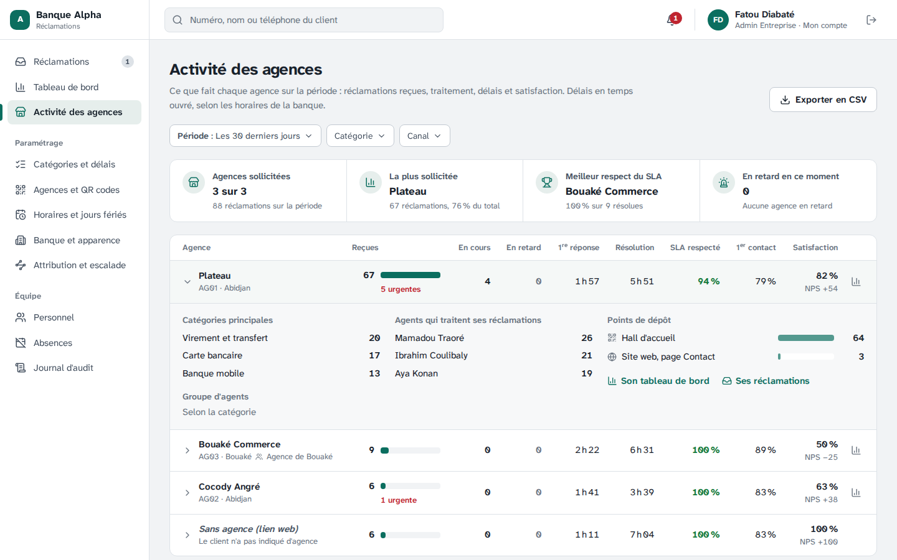
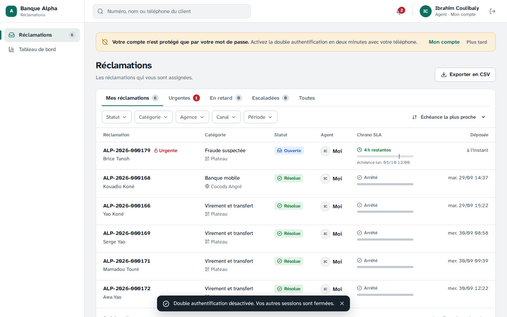
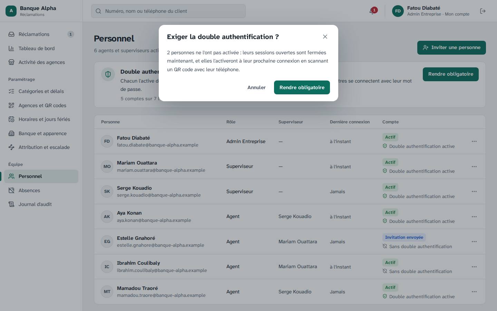
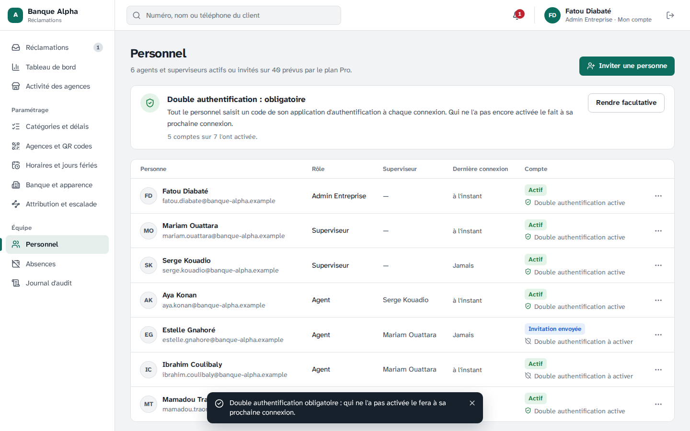
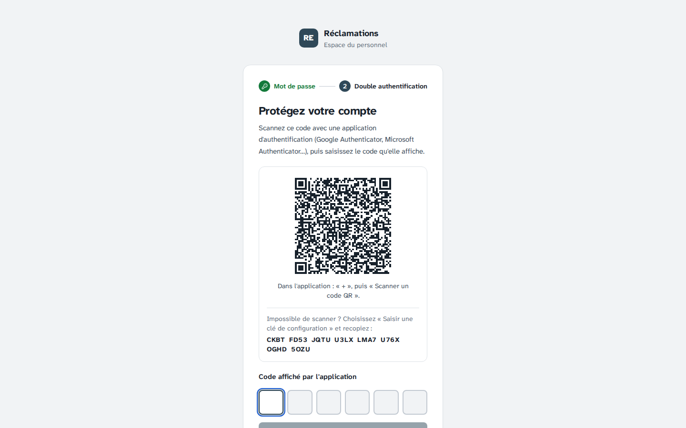
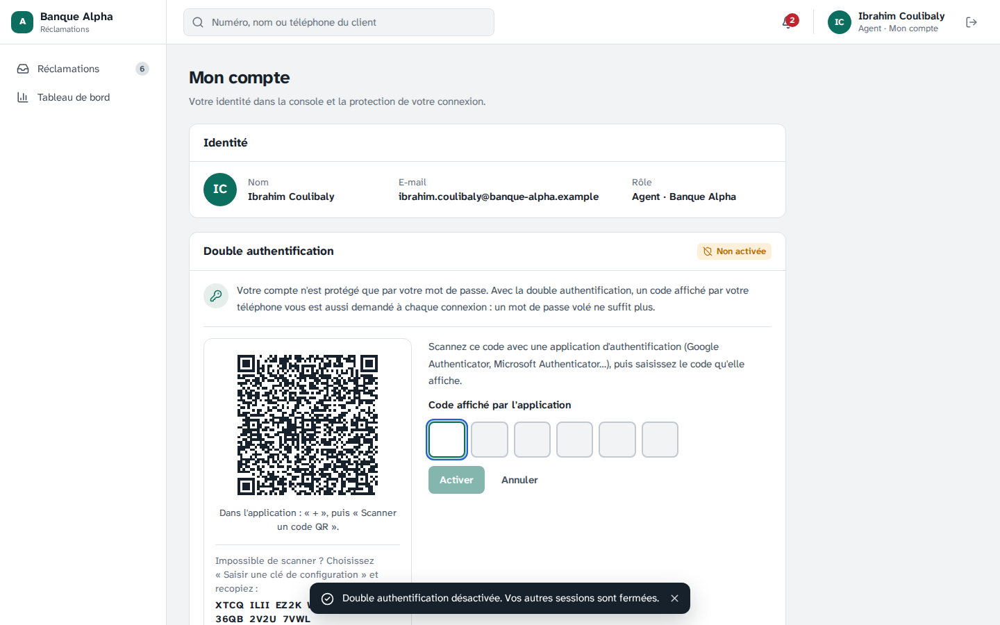
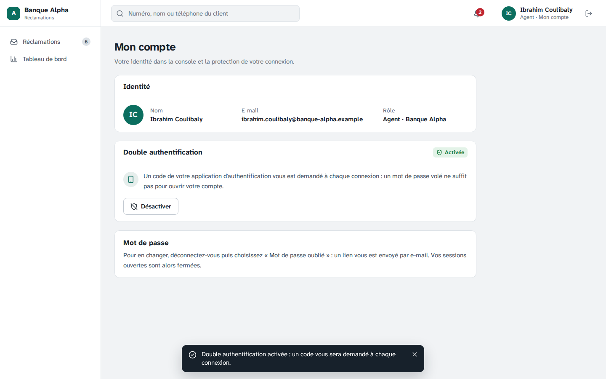

# Étape 19 — Activité des agences et double authentification au choix de la banque

Plateforme de gestion des réclamations · Makor Telecoms · Solution 1
Version du 03/10/2026 · **Statut : validé le 05/10/2026** (décisions V1 à V12 retenues telles que proposées).

Cette étape répond à deux demandes du client, ajoutées à la phase 2 avant WhatsApp, qui devient l'étape 20 :

- **L'Admin Entreprise voit ce que fait chacune de ses agences.** Un nouvel écran, « Activité des agences », donne une ligne par agence de la banque : volume, urgentes, délais, respect du SLA, charge du moment, satisfaction. Le détail montre les catégories, les agents et chaque QR code. Les superviseurs le consultent aussi ; l'agent garde son propre tableau de bord.
- **La double authentification n'est plus obligatoire.** Chaque banque choisit. Par défaut, elle est **facultative** : chacun l'active ou la désactive depuis un nouvel écran, « Mon compte ». L'Admin Entreprise peut l'**exiger** de tout son personnel, puis revenir au facultatif. Le Super Admin de Makor la garde toujours, puisqu'il accède à toutes les banques.

Rien ne change pour le client de la banque, ni pour le traitement des réclamations.

Livrables :

- **Base de données.** Migration [`20261005120000_double_authentification`](../backend/prisma/migrations/20261005120000_double_authentification/migration.sql) : `banque.double_authentification_obligatoire`, faux par défaut. L'Admin Entreprise peut modifier cette seule colonne de sa banque (droit par colonne). Il ne peut pas toucher au secret TOTP d'un compte.
- **Contrat.** [`contrat/openapi.yaml`](../contrat/openapi.yaml) passe de 107 à **112 opérations** (partie 6).
- **API.**
  - [Connexion](../backend/src/modules/auth/auth.service.ts) : le mot de passe suffit quand la double authentification n'est ni active ni exigée. Le service gère aussi « Mon compte » (préparer, confirmer, désactiver).
  - [Règle de la banque](../backend/src/modules/parametrage/parametrage.service.ts) : la rendre obligatoire ferme aussitôt les sessions sans code.
  - [Activité des agences](../backend/src/modules/reporting/indicateurs.ts) : une requête groupée par agence pour chaque mesure, sans boucle.
  - L'e-mail d'invitation ne parle de l'application d'authentification que si la banque l'exige.
- **Écrans.**
  - [Activité des agences](../frontend/src/ecrans/back-office/Agences.tsx), dans le menu sous « Tableau de bord ».
  - [Mon compte](../frontend/src/ecrans/back-office/Compte.tsx), ouvert en cliquant sur son nom en haut à droite, avec le bandeau de rappel.
  - La règle « Double authentification » en tête de [Personnel](../frontend/src/ecrans/back-office/Personnel.tsx), et l'état de chacun dans la liste.
- **Démo, maquettes et jeu de démonstration.**
  - [Démo cliquable](demo/index.html) : « Activité des agences » pour le superviseur et l'Admin Entreprise, calculée sur les réclamations de la démo ; « Mon compte » pour tous, où n'importe quel code à 6 chiffres est accepté.
  - [Maquettes](maquettes/index.html) : deux écrans de plus (32 en tout), « Activité des agences » et « Mon compte » en quatre états. Personnel a une variante « exigée ». Les notes de connexion sont mises à jour.
  - Jeu de démonstration : la Banque Alpha la laisse facultative, et tout son personnel l'a activée, sauf l'invitée. La Banque Horizon l'exige.
- **Recette.** Critère 16 dans la section « Critères de la phase 2 » du [rapport](recette/rapport.md), et sa fiche dans le [cahier de recette](recette/cahier-de-recette.md).

## 1. Activité des agences

Pour l'Admin Entreprise et les superviseurs, **toutes les agences de leur banque**, sur la période choisie (le mois en cours par défaut) :

| Colonne | Contenu |
|---|---|
| Agence | Nom, code, ville, groupe d'agents (étape 16) ; « Inactive » si elle est désactivée |
| Reçues | Réclamations déposées sur la période, dont urgentes |
| En cours | À traiter et en attente du client, **à cet instant** |
| En retard | Échéance SLA dépassée, à cet instant |
| 1re réponse, Résolution | Délais moyens, en temps ouvré |
| SLA respecté, 1er contact | Mêmes définitions que le tableau de bord (S5, S6, §6.6) |
| Satisfaction | Clients satisfaits et NPS, si la banque fait des enquêtes (étape 15) |

En tête, quatre repères : les agences sollicitées sur la période, la plus sollicitée, le meilleur respect du SLA et les agences qui ont des réclamations en retard.

Une agence se déplie et montre :

- ses trois catégories principales ;
- les agents qui traitent ses réclamations, les cinq plus sollicités ;
- **chacun de ses QR codes avec son volume** ;
- deux liens : **son tableau de bord**, filtré sur l'agence, et **ses réclamations**, toute la banque filtrée sur l'agence.

Les filtres sont ceux du tableau de bord : période, catégorie et canal. Ils restent dans l'adresse. L'export CSV suit les règles des autres exports.

## 2. La double authentification, au choix de chaque banque

| | Facultative (par défaut) | Obligatoire (choix de l'Admin Entreprise) |
|---|---|---|
| Connexion sans double authentification active | Mot de passe seul ; un bandeau rappelle de l'activer | Mot de passe, puis QR code à scanner avant d'entrer |
| Connexion avec double authentification active | Mot de passe, puis code | Mot de passe, puis code |
| Première connexion d'un invité | Mot de passe ; la console s'ouvre | Mot de passe, puis QR code (comme avant) |
| « Mon compte » | Activer (QR code, premier code) ou désactiver (avec un code) | Activée, sans bouton pour la désactiver |
| Téléphone perdu | L'Admin Entreprise réinitialise ; le mot de passe suffit, la personne la réactive quand elle veut | L'Admin Entreprise réinitialise ; nouveau QR code à la connexion |
| Super Admin de Makor | Toujours exigée | Toujours exigée |

## 3. Ce qui protège ce choix

- **L'Admin Entreprise ne peut pas se fermer la porte.** Pour exiger la double authentification, il doit l'avoir activée sur son propre compte (422 `DOUBLE_AUTHENTIFICATION_A_ACTIVER`).
- **L'exiger prend effet tout de suite.** Les sessions ouvertes du personnel qui ne l'a pas activée sont fermées. Leur refresh token est refusé tant qu'ils n'ont pas scanné le QR code.
- **La désactiver demande un code de l'application.** Un mot de passe volé ne suffit donc pas pour la retirer. La personne garde sa session ; ses autres sessions sont fermées.
- **Un code faux compte comme un échec de connexion.** Le verrouillage après 5 échecs pendant 15 minutes, la limite par adresse IP et l'anti-rejeu restent ceux de l'étape 7.
- **Un nouveau secret ne sert qu'une fois confirmé.** Préparer l'activation n'ouvre rien. Seul un premier code valide l'active.
- **Tout est au journal d'audit de la banque.** Activation, désactivation, et changement de la règle avec le nombre de sessions fermées.
- **En base,** l'Admin Entreprise ne peut modifier que la règle de sa propre banque. Le contexte banque ne peut ni marquer un compte comme protégé, ni effacer un secret (vérifications PostgreSQL, partie 7).

> **Recommandation.** Les comptes du personnel donnent accès aux réclamations et aux coordonnées des clients de la banque. Facultative, la double authentification laisse chaque personne choisir son niveau de protection. Nous recommandons à chaque banque de l'exiger dès que son personnel est équipé ; elle s'active en deux minutes avec Google Authenticator ou Microsoft Authenticator, sans frais.

## 4. Décisions à valider

| N° | Sujet | Proposition |
|---|---|---|
| V1 | Qui voit l'activité des agences | **L'Admin Entreprise et les superviseurs**, toutes les agences de leur banque. Pas l'agent, qui a son tableau de bord limité à ses réclamations (étape 11). Le Super Admin ne voit toujours que des totaux par banque |
| V2 | Ce qu'on compte pour une agence | **Les réclamations rattachées à l'agence** : par son QR code, ou choisie par le client sur le lien web. Mêmes définitions que le tableau de bord, donc **la somme des lignes donne le tableau de bord**. La charge (en cours, en retard) est celle de l'instant, quelle que soit la période |
| V3 | Sans agence | Les dépôts par lien web où le client n'a pas indiqué d'agence forment **une dernière ligne, « Sans agence (lien web) »** : rien ne disparaît du total. Une agence désactivée reste affichée tant qu'elle a de l'activité sur la période ou des réclamations en cours |
| V4 | Détail d'une agence | **3 catégories principales, 5 agents les plus sollicités, chaque QR code avec son volume**, le groupe d'agents. Liens vers son tableau de bord et ses réclamations, sur la même période |
| V5 | Filtres, ordre, export | Période, catégorie, canal ; **de la plus sollicitée à la moins sollicitée** ; export CSV fait dans le navigateur, aux règles des exports de l'API (UTF-8 avec BOM, « ; », anti-formule). Pas d'opération d'export de plus côté API |
| V6 | Règle par défaut | **Facultative pour toutes les banques**, existantes et nouvelles. Ceux qui l'ont déjà activée la gardent et saisissent toujours un code ; les autres se connectent avec leur mot de passe. Pour une installation déjà en service, la mise à jour rend donc la double authentification facultative partout : l'Admin Entreprise qui veut la garder obligatoire le refait dans Personnel |
| V7 | Qui décide | **L'Admin Entreprise**, pour toute sa banque, depuis Personnel (le superviseur voit la règle). Pas de règle par rôle ni par personne. Le Super Admin voit le réglage de chaque banque, sans le changer |
| V8 | Super Admin de Makor | **Toujours exigée**, non modifiable : ce compte accède à la console de toutes les banques |
| V9 | « Mon compte » | Activer : nouveau secret, QR code et clé en clair, puis **un premier code pour confirmer**. Désactiver : **avec un code**, refusé si la banque l'exige (422 `DOUBLE_AUTHENTIFICATION_OBLIGATOIRE`) ; ses autres sessions sont fermées. Le mot de passe se change toujours par « Mot de passe oublié » |
| V10 | L'exiger | Réservé à l'Admin Entreprise **qui l'a activée lui-même**. Une fenêtre de confirmation compte les personnes concernées. **Leurs sessions sont fermées tout de suite** ; chacune scanne le QR code à sa prochaine connexion. Revenir au facultatif ne retire rien à ceux qui l'ont |
| V11 | Rappel | Tant qu'une personne ne l'a pas activée, **un bandeau en haut de chaque page** la renvoie vers « Mon compte » ; « Plus tard » le masque jusqu'au prochain chargement de la console. Personnel affiche l'état de chacun et « N comptes sur M l'ont activée » |
| V12 | Démonstration | Banque Alpha facultative, avec tout son personnel protégé sauf l'invitée ; Banque Horizon obligatoire. Les deux cas se montrent ainsi sans rien régler |

## 5. Ce que voit chacun

| Rôle | Activité des agences | Mon compte | Règle de la banque |
|---|---|---|---|
| Agent | Non | Oui | Non |
| Superviseur | Oui, toute la banque | Oui | Consulte |
| Admin Entreprise | Oui, toute la banque | Oui | Modifie |
| Super Admin | Non (totaux par banque) | Non (toujours exigée) | Lit le réglage |

## 6. Contrat

Le contrat passe de 107 à **112 opérations** :

| Opération | Chemin | Rôles |
|---|---|---|
| `lireIndicateursAgences` | `GET /banque/indicateurs/agences?du=&au=&categorieId=&canal=` | superviseur, Admin Entreprise |
| `preparerTotp` | `POST /auth/moi/totp/preparation` | personnel de la banque |
| `confirmerTotp` | `POST /auth/moi/totp/activation` | personnel de la banque |
| `desactiverTotp` | `POST /auth/moi/totp/desactivation` | personnel de la banque |
| `modifierSecuriteBanque` | `PATCH /banque/parametres/securite` | Admin Entreprise |

Changements :

- La réponse de `connexion` et d'`accepterInvitation` devient `EtapeConnexion` (auparavant `EtapeTotp`). Elle a une troisième issue, `SESSION_OUVERTE`, qui porte la session et pose le cookie. Le jeton intermédiaire n'est présent que si un code est attendu.
- `Moi` gagne `totpActif` et `totpObligatoire`.
- `doubleAuthentificationObligatoire` s'ajoute aux paramètres de la banque et aux banques de la console.
- Cinq codes d'erreur s'ajoutent :
  - `DOUBLE_AUTHENTIFICATION_OBLIGATOIRE` ;
  - `DOUBLE_AUTHENTIFICATION_A_ACTIVER` ;
  - `DOUBLE_AUTHENTIFICATION_DEJA_ACTIVE` ;
  - `DOUBLE_AUTHENTIFICATION_INACTIVE` ;
  - `DOUBLE_AUTHENTIFICATION_NON_PREPAREE`.

La [documentation hors ligne](api/index.html) et les types sont régénérés.

## 7. Tests

| Suite | Ce qui est vérifié |
|---|---|
| Bout en bout (171, dont 8 nouveaux) | Invitation dans une banque qui l'exige (enrôlement, puis session) et dans une banque où elle est facultative (session directe, sans code). Réinitialisation par l'Admin Entreprise : nouvel enrôlement si exigée, sinon le mot de passe suffit. « Mon compte » : activer avec un premier code, désactiver avec un code ; la connexion suit ; les autres sessions tombent. Rendre obligatoire : refusé à l'Admin Entreprise qui ne l'a pas activée ; sessions sans code fermées et refresh refusé ; enrôlement à la connexion ; désactivation refusée ; retour au facultatif. Super Admin toujours exigé. Activité des agences : le scénario de test compté à l'agence du Plateau ; **les lignes font le tableau de bord** ; lien web compté à l'agence choisie, sinon sans agence ; 403 pour un agent. Mesure de temps sous charge (critère 10) |
| Sécurité PostgreSQL (129, dont 5 nouveaux) | L'Admin Entreprise règle sa banque, pas une autre ; en contexte banque, impossible de marquer un compte comme protégé ou d'effacer son secret ; le Super Admin lit le réglage de chaque banque |
| Unitaires, frontend (231, dont 19 nouveaux) | Données des maquettes (activité des agences, enrôlement, profils) validées contre le contrat ; chaque nouvel écran s'affiche pour les deux banques ; activité des agences de la démo cohérente avec son tableau de bord |
| Chromium (53, dont 5 nouveaux) | Fatou ouvre l'activité des agences, déplie le Plateau, exporte, ouvre son tableau de bord et ses réclamations filtrés. Le superviseur la voit ; l'agent ne la voit pas (« Page réservée »). Ibrahim désactive sa double authentification, voit le rappel, se connecte sans code. Fatou l'exige : la session d'Ibrahim se ferme ; à la connexion, il lit le QR code (décodé depuis l'écran comme par un téléphone) et entre. Retour au facultatif : Ibrahim la désactive puis la réactive depuis « Mon compte » |

Le test Chromium de la première connexion de l'étape 8 suit la nouvelle règle : l'invitée de la Banque Alpha entre après son mot de passe, avec le rappel. La lecture du QR code est vérifiée dans le nouveau test.

La [recette automatique](recette/rapport.md) vérifie le critère 16 par les tests de bout en bout, le test Chromium et les vérifications PostgreSQL. Elle passe en 14 minutes : les 11 critères de la phase 1, les 5 de la phase 2, 781 tests sur 781 et 206 vérifications PostgreSQL. L'activité des agences du mois répond en 47 ms (p95) sur une banque de 1 000 réclamations (critère 10). Le [cahier de recette](recette/cahier-de-recette.md) a sa fiche, à signer à part.

## 8. Captures

Fatou, Admin Entreprise de la Banque Alpha, voit chacune de ses agences ; le Plateau est déplié.

Ibrahim a désactivé sa double authentification : un bandeau la lui rappelle.

Fatou l'exige de tout le personnel :

À sa connexion suivante, Ibrahim scanne le QR code avant d'entrer :

Revenue facultative, Ibrahim la gère depuis « Mon compte » :

## 9. Ce qui ne change pas

- **Le portail du client**, le dépôt, le suivi et le traitement des réclamations.
- **Le tableau de bord** et ses définitions ; l'activité des agences les reprend.
- **Le cloisonnement entre banques** : chaque banque ne voit que ses agences et son personnel.
- **Le Super Admin** se connecte toujours avec un code.
- **Pour une installation existante**, la mise à jour applique la migration (`deploiement/mettre-a-jour.sh`) ; aucune nouvelle variable.

## 10. Suite

Étape 20 : WhatsApp Business et SMS entrant (décision I1). Ils reprendront la conversation par réclamation de l'étape 17 et, si la banque le souhaite, le tri de l'assistant. Étape 21 : baromètre et recommandations IA.
