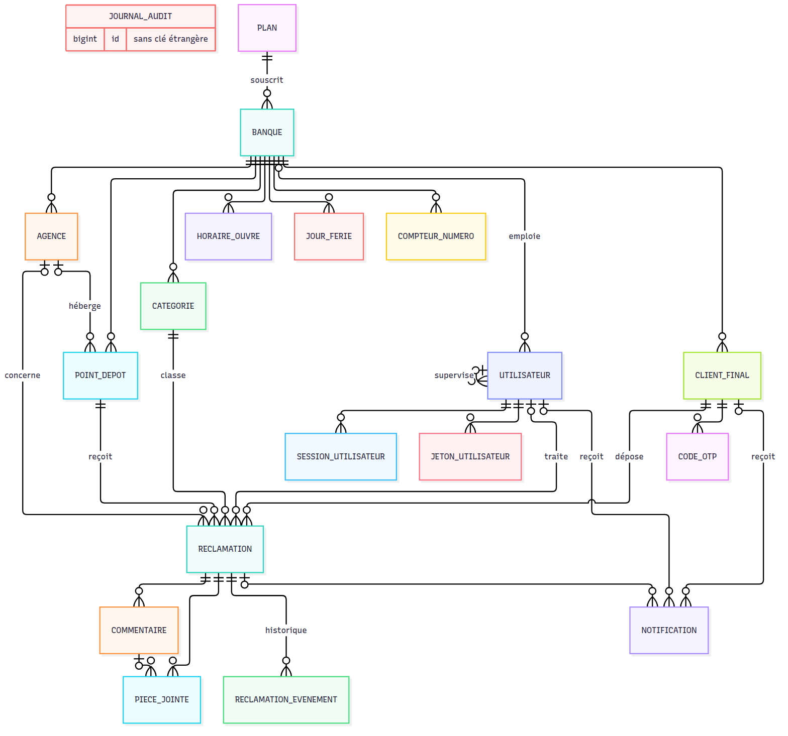

# Étape 2 — Modèle de données

Plateforme de gestion des réclamations · Makor Telecoms · Solution 1
Version du 25/09/2026 · **Statut : validé le 25/09/2026** (décisions D1 à D12 retenues telles que proposées)

Fichier livré : [`backend/prisma/schema.prisma`](../backend/prisma/schema.prisma) — 19 modèles, 13 énumérations, reconstruit depuis la section 9 du cahier des charges consolidé, avec les deux ajouts du §11 (clôture forcée avec motif, modèle Plan).

## 1. En bref

| Contrôle | Résultat |
|---|---|
| `prisma validate` | Schéma valide (Prisma 7.10.0) |
| Génération du client | OK, compilé en CommonJS (compatible NestJS) |
| Création dans PostgreSQL 16 | 19 tables, 13 types énumérés, 33 clés étrangères |
| Vérification d'intégrité (`docker compose run --rm verification`) | **32 / 32 réussies** |
| Environnement | Docker Compose : PostgreSQL 16, tri français (ICU fr-FR) |

Le modèle ajoute une protection que le CDC ne demandait pas explicitement : **les clés étrangères sont composites `(tenant_id, id)`**. PostgreSQL refuse lui-même qu'une réclamation de la banque A pointe vers la catégorie, le client, l'agence, le point de dépôt ou l'agent de la banque B. C'est important parce que les contrôles de clé étrangère ne passent pas par la Row-Level Security : sans cela, un bug applicatif pourrait créer une référence croisée que la RLS ne verrait pas.

## 2. Décisions à valider

Ces points ne sont pas tranchés par le CDC. Chacun a une proposition ; il suffit de dire « OK » ou de corriger.

| N° | Sujet | Proposition | Alternative |
|---|---|---|---|
| D1 | Isolation des références | Clés étrangères composites `(tenant_id, id)` sur toutes les relations internes à une banque | Clés simples + RLS seule |
| D2 | E-mail du personnel | Unique sur toute la plateforme : la connexion au back-office ne demande pas de choisir la banque | Unique par banque, connexion via l'adresse du portail |
| D3 | Reconnaissance du client final | Un client est retrouvé par e-mail ou téléphone **dans sa banque** d'un dépôt à l'autre : c'est ce qui lui donne, via l'OTP, l'historique de ses réclamations | Un client par dépôt (pas d'historique) |
| D4 | Jeton du lien de suivi | Stocké tel quel : il n'ouvre que la chronologie (statuts et dates) et doit figurer dans chaque notification ; le détail exige l'OTP | Stocker son empreinte et régénérer un lien à chaque envoi |
| D5 | Chaîne du journal d'audit | Une chaîne par banque + une pour la plateforme : chaque Admin Entreprise peut vérifier la sienne sans voir les autres | Une chaîne unique (vérifiable seulement par le Super Admin) |
| D6 | SMS à chaque changement de statut (point ouvert n° 5) | Paramètre par banque `sms_chaque_changement_statut`, activé par défaut comme au §6.5. Le point ouvert devient un choix commercial, pas technique | Règle fixe pour toutes les banques |
| D7 | Ce que compte le plafond d'agents | Comptes Agent et Superviseur non désactivés (invités compris). Plafond vide = illimité | Agents seulement |
| D8 | Délai de clôture automatique | 5 jours **calendaires** après la résolution (paramètre `delai_cloture_auto_jours`) | 5 jours ouvrés |
| D9 | Jours fériés | Case « récurrent » pour les dates fixes (1er mai, 7 août…) saisies une fois ; les fêtes mobiles restent saisies chaque année | Tout ressaisir chaque année |
| D10 | Indicateurs | Délais de première réponse et de résolution calculés en minutes ouvrées au moment de l'événement, stockés sur le ticket : le tableau de bord reste une simple moyenne | Calcul à la volée dans chaque requête de reporting |
| D11 | Point de dépôt | Obligatoire sur chaque réclamation au MVP ; il deviendra facultatif en phase 2 (WhatsApp, SMS entrant) | Facultatif dès maintenant |
| D12 | Version de Prisma | Prisma 7.10 (version stable actuelle, sans moteur Rust) au lieu de Prisma 6 ; l'URL de connexion est dans `prisma.config.ts` | Rester en Prisma 6 |

## 3. Diagramme



Source Mermaid : [`etape-2-diagramme-er.mmd`](etape-2-diagramme-er.mmd). Le journal d'audit est volontairement isolé : il n'a aucune clé étrangère, pour survivre à tout.

## 4. Les 19 modèles

| Domaine | Modèle (table) | Rôle | Points clés |
|---|---|---|---|
| Plateforme | `Plan` (plan) | Offre commerciale | Plafond d'agents bloquant, plafond de tickets par mois jamais bloquant ; vide = illimité |
| Plateforme | `Banque` (banque) | Le tenant | Slug du portail, préfixe des tickets (unique), fuseau horaire, couleurs, logo, seuil d'alerte SLA (75 %), délai de clôture (5 j), option SMS, suspension |
| Organisation | `Agence` | Agences de la banque | Code unique dans la banque |
| Organisation | `PointDepot` (point_depot) | QR code ou lien public | Code public unique sur la plateforme → banque, agence, canal |
| Organisation | `Categorie` | Types de réclamation | Priorité par défaut, délai cible en minutes ouvrées, nom unique dans la banque |
| Organisation | `HoraireOuvre` (horaire_ouvre) | Plages ouvrées | Plusieurs plages par jour (08:00–12:00, 14:00–17:30), en minutes depuis minuit |
| Organisation | `JourFerie` (jour_ferie) | Jours fériés | Date unique par banque, option « récurrent » |
| Personnel | `Utilisateur` | Comptes du personnel | Rôle, statut (invité / actif / désactivé), argon2id, secret TOTP chiffré, verrouillage, superviseur |
| Personnel | `SessionUtilisateur` | Refresh tokens | Empreinte SHA-256 seule, rotation par famille, révocation |
| Personnel | `JetonUtilisateur` | Invitation, réinitialisation | Empreinte seule, usage unique, expiration |
| Clients | `ClientFinal` (client_final) | Client d'une banque, sans mot de passe | E-mail et téléphone uniques dans la banque ; même personne dans deux banques = deux clients |
| Clients | `CodeOtp` (code_otp) | Codes à usage unique | HMAC du code, destination figée, compteur de tentatives |
| Réclamations | `Reclamation` | Le ticket | Numéro, jeton de suivi, statut, priorité, SLA, escalade, jalons, indicateurs, clôture, consentement |
| Réclamations | `CompteurNumero` (compteur_numero) | Séquence des numéros | Par banque et par année ; incrément atomique vérifié sous 50 dépôts simultanés |
| Réclamations | `Commentaire` | Note interne, réponse au client, message du client | Immuable |
| Réclamations | `PieceJointe` (piece_jointe) | Fichiers | Empreinte SHA-256, clé de stockage (local / S3), rattachable à un message |
| Réclamations | `ReclamationEvenement` (reclamation_evenement) | Historique métier | Type, statut avant / après, acteur, visible du client, détails JSON |
| Notifications | `Notification` | Envois e-mail, SMS, in-app | Statut, tentatives, erreur, segments SMS, clé anti-doublon, lecture in-app |
| Traçabilité | `JournalAudit` (journal_audit) | Piste d'audit | Chaînée par SHA-256, rang dans la chaîne, identité de l'auteur figée, sans clé étrangère |

## 5. Les 13 énumérations

| Énumération | Valeurs |
|---|---|
| `RoleUtilisateur` | SUPER_ADMIN, ADMIN_ENTREPRISE, SUPERVISEUR, AGENT |
| `StatutUtilisateur` | INVITE, ACTIF, DESACTIVE |
| `TypeJeton` | INVITATION, REINITIALISATION |
| `CanalDepot` | QR_CODE, LIEN_WEB |
| `StatutReclamation` | OUVERTE, EN_COURS, EN_ATTENTE_CLIENT, RESOLUE, CLOTUREE |
| `Priorite` | NORMALE, URGENTE |
| `ModeCloture` | CONFIRMATION_CLIENT, AUTOMATIQUE, FORCEE |
| `MotifClotureForcee` | DOUBLON, HORS_PERIMETRE, ABUS, AUTRE |
| `TypeCommentaire` | NOTE_INTERNE, REPONSE_AU_CLIENT, MESSAGE_DU_CLIENT |
| `TypeEvenement` | CREATION, PRISE_EN_CHARGE, QUESTION_AU_CLIENT, REPONSE_DU_CLIENT, RESOLUTION, CONFIRMATION, CONTESTATION, CLOTURE_AUTOMATIQUE, CLOTURE_FORCEE, ASSIGNATION, CHANGEMENT_PRIORITE, ESCALADE, ALERTE_SLA_PREVENTIVE, DEPASSEMENT_SLA, MESSAGE, PIECE_JOINTE |
| `TypeActeur` | CLIENT, UTILISATEUR, SYSTEME |
| `CanalNotification` | EMAIL, SMS, IN_APP |
| `StatutNotification` | EN_ATTENTE, ENVOYEE, DELIVREE, ECHEC |

Les types d'événements reprennent une à une les transitions du diagramme du §6.3 : QUESTION_AU_CLIENT (En cours → En attente client), REPONSE_DU_CLIENT (retour automatique), CONTESTATION (Résolue → En cours), etc.

## 6. Correspondance avec le cahier des charges

| Exigence | Où elle se trouve dans le schéma |
|---|---|
| Arbitrage 1 — client final séparé, sans mot de passe | `ClientFinal` distinct de `Utilisateur` ; `CodeOtp` ; `Reclamation.jetonSuivi` |
| Arbitrage 2 — tenantId partout | `tenant_id` sur toutes les tables de banque ; clés composites (D1) ; RLS à l'étape 3 |
| Arbitrage 3 — agences, QR = banque + agence | `Agence`, `PointDepot.agenceId` ; `Reclamation.agenceId` pour le reporting |
| Arbitrage 4 — SLA par catégorie, 75 %, heures ouvrées, pause | `Categorie.delaiCibleMinutes` copié sur `Reclamation.delaiCibleMinutes` ; `echeanceSlaLe`, `alertePreventiveLe`, `slaMinutesRestantes`, `slaSuspenduLe` ; `HoraireOuvre`, `JourFerie` ; `Banque.seuilAlerteSlaPourcent` |
| « Chaque alerte part une seule fois » | `alertePreventiveEnvoyeeLe`, `depassementSlaSignaleLe` + `Notification.cleDeduplication` unique |
| Arbitrage 5 — clôture sur confirmation ou après 5 jours, contestation | `clotureAutoPrevueLe`, `modeCloture`, `nbReouvertures` ; événements CONFIRMATION, CONTESTATION, CLOTURE_AUTOMATIQUE |
| Clôture forcée avec motif (§6.3, ajout §11) | `modeCloture = FORCEE`, `motifClotureForcee`, `commentaireCloture`, `clotureParId` |
| Arbitrage 6 — résolution au premier contact | `passeEnAttenteClient`, `escaladeeLe`, `nbReouvertures` sur le ticket + transitions structurées dans `ReclamationEvenement` |
| Arbitrage 7 — Super Admin sans accès au contenu | Notifications de plateforme sans `tenant_id` ni lien vers la réclamation, métadonnées seules ; le journal d'audit ne stocke jamais le contenu d'une réclamation ni le nom d'un client |
| Numéro PRÉFIXE-AAAA-NNNNNN séquentiel par banque et par année | `Banque.prefixeTickets` + `CompteurNumero` ; `Reclamation.numero` unique par banque |
| Messages immuables, deux types | `Commentaire` sans date de modification ; `TypeCommentaire` ; trigger à l'étape 3 |
| 5 pièces jointes max., images ou PDF | `PieceJointe` (la limite est une règle applicative, étape 7) |
| Notifications journalisées, segments SMS refacturés | `Notification.statut`, `tentatives`, `segmentsSms`, `tenantId` |
| Plan : plafond d'agents bloquant, plafond de tickets jamais bloquant | `Plan.plafondAgents`, `Plan.plafondTicketsMois` ; dépassement signalé une fois par mois via `cleDeduplication` |
| Aucune suppression physique | `onDelete: Restrict` partout ; statut DESACTIVE pour le personnel |
| Consentement recueilli au dépôt (ARTCI) | `Reclamation.consentementLe`, `consentementVersion` |
| Performance < 1 s | Index sur les files (statut, agent, priorité, escalade), le reporting (agence, catégorie, canal, date) et les tâches planifiées |

## 7. Ce qui est vérifié

Le script [`backend/scripts/verifier-integrite.ts`](../backend/scripts/verifier-integrite.ts) crée deux banques de test et essaie 32 écritures. Résultat sur PostgreSQL 16 : 32 / 32.

- **Isolation (14 cas)** : réclamation de A avec catégorie, client ou point de dépôt de B ; agent, superviseur ou escalade vers B ; commentaire, pièce jointe, événement, OTP, notification croisés → tous refusés par la base.
- **Unicités (8 cas)** : même e-mail client dans A et B accepté (deux clients) ; doublons d'e-mail, de téléphone, de numéro, de code de point, de préfixe, d'e-mail du personnel et de catégorie refusés.
- **Comportements (10 cas)** : numérotation atomique sous 50 dépôts simultanés, désassignation, chronologie, clôture forcée, alerte au Super Admin sans doublon, SMS avec segments, lecture relationnelle, suppression physique refusée.

Le principe « champs posés par trigger » du journal d'audit (chaîne, rang, empreintes) a aussi été essayé avec un trigger prototype : Prisma relit bien les valeurs calculées par la base. Le vrai trigger arrive à l'étape 3.

Pour rejouer la vérification, depuis la racine du projet :

```bash
docker compose up -d
docker compose run --rm verification
```

Le service `verification` tourne dans un conteneur Node 22 : il installe les dépendances, applique le schéma sur la base jetable `reclamations_verif` (créée au premier démarrage de PostgreSQL), puis lance le script. Le script refuse de tourner sur une base dont le nom ne contient pas « verif » ou « test », car il la vide.

Le PostgreSQL du conteneur est initialisé avec le tri français (ICU fr-FR) : « éclair » se range entre « eau » et « fruit », ce qui compte pour les listes de clients, d'agences et de catégories.

## 8. Ce qui arrive à l'étape 3

La migration SQL versionnée remplacera `db push` et ajoutera ce que Prisma ne sait pas exprimer :

1. Row-Level Security sur toutes les tables portant `tenant_id`, avec un rôle applicatif soumis à la RLS.
2. CHECK `utilisateur` : `tenant_id` vide si et seulement si SUPER_ADMIN.
3. CHECK `client_final` : e-mail ou téléphone obligatoire.
4. Trigger de chaînage SHA-256 du journal d'audit, UPDATE et DELETE interdits.

Proposés en complément, à confirmer à l'étape 3 : QR code toujours rattaché à une agence ; cohérence statut / date / mode de clôture ; auteur d'un commentaire cohérent avec son type ; OTP limité à EMAIL ou SMS ; bornes des horaires et des paramètres de la banque ; immuabilité des commentaires et des événements ; index partiels des workers.

## 9. Notes techniques

- Identifiants UUID v7, générés par Prisma (triés dans le temps, index plus compacts qu'avec des UUID v4).
- Horodatages en `timestamptz` ; tout est stocké en UTC, l'affichage suit le fuseau de la banque.
- Le client Prisma est généré dans `backend/src/generated/prisma` (non versionné, régénéré par `npm install`).
- Exceptions assumées à « tenant_id partout » : `plan` (donnée de la plateforme), `session_utilisateur` et `jeton_utilisateur` (lus par empreinte avant que la banque ne soit connue, rattachés à l'utilisateur), `journal_audit` (tenant_id sans clé étrangère, vide pour la plateforme).
