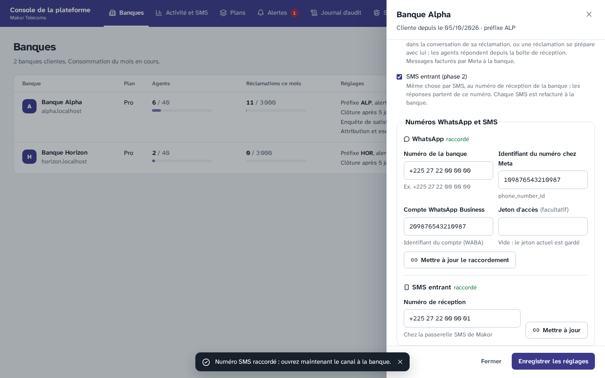
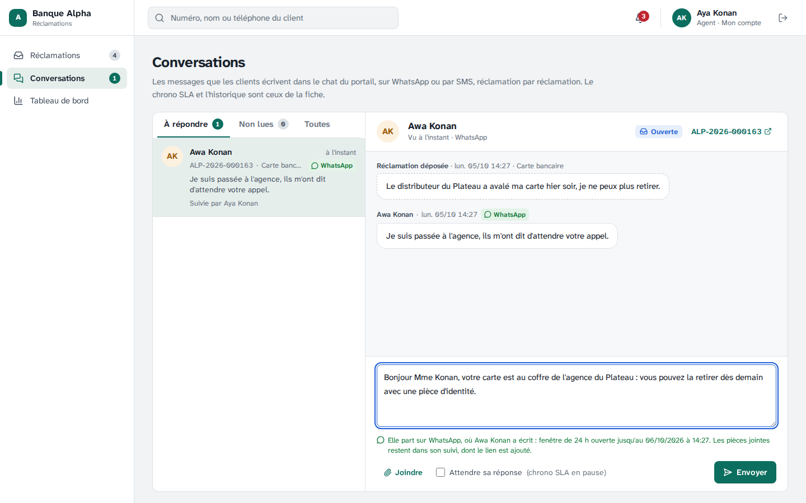
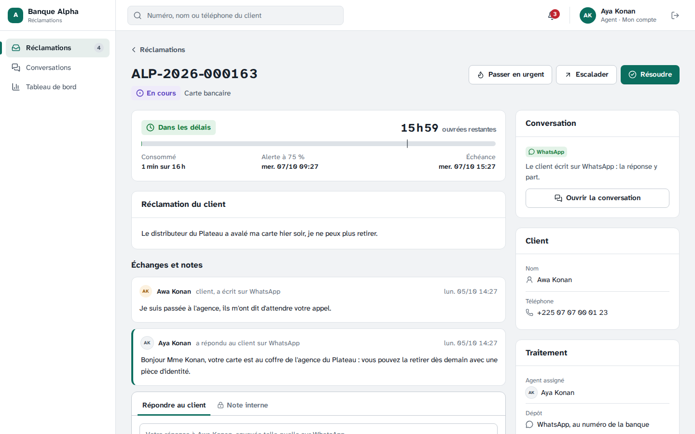
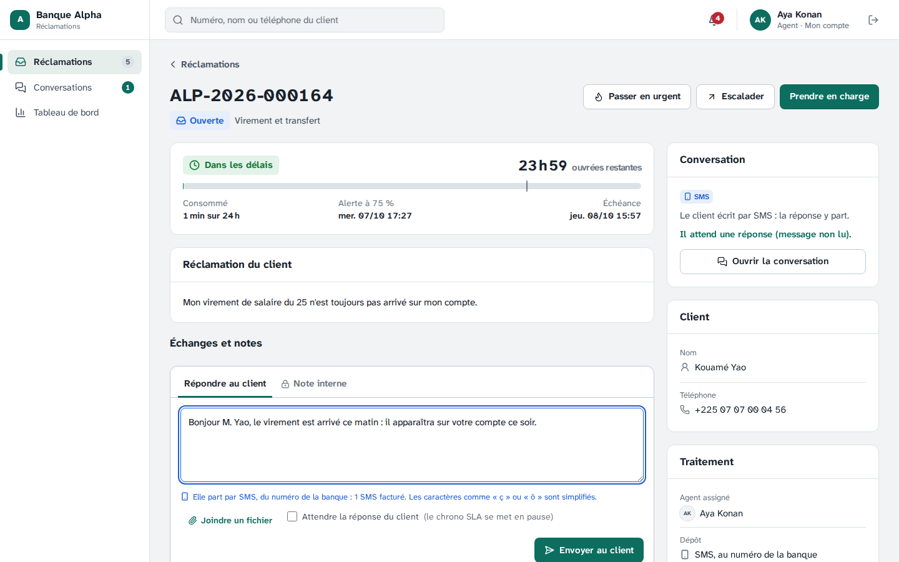
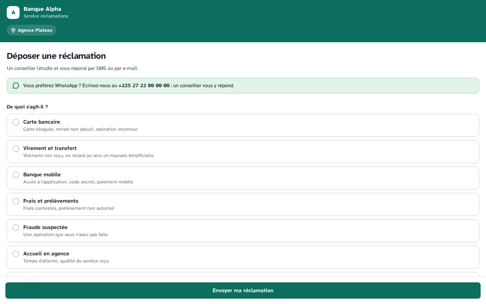
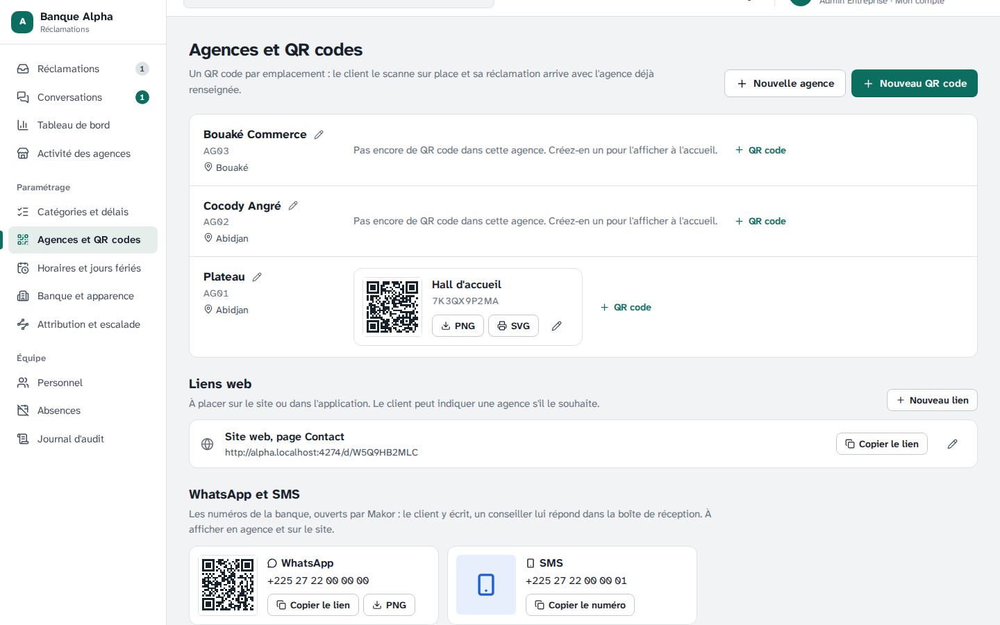
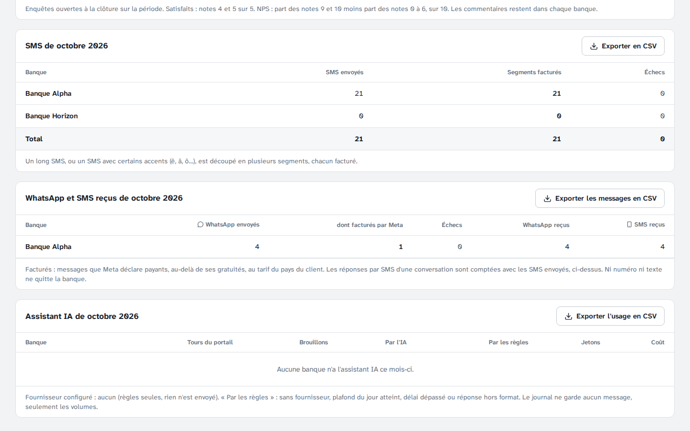

# Étape 20 — WhatsApp Business et SMS entrant

Plateforme de gestion des réclamations · Makor Telecoms · Solution 1
Version du 05/10/2026 · **Statut : en attente de validation** (décisions V1 à V15 ci-dessous).

Cette étape met en œuvre les décisions I1, I2 et I7 de l'étape 14 : **le client écrit à sa banque sur WhatsApp ou par SMS**, et la banque lui répond au même endroit.

- **Chaque banque a son propre numéro WhatsApp**, sur son propre compte WhatsApp Business chez Meta (I7). Makor l'y raccorde comme fournisseur technique (Tech Provider). Elle peut aussi avoir un numéro de réception SMS chez la passerelle de Makor.
- **Makor ouvre ces canaux banque par banque** (I2), seulement avec le chat web : les messages entrent dans la conversation de la réclamation et dans la boîte de réception des agents (étape 17).
- **Le client est reconnu à son numéro.** Son message va à sa réclamation en cours. S'il n'en a pas, une réclamation se prépare avec lui, en quelques messages, et il l'envoie en répondant OUI. Avec l'assistant IA ouvert (étape 18), celui-ci répond d'abord aux questions fréquentes, comme sur le portail.
- **L'agent répond depuis la boîte de réception**, comme au chat. La réponse part là où le client a écrit : sur WhatsApp, telle quelle, tant que la fenêtre de 24 h de Meta est ouverte ; par SMS, du numéro de la banque. Sinon, elle reste dans son suivi et il en est averti.
- **Une réclamation résolue se confirme ou se conteste d'un mot** : OUI la clôture, tout autre message la rouvre.

Livrables :

- **Base de données.** Migration [`20261006120000_whatsapp_sms_entrant`](../backend/prisma/migrations/20261006120000_whatsapp_sms_entrant/migration.sql) :
  - `banque.whatsapp` et `banque.sms_entrant`, faux par défaut, ouverts par le seul Super Admin, et seulement avec le chat web (contrainte) ;
  - `canal_banque` : le numéro de la banque par canal. Le jeton WhatsApp est chiffré (AES-256-GCM) et lu par le seul système ;
  - `session_canal` : l'échange en cours avec un client (réclamation choisie, dépôt en préparation), effacé 24 h après son dernier message ;
  - `message_entrant` : chaque message reçu ne se traite qu'une fois. Ni texte ni numéro : le texte est dans la conversation de la réclamation ;
  - le canal de chaque message (`commentaire.canal`) ; pour les envois, le canal WhatsApp, le numéro d'où part un SMS de conversation et la facturation déclarée par Meta.
- **Contrat.** [`contrat/openapi.yaml`](../contrat/openapi.yaml) passe de 112 à **117 opérations** (partie 8).
- **API.**
  - [Réception](../backend/src/modules/canaux/canaux.service.ts) : webhooks de Meta et de la passerelle SMS, signés ; routage vers la banque, dédoublonnage, un message à la fois par client ; statuts de Meta (remise, lecture, facturation, échec).
  - [Dialogue](../backend/src/domaine/canaux.ts) : règles pures, partagées avec la démo cliquable. Rattacher, choisir, confirmer, contester, préparer un dépôt.
  - [Envoi](../backend/src/infrastructure/envois/boite-envoi.ts) par la boîte d'envoi (worker) : WhatsApp par l'[API Cloud de Meta](../backend/src/infrastructure/canaux/whatsapp.ts), SMS du numéro de la banque, [ramené à l'alphabet GSM et compté en segments](../backend/src/domaine/sms.ts). Un échec de Meta fait prévenir le client autrement.
  - [Raccordement et ouverture](../backend/src/modules/plateforme/plateforme.service.ts) par le Super Admin ; facturation du mois par banque.
- **Écrans.**
  - Console de la plateforme : dans la fiche d'une banque, **Numéros WhatsApp et SMS** (raccordement), et les cases **WhatsApp Business** et **SMS entrant** ; dans **Activité et SMS**, le tableau **WhatsApp et SMS reçus**.
  - Console de la banque : le canal de chaque conversation et de chaque message ; sous la zone de réponse, **par où elle partira** (et le nombre de SMS facturés) ; les numéros de la banque dans **Agences et QR codes** (QR code WhatsApp à afficher) et **Banque et apparence**.
  - Portail : « Vous préférez WhatsApp ? Écrivez-nous au … » sur la page de dépôt.
- **Démo, maquettes et jeu de démonstration.**
  - [Démo cliquable](demo/index.html) : le client de la « Banque mobile » écrit sur WhatsApp ; la réponse y part, telle quelle.
  - [Maquettes](maquettes/index.html) : variantes « WhatsApp » des conversations, fiche d'une banque avec ses numéros, numéros de la banque, facturation.
  - Jeu de démonstration : la Banque Alpha a ses deux numéros raccordés et ouverts. Moussa Koné a déposé par WhatsApp, Adjoua Koffi relance son virement par SMS. La Banque Horizon n'en a pas.
- **Outil de développement.** `npm run canal` simule un client qui écrit sur WhatsApp ou par SMS, signé comme Meta ou la passerelle (partie 9).
- **Recette.** Critère 17 dans la section « Critères de la phase 2 » du [rapport](recette/rapport.md), et sa fiche dans le [cahier de recette](recette/cahier-de-recette.md).

## 1. Raccorder et ouvrir

Deux gestes du Super Admin, dans la fiche de la banque :

1. **Raccorder le numéro.**
   - WhatsApp : le numéro, son identifiant chez Meta (`phone_number_id`), le compte WhatsApp Business de la banque (WABA) et le jeton d'accès. Ils viennent de l'inscription intégrée de Meta (Embedded Signup), que la banque fait avec Makor. Le jeton est chiffré et ne se relit plus ; pour changer le reste, on le laisse vide.
   - SMS : le numéro de réception de la banque chez la passerelle de Makor.

   Le premier raccordement crée le point de dépôt du canal, « WhatsApp » ou « SMS », sans agence.
2. **Ouvrir le canal**, en cochant **WhatsApp Business** ou **SMS entrant**. Il faut le chat web, et le numéro raccordé. Décocher le chat ferme les deux.

Un numéro déjà raccordé à une autre banque est refusé (409). Un message reçu sur un numéro inconnu, un canal fermé ou une banque suspendue est ignoré, sans réponse.

## 2. Ce que vit le client

**Il a une réclamation en cours.** Son message entre dans la conversation de sa réclamation. La première fois, une réponse lui dit à quelle réclamation (numéro, catégorie), qu'un conseiller lui répond ici, et, si la banque est fermée, quand elle rouvre. Pour une autre réclamation, il écrit NOUVELLE.

**Il en a plusieurs.** On lui demande laquelle, par son numéro dans une liste (0 pour une nouvelle). Ses messages suivants y vont, pendant 24 h.

**Il n'en a pas.** Une réclamation se prépare avec lui :

1. Il décrit son problème. En dessous de 20 caractères, on lui demande des précisions : quand, où, quel montant.
2. La catégorie est déduite du texte : par l'assistant IA s'il est ouvert, sinon par les règles. Si aucune ne s'impose, il choisit dans la liste numérotée.
3. On lui récapitule la réclamation, avec le lien de la politique de données de la banque. **Il l'envoie en répondant OUI**, l'annule par NON, ou écrit pour la compléter.
4. Son nom vient de son profil WhatsApp ou de son dossier. Par SMS, s'il est inconnu, on le lui demande.
5. L'accusé de dépôt lui arrive au même endroit, avec le lien de son suivi.

Avec l'assistant IA ouvert, c'est l'assistant du portail (étape 18) qui accueille : il se présente comme automatique, répond aux questions fréquentes avec les réponses de la banque, mot pour mot, et passe la main dès que le client écrit « conseiller ». L'IA ne fait que trier, sur des messages masqués.

**Sa réclamation est résolue.** La résolution se termine par « Répondez OUI si c'est réglé, ou dites-nous ce qui ne va pas ». OUI, ou un simple remerciement, la clôture ; le message de clôture, avec le lien de l'enquête de satisfaction, lui arrive au même endroit. Tout autre message la conteste et la rouvre, ce message comme motif.

**Photos et documents.** Photos (JPEG, PNG, WebP) et PDF de 5 Mo au plus, contrôlés comme au dépôt sur le portail, 5 par dépôt. Il est prévenu si un fichier est refusé. Son, vidéo, position ou contact : on lui demande d'écrire. Par SMS : du texte seulement.

Toutes les réponses automatiques sont courtes et sans accent, pour tenir dans un SMS. Un code secret écrit par le client est retiré de son message, et il est mis en garde.

## 3. Ce que fait la banque

L'agent ne change pas d'outil : **Conversations** montre chaque message avec son canal, et il répond comme au chat. Sous la zone de réponse, il voit par où elle partira :

| Le client a écrit en dernier | La réponse de l'agent | Ce que voit l'agent |
|---|---|---|
| Sur WhatsApp, il y a moins de 24 h | Sur WhatsApp, telle quelle | « Elle part sur WhatsApp… fenêtre de 24 h ouverte jusqu'au … » |
| Sur WhatsApp, il y a plus de 24 h | Dans son suivi ; avis par e-mail ou SMS, sans le texte (étape 17). Il retrouve WhatsApp dès qu'il y écrit | « Meta n'y autorise plus de message libre… » |
| Par SMS | Par SMS, du numéro de la banque, ramené à l'alphabet GSM ; au-delà de 4 SMS, coupée et le lien du suivi ajouté | « Elle part par SMS… N SMS facturés » |
| Sur le portail | Comme à l'étape 17 | — |

Les pièces jointes de l'agent restent dans le suivi, dont le lien est ajouté au message.

Les étapes de la réclamation suivent le même chemin : les messages qui partaient par SMS partent dans le fil WhatsApp ou SMS du client. L'accusé de dépôt, la résolution et la clôture y partent toujours. L'e-mail ne change pas.

L'Admin Entreprise voit ses numéros dans **Agences et QR codes**, avec le QR code WhatsApp (wa.me) à imprimer et le numéro SMS à copier, pour l'agence et le site. La banque ne les crée ni ne les ferme : c'est Makor.

Le reporting compte les canaux WhatsApp et SMS dès qu'ils ont des réclamations. Dans l'activité des agences, la dernière ligne devient « Sans agence (lien web, WhatsApp ou SMS) ».

## 4. Ce qui protège ces canaux

- **Webhooks signés.** Meta signe chaque appel avec le secret de l'application de Makor (`X-Hub-Signature-256`), la passerelle SMS avec le sien (`X-Signature`). Sans signature valide : 401, rien n'est lu. L'adresse WhatsApp s'abonne avec un jeton de vérification.
- **Chaque message ne se traite qu'une fois.** Meta réessaie jusqu'à 7 jours. Les messages d'un même client se traitent un à un, dans l'ordre. Si un traitement échoue, rien n'est gardé et l'essai suivant le reprend.
- **Coût maîtrisé.** Au plus 20 réponses automatiques par client et par jour ; ses messages entrent toujours dans sa réclamation. Les limites du portail s'appliquent : 30 messages en 10 minutes par réclamation, 3 dépôts par numéro et par heure.
- **Échecs rattrapés.** Si Meta refuse un message (fenêtre fermée, numéro sans WhatsApp), il n'est pas renvoyé. Une réponse d'agent reste dans le suivi et l'avis part ; une étape de la réclamation part par SMS ordinaire.
- **Données.** Le jeton WhatsApp d'une banque n'est lu que par le système, jamais par la console ni par le Super Admin. Les sessions sont effacées 24 h après le dernier message. Le texte d'une réponse est effacé de la boîte d'envoi une fois parti. Le Super Admin ne voit ni numéro de client ni texte : des totaux par banque.
- **En base,** une banque ne voit que ses numéros, ses sessions et ses messages reçus ; le Super Admin ne peut ni lire les sessions ni ouvrir WhatsApp sans le chat (vérifications PostgreSQL, partie 11).

## 5. Facturation

Meta facture chaque banque sur son propre compte WhatsApp Business, au tarif du pays du client, au-delà de ses gratuités. Les SMS partent de la passerelle de Makor, qui les refacture.

Dans **Activité et SMS**, le Super Admin a, par banque et par mois, un tableau exportable en CSV :

| Colonne | Contenu |
|---|---|
| WhatsApp envoyés | Messages remis à Meta |
| dont facturés par Meta | Ceux que Meta déclare payants, d'après ses statuts |
| Échecs | Messages abandonnés |
| WhatsApp reçus, SMS reçus | Messages des clients |

Les SMS de conversation sont comptés avec les autres SMS envoyés, dans le tableau des SMS (étape 9).

## 6. Décisions à valider

| N° | Sujet | Proposition |
|---|---|---|
| V1 | Raccordement | **Le Super Admin saisit les identifiants** de l'inscription intégrée de Meta (numéro, `phone_number_id`, WABA) et le jeton d'accès. Le jeton est **chiffré, jamais réaffiché**. La fenêtre d'inscription de Meta n'est pas intégrée à la console : elle se fait avec la banque, depuis l'application de Makor chez Meta. Un numéro par banque et par canal |
| V2 | Ouverture | **Par le Super Admin, canal par canal**, seulement avec le chat web et le numéro raccordé. Fermer le chat ferme WhatsApp et le SMS. Un message reçu sur un canal fermé est ignoré, sans réponse |
| V3 | Reconnaître le client | **Par son numéro de téléphone**, sans code : c'est le numéro qui écrit, celui auquel partent déjà les SMS de sa réclamation. Les réponses automatiques ne lui donnent que le numéro et la catégorie de ses réclamations ; l'historique reste dans le suivi, protégé par code |
| V4 | Plusieurs réclamations | **Il choisit par le numéro** dans la liste (0 pour une nouvelle) ; son choix vaut pour ses messages suivants, 24 h. NOUVELLE démarre un nouveau dépôt à tout moment |
| V5 | Dépôt par message | Description d'au moins 20 caractères ; catégorie déduite (assistant ou règles), sinon choisie dans la liste ; **récapitulatif avec le lien de la politique de données, envoyé par OUI**, qui vaut consentement, comme la case du portail. Nom : profil WhatsApp, dossier connu, sinon demandé. Point de dépôt « WhatsApp » ou « SMS », sans agence |
| V6 | Assistant IA | Ouvert à la banque, **il accueille sur WhatsApp et par SMS comme sur le portail** : mêmes réponses de la banque, même passage à un conseiller, même tri sur des messages masqués |
| V7 | Où part la réponse | **Là où le client a écrit en dernier** : WhatsApp tant que la fenêtre de 24 h est ouverte (avec 5 minutes de marge), SMS du numéro de la banque, sinon le suivi avec un avis sans le texte. **Pas de modèle de message WhatsApp** (template payant validé par Meta) à cette étape : au-delà de 24 h, l'avis habituel |
| V8 | Réponse par SMS | Le texte même de l'agent, **ramené à l'alphabet GSM** (« ç », « ô » simplifiés), pour qu'un SMS fasse 160 caractères. **4 SMS au plus** ; au-delà, coupé et le lien du suivi ajouté. L'agent voit le nombre de SMS facturés avant d'envoyer |
| V9 | Étapes de la réclamation | Les messages qui partaient par SMS **partent dans le fil** WhatsApp ou SMS du client ; l'accusé, la résolution et la clôture y partent toujours. L'e-mail ne change pas |
| V10 | Confirmer ou contester | Après une résolution, **OUI ou un remerciement seul (« merci », « parfait ») clôture** ; tout autre message conteste et rouvre, avec ce message comme motif. Mêmes règles qu'au portail : délai de 5 jours, clôture automatique ensuite |
| V11 | Pièces jointes | Photos (JPEG, PNG, WebP) et PDF de 5 Mo, **contrôlés comme au portail**, 5 par dépôt. Son, vidéo, position, contact : on demande d'écrire. SMS : texte seul (pas de MMS) |
| V12 | Limites | **20 réponses automatiques par client et par jour**, puis silence ; ses messages entrent toujours dans sa réclamation. 30 messages en 10 minutes par réclamation, 3 dépôts par numéro et par heure |
| V13 | Échecs de Meta | **Pas de nouvel essai** sur un refus définitif. Réponse d'agent : avis du suivi ; étape de la réclamation : SMS ordinaire ; réponse automatique : rien |
| V14 | Facturation | Meta facture **chaque banque sur son compte**. Makor voit, par banque et par mois, les WhatsApp envoyés, ceux facturés par Meta, les échecs, les WhatsApp et SMS reçus ; jamais un numéro ni un texte. Les SMS de conversation sont comptés avec les SMS envoyés |
| V15 | Démonstration | Banque Alpha raccordée et ouverte : WhatsApp au +225 27 22 00 00 00, SMS au +225 27 22 00 00 01 (numéros fictifs). En développement, **les envois WhatsApp vont au journal du worker** (`WHATSAPP_ENVOI=journal`) et `npm run canal` simule le client |

## 7. Ce que voit chacun

| Rôle | Messages WhatsApp et SMS | Numéros de la banque | Raccordement, ouverture, facturation |
|---|---|---|---|
| Client | Écrit et reçoit les réponses au numéro de sa banque | Sur le portail, les affiches, le site | — |
| Agent | Ceux de ses réclamations ; il y répond | — | — |
| Superviseur | Toute la banque ; il y répond | — | — |
| Admin Entreprise | Toute la banque, en lecture (étape 17) | Agences et QR codes, Banque et apparence | — |
| Super Admin | Jamais | Dans la fiche de la banque | Oui, des totaux par banque |

## 8. Contrat

Le contrat passe de 112 à **117 opérations** :

| Opération | Chemin | Appelant |
|---|---|---|
| `raccorderCanal` | `PUT /plateforme/banques/{id}/canaux/{WHATSAPP\|SMS}` | Super Admin |
| `lireFacturationCanaux` | `GET /plateforme/facturation-canaux?mois=` | Super Admin |
| `verifierWebhookWhatsapp` | `GET /webhooks/whatsapp` | Meta (abonnement, jeton de vérification) |
| `recevoirWebhookWhatsapp` | `POST /webhooks/whatsapp` | Meta (messages et statuts, signés) |
| `recevoirSmsEntrant` | `POST /webhooks/sms` | Passerelle SMS de Makor (signée) |

Changements :

- `CanalDepot` gagne `WHATSAPP` et `SMS`. `CanalConversation` (`WEB`, `WHATSAPP`, `SMS`) s'ajoute aux conversations et à chaque message.
- La conversation d'une réclamation gagne `reponseVers` : par où partira la prochaine réponse, et la fin de la fenêtre de 24 h.
- Les banques de la console gagnent `whatsapp`, `smsEntrant` et leurs raccordements (sans jeton) ; les paramètres de la banque, ses numéros ; la banque publique du portail, son numéro WhatsApp.
- Trois codes d'erreur s'ajoutent : `SIGNATURE_INVALIDE`, `NUMERO_DEJA_UTILISE`, `CANAL_NON_RACCORDE`.

Le corps attendu de la passerelle SMS est `{ id, de, vers, texte, recuLe? }`, signé `X-Signature: sha256=<HMAC-SHA256 du corps>`. Si la passerelle retenue envoie un autre format, seul [son lecteur](../backend/src/infrastructure/canaux/sms-entrant.ts) change.

La [documentation hors ligne](api/index.html) et les types sont régénérés.

## 9. Essayer en développement

L'API et le worker tournent avec le jeu de démonstration (`docker compose up -d`, puis `npm run semer`). Dans PowerShell, un nouveau client écrit à la Banque Alpha sur WhatsApp et dépose :

```powershell
docker compose exec api npm run canal -- whatsapp 0505050505 "Bonjour" --nom "Awa Konan"
docker compose exec api npm run canal -- whatsapp 0505050505 "Le distributeur du Plateau a avale ma carte hier soir, je ne peux plus retirer"
docker compose exec api npm run canal -- whatsapp 0505050505 "OUI"
```

Moussa Koné écrit au sujet de sa réclamation en cours, Adjoua Koffi par SMS :

```powershell
docker compose exec api npm run canal -- whatsapp 0707070707 "Je vous envoie le releve ce soir"
docker compose exec api npm run canal -- sms 0102030405 "Toujours rien sur mon compte"
```

Chaque commande affiche les messages qui partiront vers le client : réponses automatiques, accusé de dépôt. `docker compose logs -f worker` montre ensuite leur envoi, et celui des réponses des agents (WhatsApp et SMS au journal, rien ne part vraiment).

Dans la console, Aya ou Serge ouvre **Conversations** : chaque message porte son canal. Répondez : l'aide sous la zone de réponse dit par où part la réponse, et le journal du worker la montre partir.

## 10. Avant la mise en service

Pour Makor, une fois :

1. L'application de Makor chez Meta, en fournisseur technique, avec les droits `whatsapp_business_messaging` et `whatsapp_business_management`.
2. Son webhook : `https://console.<domaine>/api/v1/webhooks/whatsapp`, champ `messages`, avec `WHATSAPP_JETON_VERIFICATION` (généré par `deploiement/generer-env.sh`).
3. `WHATSAPP_SECRET_APP` dans `.env` : le secret de l'application.
4. La passerelle SMS : ses SMS reçus envoyés à `https://console.<domaine>/api/v1/webhooks/sms`, signés avec `SMS_ENTRANT_SECRET`.

Pour chaque banque : l'inscription intégrée avec la banque (son compte WhatsApp Business, son numéro, son moyen de paiement chez Meta), puis le raccordement et l'ouverture dans la console. Pour le SMS, un numéro de réception chez la passerelle.

Variables nouvelles : `WHATSAPP_ENVOI` (`meta` en production), `WHATSAPP_URL`, `WHATSAPP_VERSION` (`v26.0`), `WHATSAPP_SECRET_APP`, `WHATSAPP_JETON_VERIFICATION`, `SMS_ENTRANT_SECRET`. Les valeurs de développement sont refusées en production. Sans elles, l'application démarre et les webhooks sont refusés : rien ne s'ouvre par erreur.

## 11. Tests

| Suite | Ce qui est vérifié |
|---|---|
| Bout en bout (193, dont 22 nouveaux) | Raccordement : jeton chiffré, jamais relu ; 409 pour un numéro déjà pris ; ouverture refusée sans chat ou sans numéro. Webhooks : abonnement, signature absente ou fausse (401), numéro inconnu ignoré. Dépôt guidé jusqu'au OUI, avec le nom du profil ; dépôt par SMS avec le nom demandé. Photo avec légende dans la conversation ; son et vidéo refusés. Réponse de l'agent sur WhatsApp, texte effacé après envoi ; statuts de Meta (remise, facturation, lecture). Fenêtre de 24 h dépassée et refus 131047 : avis par SMS. Résolution, « Oui merci » qui clôture, contestation, NOUVELLE, choix entre plusieurs réclamations. Réponse par SMS en GSM, coupée au-delà de 4 SMS. Plafond de 20 réponses, facturation du mois, sessions effacées, chat fermé. Un **faux serveur Meta** reçoit les envois du worker |
| Sécurité PostgreSQL (159, dont 30 nouveaux) | Raccorder : système seul ; jeton illisible pour la banque et le Super Admin. Numéro unique, au format international. Point WhatsApp sans agence. WhatsApp sans chat refusé ; ouverture réservée au Super Admin. Sessions et messages reçus cloisonnés par banque, illisibles pour le Super Admin. Dédoublonnage. Facturation : des totaux seulement |
| Unitaires, backend (359, dont 33 nouveaux) | Dialogue (accueil, choix, dépôt, OUI et NON, confirmation, contestation, plafond), canal de la réponse et fenêtre de 24 h, SMS (alphabet GSM, segments, coupure), signature et lecture des webhooks de Meta, adaptateur Meta |
| Unitaires, frontend (246, dont 15 nouveaux) | Données des maquettes validées contre le contrat ; écrans avec WhatsApp et SMS (fiche, boîte de réception, numéros, facturation) ; démo : la réponse part sur WhatsApp |
| Chromium (61, dont 8 nouveaux) | Koffi raccorde les deux numéros et ouvre les canaux. Une cliente écrit sur WhatsApp, l'assistant prépare sa réclamation, elle répond OUI. Serge la confie à Aya, qui répond depuis la boîte de réception : la réponse part sur WhatsApp, telle quelle. Un client écrit par SMS : la réponse partira du numéro de la banque, SMS comptés. Le portail propose WhatsApp. Fatou voit ses numéros. Koffi voit les totaux du mois, puis referme les canaux |

La [recette automatique](recette/rapport.md) vérifie le critère 17 par les tests de bout en bout, le test Chromium, les tests unitaires du dialogue, des SMS et de l'adaptateur Meta, et les vérifications PostgreSQL. Elle passe en 14 minutes : les 11 critères de la phase 1, les 6 de la phase 2, 859 tests sur 859 et 236 vérifications PostgreSQL. Le [cahier de recette](recette/cahier-de-recette.md) a sa fiche, à signer à part.

## 12. Captures

Koffi, Super Admin, raccorde les numéros de la Banque Alpha et ouvre les canaux :



Une cliente a écrit sur WhatsApp. Aya lui répond depuis la boîte de réception ; l'aide dit où part la réponse :



La fiche montre où le client écrit, et chaque message avec son canal :



Un client a écrit par SMS : la réponse partira du numéro de la banque, et l'agent voit combien de SMS elle coûte :



Le portail propose d'écrire sur WhatsApp :



Fatou, Admin Entreprise, a les numéros de la banque à afficher :



Koffi voit les totaux du mois :



## 13. Ce qui ne change pas

- **Le portail, le chat web et l'assistant** : WhatsApp et SMS s'y ajoutent, ils ne remplacent rien.
- **Le traitement des réclamations** : statuts, SLA, attribution, escalade, journal d'audit. Une réclamation déposée par WhatsApp se traite comme les autres.
- **Les SMS ordinaires** (code de suivi, avis) partent toujours de l'expéditeur de la plateforme.
- **Le cloisonnement entre banques** : chaque numéro mène à une seule banque.
- **Pour une installation existante**, la mise à jour applique la migration (`deploiement/mettre-a-jour.sh`). Sans les nouvelles variables, rien ne s'ouvre.

## 14. Suite

Étape 21 : baromètre de satisfaction et recommandations IA.
