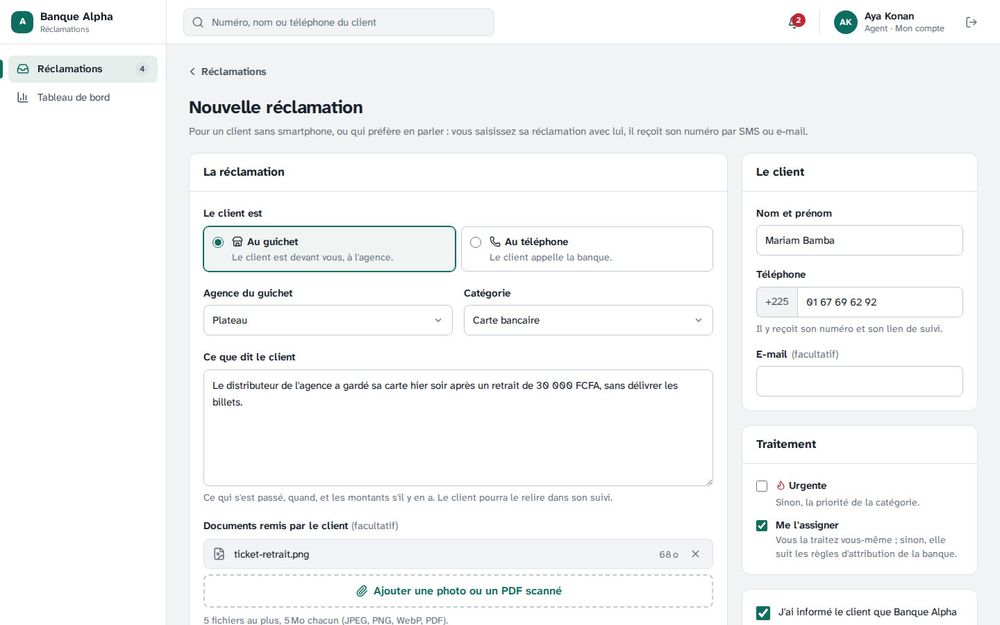
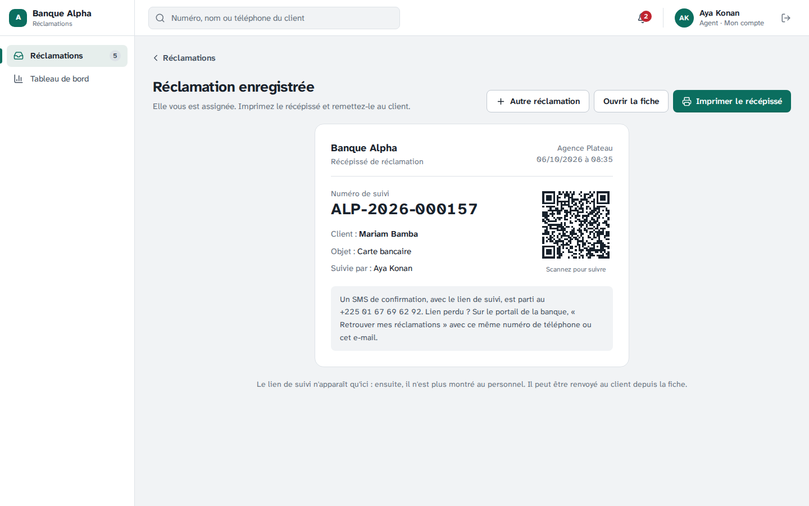
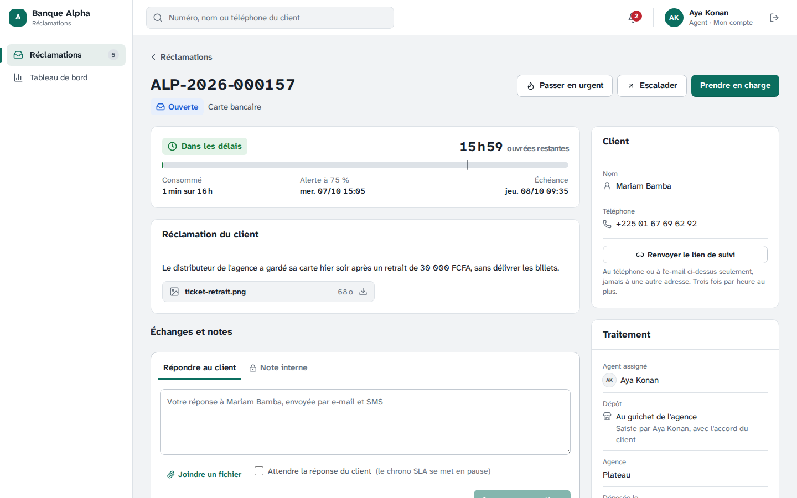
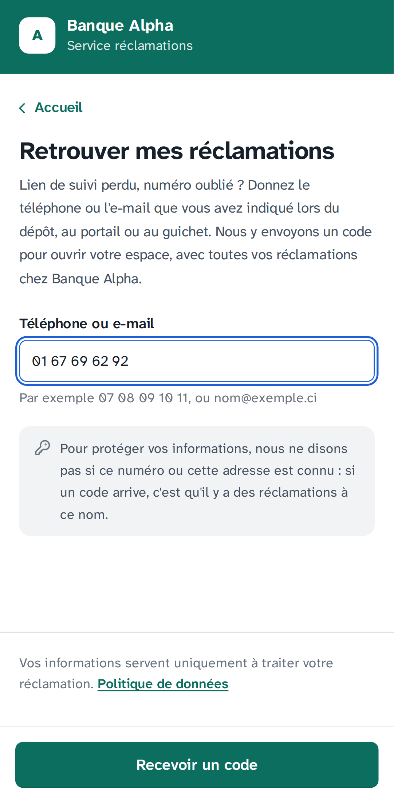
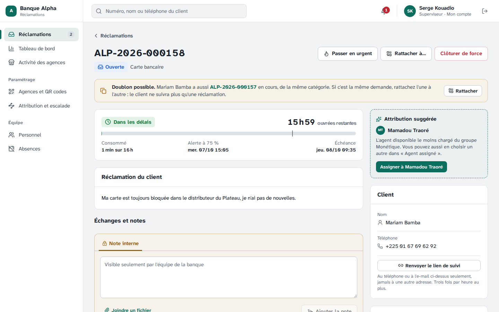
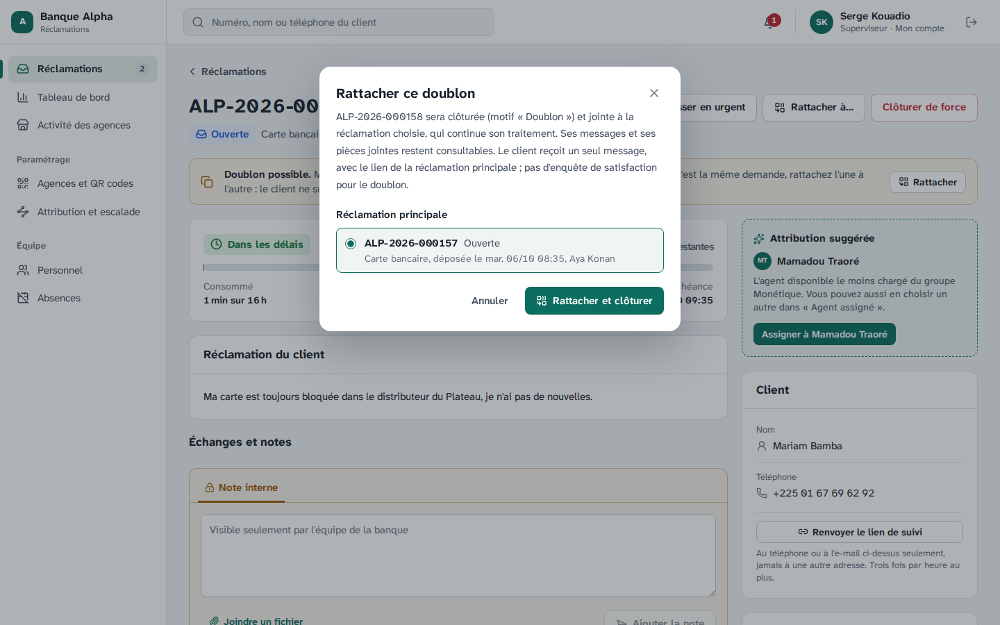
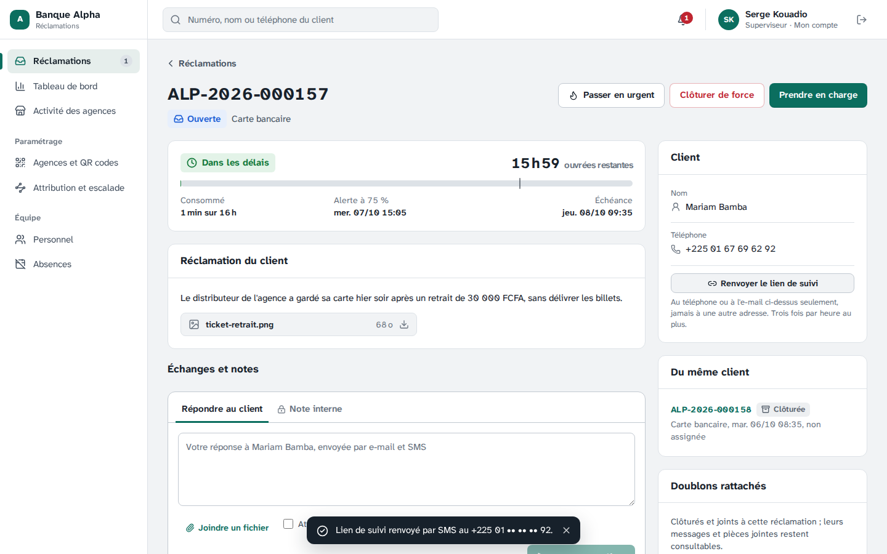
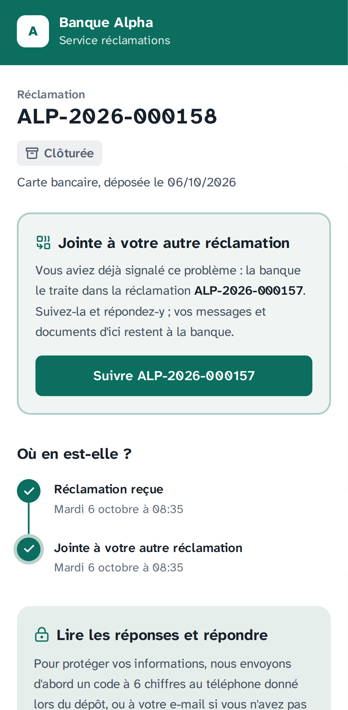
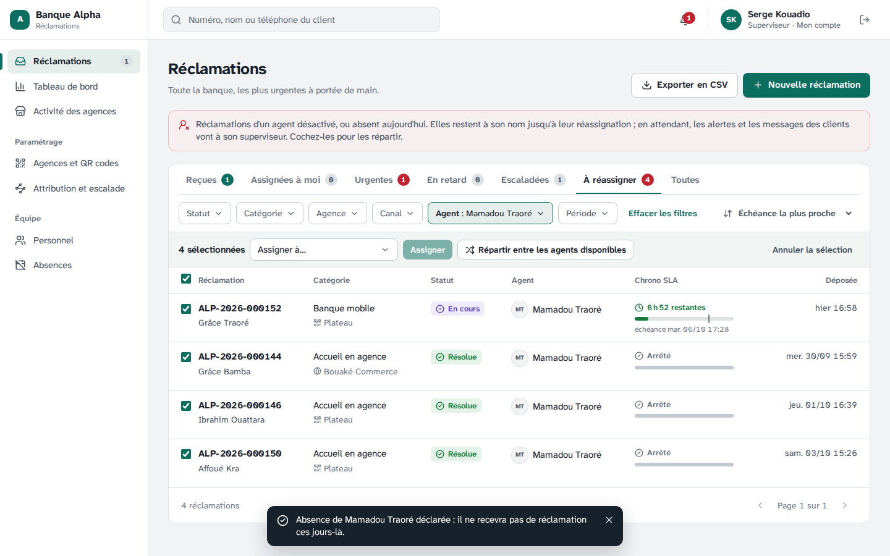

# Étape 21 — Guichet et téléphone, dossiers retrouvés, doublons, réaffectation

Plateforme de gestion des réclamations · Makor Telecoms · Solution 1
Version du 06/10/2026 · **Statut : validé le 06/10/2026** (décisions V1 à V15 retenues telles que proposées).

Cette étape répond à quatre questions posées après l'étape 20 :

- **Un client sans smartphone peut-il déposer une réclamation ?** Oui. Un agent ou un superviseur la saisit pour lui, au guichet ou au téléphone, sur deux canaux de plus : **Guichet** et **Téléphone**. Il imprime un récépissé avec le numéro et le QR code du suivi ; le client reçoit aussi son numéro par SMS ou par e-mail.
- **Le client a perdu son numéro de suivi : comment retrouve-t-il son dossier ?** Sur le portail de sa banque, **Retrouver mes réclamations** : il donne le téléphone ou l'e-mail du dépôt et reçoit un code, qui ouvre son espace avec toutes ses réclamations. Au guichet, l'agent peut aussi lui **renvoyer le lien**, aux seules coordonnées du dossier.
- **Les doublons sont-ils détectés, fusionnés ?** Détectés : deux réclamations en cours du même client et de la même catégorie, déposées à moins de 30 jours d'écart, portent **« Doublon possible »**. Rien n'est fusionné de soi-même : l'agent ou le superviseur **rattache** l'une à l'autre. Le doublon est clôturé (motif « Doublon ») et le client ne suit plus qu'une réclamation.
- **Que deviennent les dossiers d'un agent absent ?** Ils restent à son nom, mais rejoignent la file **« À réassigner »**, avec ceux d'un agent désactivé. Pendant ce temps, les alertes SLA et les messages des clients vont à son superviseur. Le superviseur les **répartit en lot** entre les agents disponibles, ou les donne à un agent.

Livrables :

- **Base de données.** Deux migrations, écrites à la main :
  - [`20261007120000_guichet_valeurs`](../backend/prisma/migrations/20261007120000_guichet_valeurs/migration.sql) : canaux `GUICHET` et `TELEPHONE`, événement `RATTACHEMENT` ;
  - [`20261007120100_guichet_doublons_reaffectation`](../backend/prisma/migrations/20261007120100_guichet_doublons_reaffectation/migration.sql) : `reclamation.rattachee_a_id`, la principale d'un doublon, dans la même banque (clé étrangère composée), seulement sur une réclamation clôturée pour doublon (contrainte) ; un point Guichet par agence, un point Téléphone par banque ; la banque ne peut modifier que cette colonne (droit de colonne).
- **Contrat.** [`contrat/openapi.yaml`](../contrat/openapi.yaml) passe de 117 à **124 opérations** (partie 8).
- **API.**
  - [Règles des doublons](../backend/src/domaine/doublons.ts) et de la [répartition en lot](../backend/src/domaine/attribution.ts), pures, partagées avec la démo cliquable ;
  - [cycle de vie](../backend/src/application/reclamations/cycle-de-vie.ts) : `saisir`, `rattacher`, `renvoyerLienSuivi` ; transition `RATTACHER` et opération `RENVOYER_LIEN` dans la [machine d'états](../backend/src/domaine/reclamation/machine.ts) ;
  - [alertes](../backend/src/application/reclamations/attribution.ts) : d'un agent absent ou désactivé, elles vont à son superviseur ;
  - [portail](../backend/src/modules/public/public.service.ts) : banque de l'adresse, code d'accès par téléphone ou e-mail.
- **Écrans.**
  - Console de la banque : **Nouvelle réclamation** et son récépissé imprimable ; sur la fiche, le bandeau « Doublon possible », **Rattacher à…**, **Du même client**, **Doublons rattachés**, **Renvoyer le lien de suivi**, le dépôt « Au guichet de l'agence » ou « Par téléphone » avec « Saisie par … » ; dans les files, le badge « Doublon possible », l'onglet **À réassigner** et l'assignation en lot ; dans **Absences** et **Personnel**, les réclamations en cours de chacun.
  - Portail : accueil aux couleurs de la banque de l'adresse, **Retrouver mes réclamations**, « Déjà une réclamation ? Retrouvez-la » sous le formulaire, et le suivi d'un doublon qui mène à la principale.
- **Démo, maquettes et jeu de démonstration.**
  - [Démo cliquable](demo/index.html) : doublons signalés et rattachement, lien renvoyé, file « À réassigner » des agents absents.
  - [Maquettes](maquettes/index.html) : 3 écrans de plus (35) : saisie au guichet (saisie, erreurs, récépissé, fiche), doublon et rattachement, retrouver ses réclamations ; variantes « À réassigner » des files et « Jointe à une autre » du suivi.
  - Jeu de démonstration : Aya a saisi au guichet du Plateau la réclamation d'Ahou Kouamé, Serge celle de Bakary Fofana par téléphone ; Yao Kouassi a redéposé sa réclamation « carte » (doublon possible) ; Mamadou est absent aujourd'hui et demain, ses dossiers sont à réassigner.
- **Recette.** Critère 18 dans la section « Critères de la phase 2 » du [rapport](recette/rapport.md), et sa fiche dans le [cahier de recette](recette/cahier-de-recette.md).

## 1. Saisir une réclamation au guichet ou au téléphone

Dans **Réclamations**, l'agent ou le superviseur clique **Nouvelle réclamation** :

1. **Le client est au guichet**, et l'agence est obligatoire, ou **au téléphone**, et l'agence dont il parle est facultative.
2. La catégorie, ce que dit le client, ses documents (photos, PDF scannés, mêmes contrôles qu'au portail).
3. Son nom, un téléphone ou un e-mail au moins : il y reçoit son numéro et son lien.
4. **Urgente** au besoin ; pour l'agent, **Me l'assigner** (coché) : il la traite lui-même, sinon les règles d'attribution de la banque s'appliquent.
5. La case « J'ai informé le client que la banque utilise ces informations… selon sa politique de données, et il l'accepte ». Son accord oral est inscrit au journal d'audit (`reclamation.saisie`), au nom de l'agent, avec la version de la politique.

**Enregistrer** affiche le **récépissé** : banque, agence, date et heure, numéro de suivi, client, objet, agent, QR code du suivi, et comment le retrouver. **Imprimer le récépissé** n'imprime que lui. Le lien de suivi n'est montré qu'ici : ensuite, il ne s'affiche plus au personnel.

Le client reçoit l'accusé habituel par SMS ou e-mail. Pour lui, rien ne change ensuite : suivi, code, réponses, confirmation, enquête. Sur la fiche, le dépôt dit « Au guichet de l'agence » ou « Par téléphone », et « Saisie par Aya Konan, avec l'accord du client » ; la chronologie, « Saisie pour le client ».

Les points Guichet et Téléphone sont créés au premier besoin, un par agence et un par banque. Ils n'ont ni QR code ni lien : ils n'apparaissent pas dans **Agences et QR codes**, et le portail refuse leur code. Dans le tableau de bord et l'activité des agences, Guichet et Téléphone sont deux canaux de plus ; une saisie au téléphone sans agence va à « Sans agence ».

## 2. Retrouver ses réclamations

**Sur le portail.** L'adresse du portail de la banque (`https://alpha.<domaine>`) affiche maintenant son accueil, à ses couleurs, avec **Retrouver mes réclamations**. Le formulaire de dépôt y mène aussi : « Déjà une réclamation ? Retrouvez-la ».

1. Le client donne le téléphone ou l'e-mail du dépôt, au portail comme au guichet.
2. S'il a des réclamations dans cette banque, un code à 6 chiffres y part (10 minutes). **La réponse est la même dans tous les cas** : « Saisissez le code reçu », avec le numéro masqué. Le portail ne dit jamais si un numéro a une réclamation.
3. Le code ouvre son espace client (30 minutes) avec toutes ses réclamations dans cette banque. En le quittant, il revient à « Retrouver mes réclamations ».

Défi anti-robot à chaque demande, 3 demandes par heure et par numéro ou adresse, 5 essais par code ; un numéro inconnu se comporte comme un code faux.

**Au guichet ou au téléphone.** Sur la fiche, **Renvoyer le lien de suivi** : le lien part au téléphone ou à l'e-mail du dossier, jamais à une autre adresse, et le message de confirmation n'affiche que le numéro masqué (« +225 07 •• •• •• 11 »). Trois fois par heure et par réclamation. Changer de numéro n'est pas possible depuis la console : c'est le client qui en dépose une avec son nouveau numéro.

## 3. Doublons

**Doublon possible** : deux réclamations distinctes du même client (reconnu à son téléphone ou à son e-mail), de la même catégorie, toutes deux non clôturées, déposées à moins de 30 jours d'écart. Le badge apparaît dans les files et le bandeau sur la fiche. Le portail ne prévient pas le client : il n'est pas identifié au dépôt, et lui dire « vous avez déjà une réclamation » révélerait celles d'un numéro à quiconque le saisit.

**Du même client** : sur la fiche, ses 10 dernières réclamations, les plus récentes d'abord, avec leur statut et leur agent. Un agent ne peut ouvrir que les siennes ; les autres sont listées « assignée à un autre agent ».

**Rattacher** : depuis le doublon, **Rattacher à…**, choisir la réclamation principale parmi celles du même client en cours que l'on peut ouvrir (quelle que soit la catégorie), **Rattacher et clôturer**.

- Le doublon est **clôturé, motif « Doublon »**, et joint à la principale. Ses messages et pièces jointes restent consultables sur sa fiche.
- La principale continue son traitement ; elle liste ses **Doublons rattachés** ; sa chronologie note « Doublon rattaché » (interne).
- Le client reçoit **un seul message** : « votre réclamation … est jointe à …, déjà en cours », avec le lien de la principale. Pas d'enquête de satisfaction pour le doublon. Son ancien lien de suivi affiche « Jointe à votre autre réclamation » et mène à la principale.
- Refusé : une principale d'un autre client, clôturée, elle-même un doublon, ou que l'acteur ne peut pas ouvrir.

Le rattachement est réservé à l'agent assigné au doublon (et qui peut ouvrir la principale, donc qui l'a aussi) et aux superviseurs. Il est inscrit au journal d'audit (`reclamation.rattachement`). Dans le tableau de bord, le doublon reste compté parmi les réclamations reçues et clôturées.

## 4. Dossiers d'un agent absent ou désactivé

**À réassigner** : un onglet des files du superviseur et de l'Admin Entreprise, avec les réclamations en cours d'un agent désactivé, ou absent aujourd'hui (absences de l'étape 16, quand l'attribution est ouverte à la banque). Il n'apparaît que s'il y en a.

En attendant leur réassignation, ces réclamations restent au nom de l'agent, et ce qui lui serait arrivé va **à son superviseur** (ou à tous les superviseurs s'il n'en a pas) : alerte préventive, dépassement, message du client, contestation.

**En lot** : le superviseur coche des réclamations (ou « Tout sélectionner »), puis :

- **Assigner à** un agent actif ;
- ou **Répartir entre les agents disponibles** : chacune à l'agent présent le moins chargé, d'abord dans le groupe de sa catégorie ou de son agence, sinon dans toute la banque, jamais à l'agent actuel.

Le résultat dit combien sont assignées, et pourquoi d'autres sont laissées (clôturée entre-temps, aucun agent disponible). 100 réclamations au plus par lot ; chaque assignation prévient son agent et va au journal, comme une à une.

**Absences** montre les réclamations en cours de l'agent absent, « N à réassigner », avec un lien vers ses dossiers. **Personnel** prévient avant de désactiver un agent qui en a ; après, ses superviseurs reçoivent une notification « Réclamations de … à réassigner », qui ouvre la file.

## 5. Ce qui protège ces fonctions

- **Cloisonnement** : saisie, rattachement, lot et code d'accès ne voient que la banque de l'acteur ou de l'adresse (RLS et clés composées). Un doublon ne peut être rattaché qu'à une réclamation de la même banque, en base.
- **Coordonnées** : rien ne part ailleurs qu'aux coordonnées du dossier ; le personnel ne voit le lien de suivi qu'au récépissé.
- **Portail** : la même réponse pour un numéro connu ou non, un défi anti-robot, des limites par numéro.
- **Droits** : la machine d'états décide (`RATTACHER`, `RENVOYER_LIEN`) ; l'Admin Entreprise consulte sans saisir ni rattacher ; l'assignation en lot est réservée au superviseur.
- **Pas de donnée au Super Admin** : il ne voit ni saisies ni doublons, seulement les totaux habituels.

## 6. Décisions à valider

| N° | Sujet | Proposition |
|---|---|---|
| V1 | Qui saisit | **L'agent et le superviseur**, depuis **Nouvelle réclamation**. Pas l'Admin Entreprise, qui consulte |
| V2 | Canaux | **Guichet** (agence obligatoire) et **Téléphone** (agence facultative), deux canaux de dépôt de plus, comptés à part au tableau de bord |
| V3 | Accord du client | La politique de données lui est présentée ; **son accord oral est une case** que l'agent coche, inscrite au journal à son nom avec la version de la politique |
| V4 | Assignation | L'agent qui saisit **se l'assigne** par défaut (décochable) ; le superviseur suit les règles d'attribution. **Urgente** possible dès la saisie |
| V5 | Récépissé | **À imprimer** : numéro, date, agence, QR code du suivi. Le lien n'est montré qu'à ce moment au personnel. Le client reçoit aussi l'accusé par SMS ou e-mail |
| V6 | Points internes | Un point Guichet par agence, un point Téléphone par banque, créés au premier besoin, **sans QR code ni lien** : absents de **Agences et QR codes**, refusés par le portail |
| V7 | Retrouver | Sur le portail, par **le téléphone ou l'e-mail du dépôt et un code** ; **même réponse** que le numéro soit connu ou non ; anti-robot, 3 demandes par heure et par numéro, 5 essais par code |
| V8 | Lien renvoyé | Depuis la fiche, **aux seules coordonnées du dossier**, numéro masqué à l'écran, 3 fois par heure. Pas de changement de numéro depuis la console |
| V9 | Doublon possible | Même client, même catégorie, **toutes deux en cours, à moins de 30 jours** : signalé dans les files et sur la fiche, jamais fusionné de soi-même. **Pas d'avertissement au portail** (il dévoilerait les réclamations d'un numéro) |
| V10 | Rattacher | Par **l'agent assigné aux deux** ou un superviseur ; à une réclamation **du même client, en cours**, de n'importe quelle catégorie. Le doublon est **clôturé, motif Doublon** ; ses messages et pièces restent consultables |
| V11 | Client d'un doublon | **Un seul message**, avec le lien de la principale ; **pas d'enquête** ; son ancien lien mène à la principale. Le doublon reste compté dans les reçues et les clôtures |
| V12 | Du même client | Les **10 dernières** réclamations du client sur la fiche ; un agent n'ouvre que les siennes |
| V13 | À réassigner | Les dossiers d'un agent **désactivé, ou absent aujourd'hui** (attribution ouverte), dans un onglet du superviseur ; ils restent à son nom ; ses **alertes et messages des clients vont à son superviseur** |
| V14 | En lot | Par le superviseur : **à un agent**, ou **répartis** au moins chargé (groupe de la catégorie ou de l'agence, sinon la banque), jamais à l'agent actuel ; **100 au plus** ; chaque assignation prévenue et journalisée |
| V15 | Absences et personnel | Les réclamations en cours de chacun ; avant de désactiver, l'avertissement ; après, **une notification aux superviseurs**, qui ouvre la file |

Correction au passage : depuis l'étape 20, les points WhatsApp et SMS pouvaient ouvrir un formulaire de dépôt sur le portail par leur code. Le portail n'accepte plus que les codes des QR codes et des liens web (`lireFormulaireDepot`, `deposerReclamation`, `converserAvecAssistant`).

## 7. Ce que voit chacun

| Rôle | Saisie | Doublons | À réassigner | Retrouver |
|---|---|---|---|---|
| Client | Au guichet ou au téléphone, récépissé et SMS | Un seul message ; son ancien lien mène à la principale | — | Par son téléphone ou son e-mail et un code |
| Agent | Saisit, se l'assigne | Badge et bandeau ; rattache entre deux réclamations à lui | — | Renvoie le lien |
| Superviseur | Saisit | Rattache | Onglet, assignation en lot, alertes des absents | Renvoie le lien |
| Admin Entreprise | Consulte | Consulte | Onglet, en lecture | — |
| Super Admin | Jamais | Jamais | — | — |

## 8. Contrat

Le contrat passe de 117 à **124 opérations** :

| Opération | Chemin | Appelant |
|---|---|---|
| `saisirReclamation` | `POST /banque/reclamations` (multipart, `Idempotency-Key`) | Agent, superviseur |
| `rattacherReclamation` | `POST /banque/reclamations/{id}/rattachement` | Agent assigné, superviseur |
| `renvoyerLienSuivi` | `POST /banque/reclamations/{id}/lien-suivi` | Agent assigné, superviseur |
| `assignerEnLot` | `POST /banque/reclamations/assignation-en-lot` | Superviseur |
| `lireBanquePortail` | `GET /public/banques/{slug}` | Portail |
| `demanderCodeAcces` | `POST /public/banques/{slug}/acces` | Portail (anti-robot) |
| `verifierCodeAcces` | `POST /public/banques/{slug}/acces/verification` | Portail |

Changements :

- `CanalDepot` gagne `GUICHET` et `TELEPHONE` ; `TypeEvenement`, `RATTACHEMENT` ; l'action `RATTACHER` et l'opération `RENVOYER_LIEN` ; le code d'erreur `RATTACHEMENT_IMPOSSIBLE` ; la file `a-reassigner` et son compteur `aReassigner`.
- La fiche gagne `saisiePar`, `duMemeClient`, `rattacheeA` et `doublonsRattaches` ; chaque ligne des files, `doublonPossible` ; le suivi et la réclamation du client, `rattacheeA` ; les utilisateurs et les absences, `reclamationsEnCours`.

La [documentation hors ligne](api/index.html) et les types sont régénérés.

## 9. Essayer en développement

Avec le jeu de démonstration (`docker compose up -d`, puis `npm run semer`), dans la console (http://localhost:5173) :

1. Aya (`aya.konan@banque-alpha.example`), **Réclamations › Nouvelle réclamation** : saisissez une réclamation au guichet du Plateau pour un client fictif, puis **Imprimer le récépissé** (l'aperçu d'impression de Firefox suffit). Le SMS est dans le journal du worker (`docker compose logs worker`).
2. Serge, **Réclamations** : la réclamation de Yao Kouassi déposée en dernier porte « Doublon possible ». Ouvrez-la, **Rattacher à…**.
3. Serge, onglet **À réassigner** : les dossiers de Mamadou, absent ; cochez-les et répartissez-les.
4. Portail : http://alpha.localhost:5174, **Retrouver mes réclamations**, avec le numéro saisi en 1 ; le code est dans le journal du worker.

## 10. Tests

| Suite | Ce qui est vérifié |
|---|---|
| Bout en bout (212, dont 19 nouveaux) | Saisie au guichet et au téléphone : agence obligatoire au guichet, canal et point interne, accusé, idempotence, consentement au journal ; points internes refusés au portail et absents du paramétrage. Retrouver : banque du portail, code au numéro connu, même réponse pour un inconnu, anti-robot, limites. Lien renvoyé : coordonnées du dossier, limite, 403 et 404. Doublons : badges, du même client, principale invisible pour un agent (404), refus (422), effets du rattachement, suivi et vue du client, 409 sur une réclamation clôturée. À réassigner : agent désactivé (notification aux superviseurs, file, message du client alerté au superviseur), assignation en lot (répartie, à un agent, raisons des refus), agent absent |
| Sécurité PostgreSQL (173, dont 14 nouveaux) | Rattachement dans la même banque et seulement pour un doublon clôturé ; colonne seule modifiable ; un point Guichet par agence, un Téléphone par banque ; saisie, lot et code d'accès cloisonnés par banque |
| Unitaires, backend (375, dont 16 nouveaux) | Doublon possible et refus de rattachement ; répartition en lot (groupe, banque, jamais l'agent actuel, charge) ; machine d'états (`RATTACHER`, `RENVOYER_LIEN`) |
| Unitaires, frontend (289, dont 43 nouveaux) | Données des maquettes validées contre le contrat, boutons de chaque fiche égaux à la machine d'états ; écrans de l'étape (fiche d'un doublon vue par l'agent et le superviseur, récépissé, saisie, files à réassigner, portail) ; démo : doublon rattaché, un seul SMS, lien renvoyé, à réassigner |
| Chromium (65, dont 4 nouveaux) | Aya saisit au guichet, corrige les erreurs, imprime le récépissé ; la cliente retrouve ses réclamations par son numéro, puis redépose ; Serge voit le doublon possible, le rattache, renvoie le lien ; l'ancien lien mène à la principale ; Mamadou absent, ses dossiers sont répartis en lot |

La [recette automatique](recette/rapport.md) vérifie le critère 18 par les tests de bout en bout, le test Chromium, les tests unitaires des doublons et de la répartition, et les vérifications PostgreSQL. Elle passe en 14 minutes : les 11 critères de la phase 1, les 7 de la phase 2, 941 tests sur 941 et 250 vérifications PostgreSQL. Le [cahier de recette](recette/cahier-de-recette.md) a sa fiche, à signer à part.

Au passage, le test Chromium de l'activité des agences (étape 19) ne dépend plus du jour du mois : en début de mois, la ligne « Sans agence » n'apparaît qu'avec des dépôts sans agence, et le test la cherche maintenant sur 30 jours.

## 11. Captures

Aya saisit la réclamation d'une cliente venue au guichet. Le premier envoi manquait d'agence : l'erreur disparaît dès le champ corrigé.

Le récépissé à imprimer et à remettre à la cliente :

Sur la fiche, le dépôt et qui l'a saisie :

La cliente a perdu son SMS ; elle retrouve ses réclamations avec son numéro :

Elle a redéposé la même réclamation. Serge voit le doublon possible :

Il la rattache à la réclamation d'Aya :

La principale liste son doublon ; le lien de suivi est renvoyé à la cliente :

L'ancien lien de la cliente mène à la principale :

Mamadou est absent : ses dossiers sont à réassigner, Serge les répartit en lot :

## 12. Ce qui ne change pas

- **Le dépôt par QR code et par lien web**, le suivi, le code, l'espace client, l'enquête : la saisie au guichet suit le même cycle de vie.
- **L'attribution automatique et les absences** de l'étape 16 : la répartition en lot reprend leurs règles de charge et de groupes.
- **Le cloisonnement entre banques** et ce que voit le Super Admin.
- **Pour une installation existante**, la mise à jour applique les deux migrations (`deploiement/mettre-a-jour.sh`). Aucune variable nouvelle.

## 13. Suite

Étape 22 : envois non remis (état de chaque message, accusés de remise des SMS, nouvelles tentatives espacées, ce que voit l'agent) et pièces jointes (Word sans macro, antivirus ClamAV, 10 Mo). Étape 23 : baromètre de satisfaction et recommandations IA.
