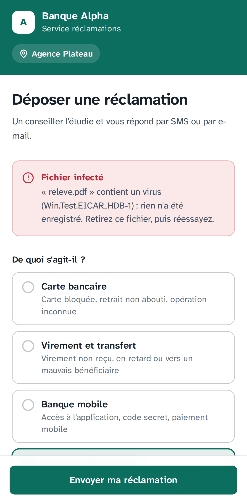
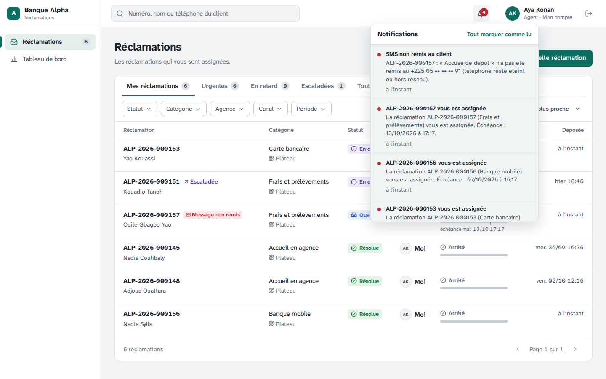
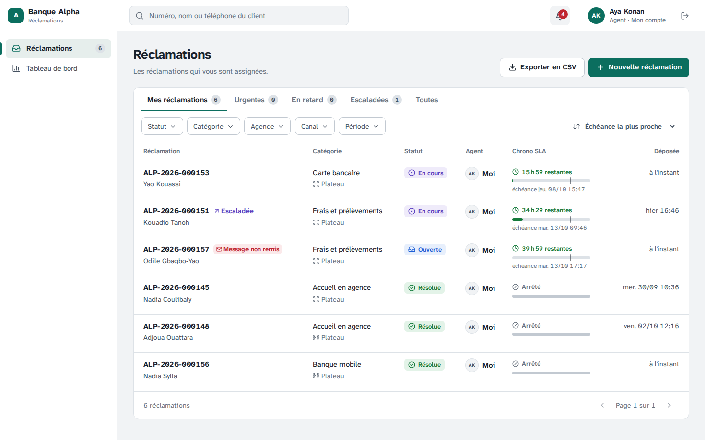
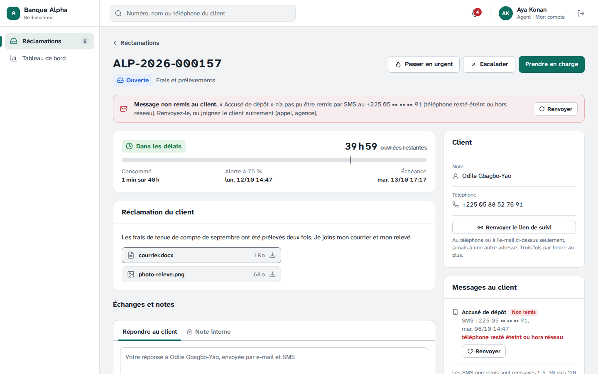
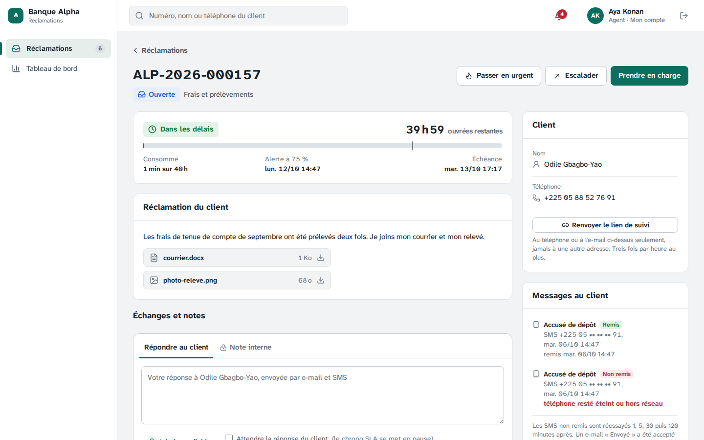
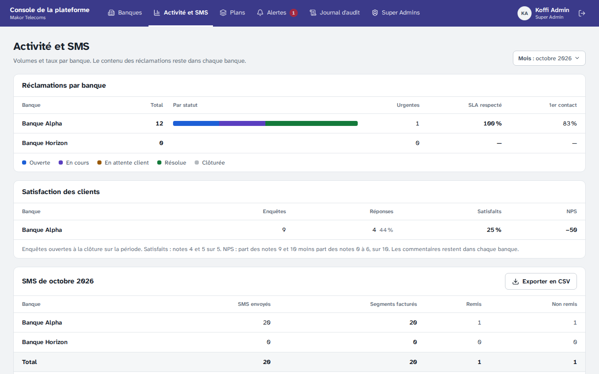

# Étape 22 — Envois non remis, pièces jointes Word et antivirus

Plateforme de gestion des réclamations · Makor Telecoms · Solution 1
Version du 06/10/2026 · **Statut : en attente de validation** (décisions V1 à V13, partie 7).

Cette étape répond à trois questions posées après l'étape 20 :

- **Un SMS n'est pas arrivé : que voit l'agent, une nouvelle tentative est-elle prévue ?** Chaque message envoyé au client a maintenant son **état** sur la fiche : en cours d'envoi, nouvel essai prévu, envoyé, remis, non remis (et pourquoi). Un échec passager est **réessayé 1, 5, 30 puis 120 minutes après** ; un numéro invalide ou refusé ne l'est pas. La passerelle SMS signale ce qu'est devenu chaque SMS (**accusé de remise**). Quand un message n'est pas arrivé et que rien ne l'a remplacé, l'agent est **prévenu**, le voit dans sa file et sur la fiche, et le **renvoie** d'un clic.
- **Quels fichiers, quelle taille ?** Photos (JPEG, PNG, WebP), PDF et maintenant **documents Word (.docx, sans macro)**, **10 Mo** par fichier, 5 fichiers. L'ancien format .doc et les documents à macros sont refusés, avec ce qu'il faut faire.
- **Les fichiers sont-ils contrôlés par un antivirus ?** Oui : chaque fichier reçu (portail, console, WhatsApp) est analysé par **ClamAV**, sur le serveur, avant d'être enregistré. Un fichier infecté est refusé. Si l'antivirus ne répond pas, le fichier attend, sans pouvoir être téléchargé, et il est analysé dès son retour.

Livrables :

- **Base de données.** Une migration, écrite à la main : [`20261008120000_envois_pieces_jointes`](../backend/prisma/migrations/20261008120000_envois_pieces_jointes/migration.sql). Sur chaque envoi : l'heure du prochain essai, celle de la remise, le motif d'un échec (liste fermée). Sur chaque pièce jointe : le résultat de l'antivirus (en attente, sain, infecté), l'heure de l'analyse et le nom du virus ; seul le système l'écrit, une seule fois, et la pièce jointe reste par ailleurs immuable. La facturation SMS compte aussi les SMS remis.
- **Contrat.** [`contrat/openapi.yaml`](../contrat/openapi.yaml) passe de 124 à **126 opérations** (partie 8).
- **API et worker.**
  - [Règles des envois](../backend/src/domaine/envois.ts), pures, partagées avec les écrans et la démo : états, espacement des essais, motifs, messages renvoyables ;
  - [boîte d'envoi](../backend/src/infrastructure/envois/boite-envoi.ts) : essais espacés, refus définitifs de la passerelle et du serveur d'e-mail ([adaptateurs](../backend/src/infrastructure/envois/adaptateurs.ts)) ;
  - [accusés de remise](../backend/src/infrastructure/canaux/remise-sms.ts), [alerte à l'agent](../backend/src/application/reclamations/envois.ts), renvoi dans le [cycle de vie](../backend/src/application/reclamations/cycle-de-vie.ts) ;
  - [documents Word](../backend/src/infrastructure/fichiers/word.ts), [antivirus ClamAV](../backend/src/infrastructure/fichiers/antivirus.ts), [analyse différée](../backend/src/application/fichiers/analyse.ts) par le worker.
- **Écrans.**
  - Fiche : panneau **Messages au client**, bandeau du message non remis, **Renvoyer** ; pièces jointes « analyse en cours » ou « effacée : virus ».
  - Files : badge **Message non remis**. Console de la plateforme : colonnes **Remis** et **Non remis** de la facturation SMS (et de son export).
  - Choix des fichiers (portail et console) : Word accepté, .doc et .docm écartés tout de suite avec la raison, 10 Mo.
- **Exploitation.** Service **clamav** dans [`docker-compose.prod.yml`](../docker-compose.prod.yml) (et dans [`docker-compose.yml`](../docker-compose.yml), profil `antivirus`) ; requêtes jusqu'à 60 Mo dans [Caddy](../docker/caddy/commun.caddy) ; santé de l'antivirus dans `/api/v1/sante` et dans [`verifier.sh`](../deploiement/verifier.sh) ; [guide d'exploitation](exploitation.md) à jour.
- **Démo, maquettes et jeu de démonstration.**
  - [Démo cliquable](demo/index.html) : les messages au client sur la fiche.
  - [Maquettes](maquettes/index.html) : un écran de plus (36) : la fiche d'Ahou Kouamé, SMS non remis, pièces jointes saines, en analyse ou effacées.
  - Jeu de démonstration : l'accusé de dépôt de Bakary Fofana n'a pas été remis (téléphone injoignable) ; Serge et Mariam en sont prévenus.
- **Recette.** Critère 19 dans la section « Critères de la phase 2 » du [rapport](recette/rapport.md), et sa fiche dans le [cahier de recette](recette/cahier-de-recette.md).

## 1. L'état de chaque message au client

Chaque e-mail, SMS ou message WhatsApp envoyé au client (accusé de dépôt, changement de statut, réponse, question, résolution, clôture, lien de suivi, code…) passe par ces états :

| État | Ce que cela veut dire |
|---|---|
| En cours d'envoi | Dans la boîte d'envoi, pas encore parti (quelques secondes) |
| Nouvel essai prévu | La passerelle ou le serveur d'e-mail n'a pas répondu : nouvel essai à l'heure indiquée |
| Envoyé | Accepté par la passerelle SMS, Meta ou le serveur d'e-mail. **Pour un e-mail, c'est le dernier état** : il n'y a pas d'accusé de remise |
| Remis | La passerelle (SMS) ou Meta (WhatsApp) confirme qu'il est arrivé sur le téléphone |
| Lu | Lu sur WhatsApp |
| Non remis | Définitivement non remis, avec le motif |

Les motifs, en mots du personnel : numéro invalide ; téléphone injoignable ; téléphone resté éteint ou hors réseau (le SMS a expiré) ; refusé par l'opérateur ; adresse e-mail refusée ; WhatsApp n'a pas pu le remettre ; envoi impossible après 5 essais. Le message technique reste dans la base, pour le diagnostic.

**Les essais.** Un échec passager (passerelle ou serveur d'e-mail injoignable, erreur 5xx) est réessayé **1, 5, 30 puis 120 minutes** après : 5 essais en 2 h 36 environ. Un refus définitif (numéro invalide ou inconnu, adresse refusée) ne se réessaie pas : l'erreur serait la même. Pendant les essais, `/api/v1/sante` ne signale un retard d'envoi qu'à partir de 10 minutes après l'heure prévue de l'essai.

**WhatsApp** garde le repli de l'étape 20 : un message que Meta ne remet pas repart par SMS ordinaire (ou, pour une réponse d'agent, par un avis dans le suivi). Son état « Non remis » s'affiche, sans alerte : le client est prévenu autrement.

## 2. Ce que voit l'agent

- **Sur la fiche**, le panneau **Messages au client** liste les messages envoyés au client, les plus récents d'abord (50 au plus) : objet (« Accusé de dépôt », « Résolution »…), canal, coordonnée **masquée** (`+225 07 •• •• •• 11`, `y••••@exemple.ci`), date, état et motif. **Jamais le texte du message** ni le message technique.
- **Un bandeau rouge** quand un message n'est pas arrivé, que rien ne l'a remplacé et que l'utilisateur peut le renvoyer : « Message non remis au client. « Résolution » n'a pas pu être remis par SMS au +225 07 •• •• •• 11 (téléphone injoignable). Renvoyez-le, ou joignez le client autrement (appel, agence). »
- **Dans les files**, le badge **Message non remis** sur la ligne.
- **Une notification dans l'application** : « SMS non remis au client — ALP-2026-000157 : « Accusé de dépôt » n'a pas été remis au +225 05 •• •• •• 73 (téléphone resté éteint ou hors réseau). » À l'agent assigné ; s'il est absent ou désactivé, à son superviseur ; si la réclamation n'est à personne, aux superviseurs. Une fois par message.

**« Remplacé ».** Un message non remis ne compte plus quand le client a reçu le même message autrement : l'e-mail parti au même moment, ou le renvoi. Un client qui a donné son téléphone et son e-mail reçoit chaque message sur les deux : si le SMS échoue mais que l'e-mail part, l'état du SMS s'affiche, sans bandeau ni alerte.

**Renvoyer.** L'agent assigné ou un superviseur renvoie **le même message, à la même coordonnée** (celle du dossier) : il repasse par la boîte d'envoi, avec ses essais. Seuls les messages dont le texte est gardé se renvoient : accusé, statut, réponse, question, résolution, clôture, lien de suivi, rattachement. Un code de connexion (effacé après l'envoi, le client en redemande un) ou un avis de conversation (sans texte) ne se renvoie pas. Un message déjà renvoyé ne se renvoie pas une seconde fois ; **3 renvois par heure** et par réclamation ; chaque renvoi est inscrit au journal d'audit.

Si le numéro lui-même est faux, le renvoi n'y change rien : comme à l'étape 21 (décision V8), le numéro ne se change pas depuis la console ; l'agent joint le client autrement, et une nouvelle réclamation portera le bon numéro.

## 3. Accusés de remise de la passerelle SMS

La passerelle de Makor signale ce que devient chaque SMS. **Interface proposée, à confirmer avec son équipe** :

```
POST https://console.<domaine>/api/v1/webhooks/sms/remise
X-Signature: sha256=<HMAC-SHA256 du corps avec SMS_ENTRANT_SECRET>
Content-Type: application/json

{ "id": "<identifiant rendu à l'envoi>", "reference": "<identifiant envoyé avec le SMS>",
  "statut": "REMIS" | "NON_REMIS" | "EXPIRE" | "REJETE" | "EN_COURS",
  "code": "<code de l'opérateur, facultatif>", "recuLe": "2026-10-08T09:12:00Z" }
```

- Même secret que les SMS reçus de l'étape 20 : rien de nouveau à configurer. Signature absente ou fausse : 401.
- Le SMS est retrouvé par `reference` (l'identifiant que l'API envoie déjà avec chaque SMS, `Idempotency-Key`) ou par `id`.
- `REMIS` : remis ; `NON_REMIS` (téléphone injoignable), `EXPIRE` (resté éteint jusqu'à la fin de la validité du SMS, souvent 24 à 48 h selon la passerelle) et `REJETE` (refusé par l'opérateur) : non remis, l'agent est prévenu ; `EN_COURS` est ignoré.
- Réponse 200 dans tous les cas où la signature est bonne, SMS inconnu compris : la passerelle n'a pas à réessayer. Un accusé reçu deux fois, ou un accusé contraire arrivé après, ne change rien.

En développement, sans passerelle : `npm run canal -- remise <numéro> NON_REMIS` envoie l'accusé du dernier SMS parti à ce numéro (partie 9).

**Facturation.** Un SMS accepté par la passerelle est facturé même si l'opérateur ne le remet pas. Le Super Admin voit, par banque et par mois : SMS envoyés, segments facturés, **remis**, **non remis**. Des totaux, jamais un numéro ni un texte.

## 4. Pièces jointes : Word et 10 Mo

| | Avant | Étape 22 |
|---|---|---|
| Types | JPEG, PNG, WebP, PDF | les mêmes, et **Word .docx sans macro** |
| Taille | 5 Mo par fichier | **10 Mo** par fichier |
| Nombre | 5 par dépôt ou message | inchangé |

Le type est toujours reconnu **au contenu** du fichier, jamais à son nom. Un document Word est une archive : l'API la lit sans l'extraire et refuse, avec la raison :

- l'**ancien format .doc** : « ancien format Word (.doc) ou fichier Office non accepté. Enregistrez-le en .docx ou en PDF » (il peut contenir des macros, et ne se contrôle pas de la même façon) ;
- un document **à macros** (.docm, ou macros glissées dans un .docx) ou à **contrôles ActiveX** ;
- un document **protégé par un mot de passe** (l'antivirus ne pourrait pas le lire) ;
- une **archive anormale** (« bombe » qui se décompresse en gigaoctets, plus de 2 000 éléments).

Le choix des fichiers, au portail et dans la console, écarte tout de suite un .doc ou un .docm avec la même explication ; il reconnaît un .docx à son extension quand l'ordinateur ne connaît pas son type (Windows sans Word). Les fichiers reçus sur WhatsApp suivent les mêmes règles.

## 5. Antivirus

**ClamAV**, antivirus libre, tourne dans un conteneur du VPS : **aucun fichier ne sort du serveur**. L'API lui passe chaque fichier reçu par le réseau interne, avant de l'enregistrer. Ses signatures se mettent à jour chaque jour (freshclam).

- **Infecté** : le dépôt, le message ou la réponse est refusé (422) : « « releve.pdf » contient un virus (…) : rien n'a été enregistré. Retirez ce fichier, puis réessayez. » Rien n'est enregistré.
- **Antivirus injoignable** (redémarrage, panne) : le fichier est accepté, marqué **« Analyse antivirus en cours »** et **ne se télécharge pas** (409). Le worker reprend ces fichiers chaque minute ; dès le retour de ClamAV, ils deviennent téléchargeables. Si l'un est infecté : il est **effacé**, la pièce jointe garde son nom avec « Effacé : l'antivirus y a trouvé un virus », l'agent (ou son superviseur) est prévenu et le journal d'audit le note.
- **Fichiers déjà reçus** avant cette étape : analysés de la même façon par le worker, dans les minutes qui suivent la mise à jour.
- **Supervision** : `/api/v1/sante` répond `"antivirus":"indisponible"` et `"statut":"degrade"` quand ClamAV ne répond pas ; `deploiement/verifier.sh --local` vérifie que l'API joint ClamAV et qu'il reconnaît le fichier de test **EICAR** (sans danger, reconnu par tous les antivirus).
- **Mémoire** : ClamAV prend environ 1,3 Go, le double pendant le rechargement quotidien des signatures. Le VPS de 8 Go suffit.
- **Production** : l'antivirus est obligatoire, `ANTIVIRUS=aucun` y est refusé au démarrage. En développement, il est désactivé par défaut (le journal le rappelle) ; le profil `antivirus` le lance (partie 9).

## 6. Ce qui protège ces fonctions

- **Rien de plus n'est montré** : la fiche donne la coordonnée masquée et l'état, jamais le texte ni le message technique ; la notification de l'agent aussi.
- **États écrits par le système seul** : la banque ne peut pas marquer un message remis ni une pièce jointe saine (droits de colonne) ; le Super Admin non plus. Motifs et noms de virus contrôlés en base.
- **Pièce jointe immuable** : seul le résultat de l'analyse s'écrit, une seule fois, d'« en attente » à « saine » ou « infectée », sans rien changer d'autre ; ni suppression, ni retour en arrière, même par le propriétaire des tables.
- **Webhook signé** : un accusé sans la bonne signature est refusé ; il ne peut changer qu'un SMS en attente ou envoyé.
- **Renvoi** : seulement à la coordonnée du dossier, par l'agent assigné ou un superviseur, limité et journalisé ; cloisonné par banque.

## 7. Décisions à valider

| | Sujet | Proposition |
|---|---|---|
| V1 | États | **En cours d'envoi, Nouvel essai prévu, Envoyé, Remis, Lu, Non remis** (avec le motif). Pour un e-mail, « Envoyé » est le dernier état : accepté par le serveur d'envoi, sans accusé de remise |
| V2 | Essais | **5 essais, 1, 5, 30 puis 120 minutes** après chaque échec passager ; un refus définitif (numéro invalide ou refusé, adresse refusée) n'est **pas réessayé** |
| V3 | Accusés de remise | Interface **proposée à la passerelle de Makor** (partie 3), signée avec **le même secret** que les SMS reçus ; à confirmer avec son équipe |
| V4 | Ce que voit l'agent | Sur la fiche, **Messages au client** : objet, canal, coordonnée masquée, état, motif ; **jamais le texte**. Badge dans les files, bandeau sur la fiche |
| V5 | Alerte | **Dans l'application**, à l'agent assigné (sinon son superviseur, ou les superviseurs), **une fois par message**, seulement si rien ne l'a remplacé (e-mail parti au même moment, renvoi). Pas d'e-mail ni de SMS à l'agent |
| V6 | Renvoyer | Par l'agent assigné ou un superviseur, **le même message à la même coordonnée** ; seulement ceux dont le texte est gardé (pas un code, pas un avis de conversation) ; **une fois** par message non remis, **3 renvois par heure** et par réclamation ; journal d'audit |
| V7 | Pas de bascule automatique | Un SMS non remis ne part **pas de lui-même par e-mail** : le client qui a donné les deux reçoit déjà chaque message sur les deux. WhatsApp garde son repli de l'étape 20, **sans alerte** |
| V8 | Facturation | Un SMS parti est **facturé même non remis** ; Makor voit en plus les **remis** et les **non remis**, par banque et par mois |
| V9 | Types de fichiers | Photos, PDF et **Word .docx sans macro** ; **.doc refusé** (à enregistrer en .docx ou en PDF) ; macros, ActiveX, mot de passe et archives anormales refusés. Pas d'Excel ni de PowerPoint |
| V10 | Taille | **10 Mo par fichier**, 5 fichiers par dépôt ou message (requêtes jusqu'à 60 Mo) |
| V11 | Antivirus | **ClamAV sur le VPS** (aucun fichier ne sort), signatures mises à jour chaque jour ; chaque fichier **analysé avant d'être enregistré**, un fichier infecté **refusé** |
| V12 | Antivirus indisponible | Fichier gardé **« en analyse », non téléchargeable**, analysé par le worker dès le retour de ClamAV ; infecté : **effacé**, agent prévenu, journal d'audit. Fichiers déjà reçus : analysés après la mise à jour |
| V13 | Exploitation | Antivirus **obligatoire en production** ; santé « dégradée » s'il ne répond pas ; contrôle EICAR dans `verifier.sh` ; environ **1,3 Go de mémoire** de plus sur le VPS |

## 8. Contrat

Le contrat passe de 124 à **126 opérations** :

| Opération | Chemin | Appelant |
|---|---|---|
| `renvoyerMessage` | `POST /banque/reclamations/{id}/envois/{envoiId}/renvoi` | Agent assigné, superviseur |
| `recevoirRemiseSms` | `POST /webhooks/sms/remise` (signé) | Passerelle SMS de Makor |

Changements :

- La fiche gagne `envois` (schémas `EnvoiClient`, `EtatEnvoi`, `MotifEchec`) ; chaque ligne des files, `envoiNonRemis`.
- Chaque pièce jointe gagne `antivirus` (`EN_ATTENTE`, `SAIN`, `INFECTE`) ; les téléchargements répondent 409 `FICHIER_EN_ANALYSE` ou `FICHIER_SUPPRIME` ; les envois de fichiers, 422 `FICHIER_INFECTE`. Fichiers : 10 Mo, Word .docx.
- La santé gagne `antivirus` (`ok`, `indisponible`, `desactive`) ; la facturation SMS, `remis`.
- Codes d'erreur : `FICHIER_INFECTE`, `FICHIER_EN_ANALYSE`, `FICHIER_SUPPRIME`, `MESSAGE_NON_RENVOYABLE`.

La [documentation hors ligne](api/index.html) et les types sont régénérés.

## 9. Essayer en développement

Avec le jeu de démonstration (`docker compose up -d`, puis `npm run semer` sur une base neuve), dans la console (http://localhost:5173) :

1. Serge (`serge.kouadio@banque-alpha.example`) : la notification « SMS non remis au client », et dans les files la réclamation de Bakary Fofana avec **Message non remis**. Sur sa fiche, le bandeau, **Messages au client**, **Renvoyer**.
2. Un accusé de remise à la main, pour le dernier SMS parti à un numéro : `docker compose exec api npm run canal -- remise 0101020304 NON_REMIS` (ou `REMIS`, `EXPIRE`, `REJETE`). Les SMS partent par le worker, qui les écrit dans son journal (`docker compose logs worker`).
3. Portail (http://alpha.localhost:5174/d/7K3QX9P2MA) : joindre un document Word ; un .doc est écarté tout de suite.
4. Avec le vrai antivirus : dans le fichier `.env` à la racine du dépôt, `COMPOSE_PROFILES=antivirus` et `ANTIVIRUS=clamav`, puis `docker compose up -d` (au premier démarrage, une à deux minutes pour charger les signatures ; environ 1,3 Go de mémoire pour Docker Desktop). Sans lui, les fichiers sont acceptés sans analyse et le journal de l'API le rappelle.

L'antivirus de Windows met en quarantaine tout fichier qui contient le fichier de test EICAR : les tests le fabriquent en mémoire, jamais sur le disque du poste.

## 10. Tests

| Suite | Ce qui est vérifié |
|---|---|
| Bout en bout (221, dont 9 nouveaux) | Refus définitif de la passerelle : non remis, motif, alerte à l'agent une fois, fiche sans numéro complet ni texte, badge. Renvoi : droits (403), autre banque (404), message inconnu (404), même texte au même numéro, une seule fois (422), 3 par heure (429), journal. Essai 1 minute après un échec passager, puis refus : l'e-mail parti au même moment l'a remplacé, pas d'alerte. Accusés de remise : signature, référence ou identifiant, EN_COURS et inconnus ignorés, une seule fois. Facturation : SMS envoyés, remis, non remis. Word accepté et téléchargé ; macros, ActiveX, mot de passe, archive piégée, ancien .doc refusés ; virus refusé au dépôt et dans une réponse d'agent ; antivirus injoignable : santé dégradée, fichiers en analyse (409), analysés par le worker, infecté effacé (409), audit et alerte |
| Sécurité PostgreSQL (190, dont 17 nouveaux) | États des envois et résultat de l'antivirus écrits par le système seul ; motifs et noms de virus contrôlés ; résultat écrit une seule fois, rien d'autre ne change, ni suppression ; pièce jointe invisible d'une autre banque ; facturation SMS réservée au Super Admin |
| Unitaires, backend (403, dont 28 nouveaux) | États, espacement, remplacement, masquage (`domaine/envois`) ; refus définitifs ou passagers de la passerelle et du serveur d'e-mail ; contrôle des documents Word (11) ; adaptateur ClamAV (sain, infecté, injoignable, muet) |
| Unitaires, frontend (300, dont 11 nouveaux) | Fiche (bandeau, messages au client, Admin Entreprise sans renvoi), pièces jointes en analyse ou effacées, choix des fichiers (.docx sans type connu, .doc, .docm, 10 Mo), badge des files, colonnes de la facturation ; démo : messages au client sur la fiche |
| Chromium (68, dont 3 nouveaux) | Au portail, Word accepté ; .doc écarté au choix, fichier infecté et Word à macros refusés par l'API ; accusé « expiré » de la passerelle : Aya prévenue, badge, bandeau, renvoi, puis « Remis » ; colonnes Remis et Non remis de Makor |

La [recette automatique](recette/rapport.md) vérifie le critère 19 par les tests de bout en bout, le test Chromium, les tests unitaires des envois et des fichiers, et les vérifications PostgreSQL. Elle passe en 15 minutes : les 11 critères de la phase 1, les 8 de la phase 2, 992 tests sur 992 et 267 vérifications PostgreSQL. Le [cahier de recette](recette/cahier-de-recette.md) a sa fiche, à signer à part.

## 11. Captures

Au portail, un relevé infecté (le fichier de test EICAR) est refusé ; rien n'est enregistré :



L'accusé de dépôt n'est pas arrivé (téléphone resté éteint) ; Aya est prévenue :



Dans sa file, le badge :



La fiche : le bandeau, les pièces jointes (dont le courrier Word) et les messages au client, numéro masqué :



Renvoyé, puis remis d'après la passerelle :



Makor voit les SMS remis et non remis :



## 12. Ce qui ne change pas

- **Les messages envoyés au client** : mêmes textes, mêmes canaux, mêmes règles (S10 : numéro et lien, jamais le contenu de la réclamation).
- **Le repli WhatsApp** de l'étape 20 et la facturation de Meta.
- **Le numéro du client** ne se change pas depuis la console (étape 21, V8).
- **Pour une installation existante**, la mise à jour applique la migration et démarre le service clamav (`deploiement/mettre-a-jour.sh`) ; aucune variable nouvelle à remplir. Les fichiers déjà reçus sont analysés dans les minutes qui suivent ; d'ici là, ils s'affichent « en analyse ».

## 13. Suite

Étape 23 : baromètre de satisfaction et recommandations IA.
