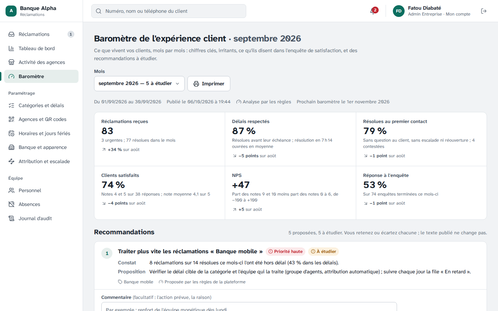
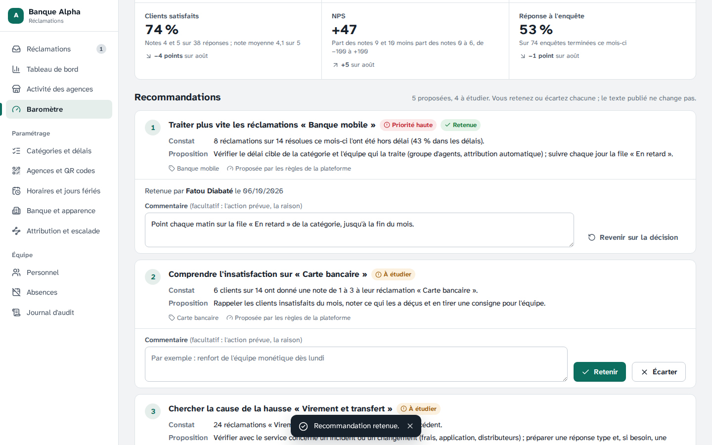
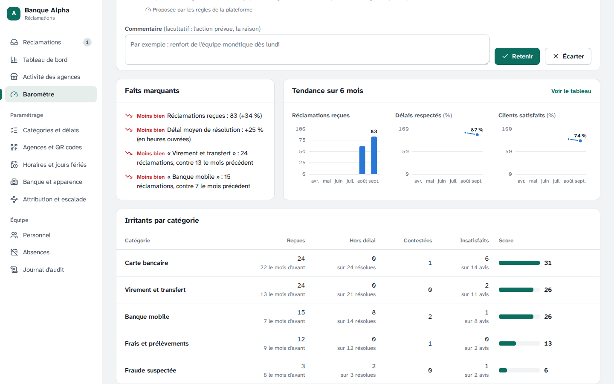
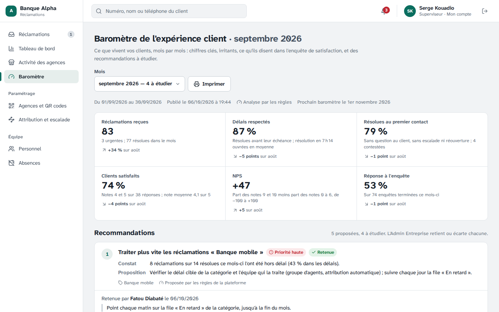
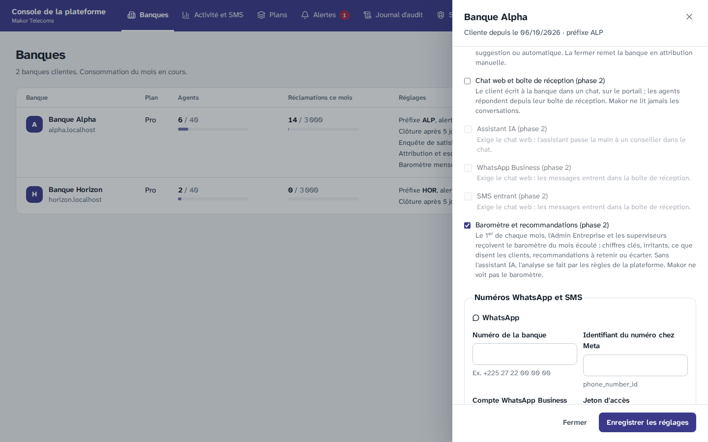
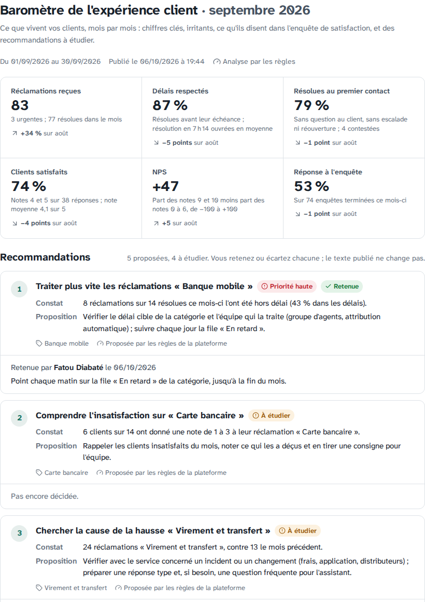
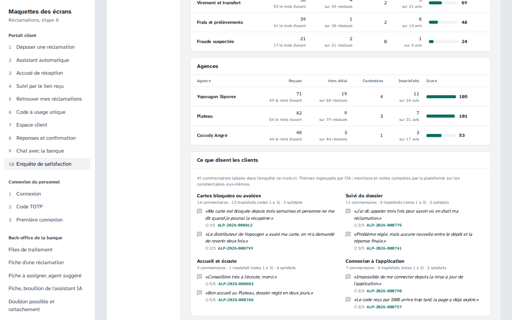

# Étape 23 — Baromètre mensuel de l'expérience client et recommandations

Plateforme de gestion des réclamations · Makor Telecoms · Solution 1
Version du 06/10/2026 · **Statut : en attente de validation** (décisions V1 à V13, partie 7).

Dernière fonction de la phase 2 (cadrage de l'étape 14) : chaque mois, une synthèse par banque de ce que vivent ses clients, et des recommandations que l'Admin Entreprise retient ou écarte.

- **Quoi ?** Le 1er de chaque mois, la banque reçoit le **baromètre du mois écoulé** : réclamations reçues, délais respectés, résolution au premier contact, contestations, satisfaction, NPS et taux de réponse à l'enquête, comparés au mois précédent ; la **tendance sur 6 mois** ; les **irritants** par catégorie et par agence ; **ce que disent les clients** dans leurs commentaires, regroupés en thèmes avec des exemples ; les **faits marquants** ; jusqu'à **5 recommandations**.
- **Qui ?** L'Admin Entreprise et les superviseurs le lisent ; l'Admin Entreprise **retient ou écarte** chaque recommandation, avec un commentaire. Les agents n'y ont pas accès ; Makor non plus (il contient les commentaires des clients).
- **Et l'IA ?** Les chiffres sont toujours calculés par la plateforme. Si la banque a l'assistant IA (son accord de l'étape 18), l'IA regroupe les commentaires et rédige les recommandations, à partir de commentaires **masqués** ; une réponse qui cite un chiffre absent des données est **écartée**. Sinon, des **règles** font le même travail.

Livrables :

- **Base de données.** Une migration, écrite à la main : [`20261009120000_barometre`](../backend/prisma/migrations/20261009120000_barometre/migration.sql). `banque.barometre` (ouvert par Makor) ; `barometre` : un instantané par banque et par mois, **figé** (le worker l'écrit une fois ; personne ne le modifie ni ne l'efface) ; `recommandation_barometre` : la banque n'en change que la décision ; la finalité `BAROMETRE` du journal des appels à l'IA.
- **Contrat.** [`contrat/openapi.yaml`](../contrat/openapi.yaml) passe de 126 à **129 opérations** (partie 8).
- **API et worker.**
  - [Règles du baromètre](../backend/src/domaine/barometre.ts), pures : mois, irritants, thèmes par mots-clés, faits marquants, recommandations par règles ;
  - [analyse par l'IA](../backend/src/domaine/ia/barometre.ts) : ce qui part au fournisseur, et la vérification de ce qui revient ;
  - [publication mensuelle](../backend/src/application/barometre/barometres.ts) : chiffres du mois, analyse, publication, notification ; un nouveau travail du [worker](../backend/src/worker/planification.ts), toutes les 10 minutes ;
  - [lecture et décisions](../backend/src/modules/barometre/barometre.service.ts).
- **Écrans.**
  - Back-office : page **Baromètre** (menu, Admin Entreprise et superviseurs) ; la notification y mène ; elle s'imprime seule.
  - Petits graphiques de tendance, un par mesure ([`Tendance.tsx`](../frontend/src/ui/Tendance.tsx)), avec le tableau des valeurs.
  - Console de la plateforme : case « Baromètre et recommandations » dans la fiche de la banque ; colonne **Baromètres** de l'usage de l'IA (et de son export).
- **Démo, maquettes et jeu de démonstration.**
  - [Démo cliquable](demo/index.html) : la page Baromètre, recalée sur le mois écoulé ; l'Admin Entreprise y décide pour de faux.
  - [Maquettes](maquettes/index.html) : un écran de plus (37), le baromètre d'août de la Banque Alpha analysé par l'IA, vu par l'Admin Entreprise ou un superviseur, et avant le premier baromètre.
  - Jeu de démonstration : baromètre ouvert à la Banque Alpha, ceux des deux derniers mois écoulés publiés (règles), la première recommandation du plus ancien retenue par Fatou.
- **Exploitation.** `scripts/taches.js --barometre` publie à la main un baromètre manquant ; une ligne de dépannage dans le [guide d'exploitation](exploitation.md). Aucune variable nouvelle.
- **Recette.** Critère 20 dans la section « Critères de la phase 2 » du [rapport](recette/rapport.md), et sa fiche dans le [cahier de recette](recette/cahier-de-recette.md).

## 1. Ce que contient le baromètre

| Partie | Contenu |
|---|---|
| L'essentiel | 6 chiffres du mois, chacun avec son écart au mois précédent : réclamations reçues (dont urgentes, résolues), délais respectés (et délai moyen de résolution), résolues au premier contact (et contestées), clients satisfaits (et note moyenne), NPS, réponse à l'enquête |
| Recommandations | 5 au plus, les plus urgentes d'abord : titre, constat chiffré, proposition, catégorie concernée, priorité, origine (IA ou règles), décision |
| Faits marquants | Ce qui a nettement bougé depuis le mois précédent (6 au plus), seulement avec assez de données |
| Tendance sur 6 mois | Réclamations reçues (colonnes), délais respectés et clients satisfaits (courbes), un graphique et un axe par mesure ; « Voir le tableau » donne aussi les réponses et le NPS |
| Irritants | Les 5 catégories et les 3 agences les plus irritantes : reçues (et le mois d'avant), hors délai, contestées, clients insatisfaits, score |
| Ce que disent les clients | Les thèmes des commentaires de l'enquête, avec leurs mentions, insatisfaits et satisfaits, et deux exemples tels qu'écrits, chacun relié à sa réclamation |
| Comment lire ce baromètre | Les définitions, en bas de page |

Moins de 30 réponses à l'enquête dans le mois : un avertissement dit de lire la satisfaction et le NPS avec prudence. Aucun agent n'est jamais nommé : le baromètre parle de l'organisation (catégories, agences, délais).

## 2. Comment il est calculé

Mois civil, dans le fuseau de la banque, avec les définitions du tableau de bord :

- **Réclamations reçues** : déposées pendant le mois. **Délais respectés, premier contact, délai moyen** : réclamations résolues pendant le mois (temps ouvré). **Contestées** : réclamations dont la résolution a été contestée pendant le mois.
- **Satisfaction, note moyenne, NPS** : réponses à l'enquête reçues pendant le mois. **Taux de réponse** : enquêtes dont le délai de réponse (7 jours) a pris fin pendant le mois. Ainsi, rien ne change après la publication.
- **Score d'irritation** d'une catégorie ou d'une agence : 1 par réclamation reçue, plus 1 par réclamation résolue hors délai, par contestation et par client insatisfait (note de 1 à 3). 3 réclamations au moins pour figurer.
- **Commentaires** : ceux du mois, les 200 plus récents.

## 3. L'analyse : par l'IA ou par les règles

**Par l'IA, seulement avec l'accord de la banque** : quand l'assistant IA lui est ouvert (étape 18, décision I5). Ce qui part chez le fournisseur :

- les chiffres agrégés du mois et du précédent, les noms des catégories et des agences (sous des identifiants courts C1, A1…) ;
- les 60 commentaires les plus récents, **masqués** comme à l'étape 18 (téléphones, e-mails, IBAN, cartes, codes) et, en plus, **le nom du client et celui de chaque membre du personnel** remplacés par [NOM] ; raccourcis à 300 caractères ;
- jamais un numéro de réclamation, un identifiant interne, un nom de client ou d'agent.

Ce qui revient est **vérifié** avant d'être publié :

- un thème désigne les commentaires qui en parlent par leur numéro : ses mentions et sa tonalité sont **comptées par la plateforme** sur ces commentaires, et ses exemples sont les commentaires eux-mêmes ;
- une recommandation qui cite un nombre **absent des données envoyées**, une étiquette de masquage ([NOM]…), ou qui sort du format, est **écartée** ; sans recommandation valable, ce sont les règles ;
- la consigne interdit de nommer une personne, de proposer une sanction, de promettre un remboursement, et d'obéir à une instruction écrite dans un commentaire.

Chaque analyse est journalisée sans contenu (finalité `BAROMETRE`) : elle compte dans le plafond quotidien de la banque et dans l'usage que voit Makor. Pas de fournisseur, plafond atteint, délai dépassé, réponse écartée : les règles prennent le relais, sans erreur.

**Par les règles** (sans l'assistant, ou en repli), chaque recommandation s'appuie sur un chiffre du mois :

| Règle | Priorité |
|---|---|
| Une catégorie résolue hors délai à 15 % ou plus (5 résolues au moins) : traiter plus vite | Haute |
| 3 contestations ou plus dans une catégorie : répondre du premier coup | Haute |
| 40 % ou plus de clients insatisfaits dans une catégorie (5 avis au moins) : comprendre l'insatisfaction | Moyenne |
| Une catégorie en hausse de 50 % ou plus (10 réclamations au moins) : chercher la cause | Moyenne |
| 3 commentaires insatisfaits ou plus sur l'information : informer à chaque étape (et activer les SMS à chaque étape si ce n'est pas fait) | Moyenne |
| 3 commentaires insatisfaits ou plus sur l'accueil : travailler l'accueil et l'écoute | Moyenne |
| L'agence la plus en retard, à 20 % ou plus (5 résolues au moins) : la soutenir | Moyenne |
| Pas d'enquête de satisfaction, ou moins de 20 % de réponses (20 enquêtes au moins) : la mesurer, faire répondre | Moyenne |

Les plus urgentes d'abord, 2 au plus par catégorie, 5 au total. Les thèmes sont reconnus par mots-clés (délais, information et suivi, frais, accueil, distributeurs et cartes, application, solution apportée).

## 4. Recommandations et décisions

- L'**Admin Entreprise** retient ou écarte chaque recommandation, avec un commentaire facultatif (l'action prévue, la raison) ; il peut revenir sur sa décision (« à étudier »). Qui a décidé, et quand, s'affiche ; chaque décision va au journal d'audit (`barometre.recommandation`).
- Le **texte publié ne change jamais** : ni le baromètre ni les recommandations ne se modifient, même par le système.
- Les **superviseurs** voient les décisions et les commentaires, sans décider.

## 5. Publication

- Le worker passe **toutes les 10 minutes** : pour chaque banque qui a le baromètre et n'est pas suspendue, si le mois écoulé n'a pas encore le sien, il le calcule et le publie. C'est donc le **1er du mois, peu après minuit** ; et, pour une banque à qui Makor vient de l'ouvrir, **dans les 10 minutes** (le mois écoulé). Une banque créée après la fin d'un mois n'a pas de baromètre pour ce mois-là.
- **Un seul par mois** : un second passage ne fait rien, et la base refuserait un doublon ; un passage en erreur pour une banque n'empêche pas les autres, le suivant réessaie.
- **Notification dans l'application** à l'Admin Entreprise et aux superviseurs : « Le baromètre de septembre 2026 est prêt : 3 recommandations à étudier, irritant principal « Carte bancaire ». » Pas d'e-mail ni de SMS.
- Fermé par Makor : la page quitte le menu et l'API répond `FONCTION_NON_OUVERTE` ; les baromètres publiés restent et reviennent à la réouverture.

## 6. Ce qui protège ces fonctions

- **Figé** : la banque n'a que le droit de lire le baromètre et de changer la décision de ses recommandations (droits par colonne) ; le système publie sans pouvoir modifier ni effacer ce qu'il a publié.
- **Cloisonné** : chaque banque ne voit que les siens (RLS) ; une recommandation ne se décide qu'au nom d'un utilisateur de la même banque.
- **Sans Makor** : le Super Admin n'a aucun droit sur ces tables ; il ouvre la fonction et voit l'usage de l'IA, rien d'autre.
- **Contrôlé en base** : un baromètre par banque et par mois, daté du 1er du mois ; origine IA ou règles ; 5 recommandations au plus ; décision, auteur et date cohérents.
- **Données personnelles** : masquées avant l'IA (partie 3) ; les commentaires restent dans la banque.

## 7. Décisions à valider

| | Sujet | Proposition |
|---|---|---|
| V1 | Rythme | **Un baromètre par mois civil**, publié le 1er du mois suivant (fuseau de la banque), puis **figé** ; le premier, dans les 10 minutes après l'ouverture de la fonction, pour le mois écoulé |
| V2 | Ouverture | **Banque par banque par Makor** (case de la fiche de la banque), indépendamment de l'assistant IA |
| V3 | Qui le voit | **Admin Entreprise et superviseurs** ; pas les agents ; **pas Makor** (commentaires des clients), qui ne voit que l'usage de l'IA |
| V4 | Définitions | Celles de la partie 2 : reçues, résolues, contestées et réponses **pendant le mois** ; taux de réponse sur les enquêtes **terminées** dans le mois ; comparaison au mois précédent, tendance sur 6 mois |
| V5 | Irritants | Score = réclamations + hors délai + contestations + clients insatisfaits ; **3 réclamations au moins** ; 5 catégories et 3 agences |
| V6 | Accord pour l'IA | L'analyse passe par l'IA **seulement si la banque a l'assistant IA** ; sinon, par les règles. Pas de case à part |
| V7 | Ce qui part à l'IA | Chiffres agrégés, noms des catégories et agences, **60 commentaires masqués** (nom du client et du personnel compris), 300 caractères ; jamais de numéro de réclamation ni d'identifiant |
| V8 | Vérification | Une recommandation qui cite un **chiffre absent des données** ou une étiquette de masquage est écartée ; thèmes **comptés par la plateforme** ; sans recommandation valable : les règles |
| V9 | Règles | Celles de la partie 3, **5 recommandations au plus**, 2 par catégorie, les plus urgentes d'abord |
| V10 | Décisions | **L'Admin Entreprise** retient ou écarte, commentaire facultatif (1 000 caractères), retour possible ; texte publié inchangé ; journal d'audit |
| V11 | Notification | **Dans l'application**, à l'Admin Entreprise et aux superviseurs, une fois par baromètre ; ni e-mail ni SMS |
| V12 | Prudence | Moins de **30 réponses** : avertissement ; faits marquants seulement avec assez de données ; **aucun agent nommé** |
| V13 | Diffusion | La page **s'imprime** (ou s'enregistre en PDF depuis le navigateur) ; pas d'envoi par e-mail dans cette étape |

## 8. Contrat

Le contrat passe de 126 à **129 opérations** :

| Opération | Chemin | Appelant |
|---|---|---|
| `listerBarometres` | `GET /banque/barometres` | Admin Entreprise, superviseur |
| `lireBarometre` | `GET /banque/barometres/{mois}` | Admin Entreprise, superviseur |
| `deciderRecommandation` | `PUT /banque/barometres/{mois}/recommandations/{id}` | Admin Entreprise |

Changements :

- Schémas `ListeBarometres`, `ResumeBarometre`, `Barometre`, `MesuresBarometre`, `PointTendance`, `Irritant`, `ThemeBarometre`, `FaitMarquant`, `RecommandationBarometre`, `DecisionRecommandation`, `SourceAnalyse`, `MoisCivil`.
- `barometre` dans `ParametresBanque`, `BanquePlateforme` et `ModificationBanque` ; `barometres` dans `ConsommationIa`.
- Fonction fermée : 403 `FONCTION_NON_OUVERTE` ; mois sans baromètre : 404.

La [documentation hors ligne](api/index.html) et les types sont régénérés.

## 9. Essayer en développement

Avec le jeu de démonstration (`docker compose up -d`, puis `npm run semer` sur une base neuve), dans la console (http://localhost:5173) :

1. Fatou (`fatou.diabate@banque-alpha.example`) : la notification « Baromètre de … est prêt », puis la page **Baromètre** ; retenir ou écarter une recommandation ; changer de mois ; **Imprimer**.
2. Serge (`serge.kouadio@banque-alpha.example`) : la même page, sans décision. Aya : pas de page.
3. Koffi (Super Admin) : **Banques**, Banque Alpha, la case « Baromètre et recommandations » ; **Activité et SMS**, la colonne « Baromètres ».
4. Un baromètre manquant, à la main : `docker compose exec api npx tsx scripts/taches.ts --barometre`. Avec un fournisseur d'IA configuré (étape 18) et l'assistant ouvert à la banque, l'analyse passe par l'IA.

## 10. Tests

| Suite | Ce qui est vérifié |
|---|---|
| Bout en bout (235, dont 14 nouveaux) | Sur une banque créée pour le test, avec trois mois de réclamations traitées de bout en bout : fermé par défaut, ouvert par Makor ; chiffres du mois et tendance ; règles sans l'accord pour l'IA (rien n'est envoyé) ; réponse de l'IA qui invente un chiffre écartée ; publication par le travail du worker le 1er : commentaires masqués (téléphone, e-mail, nom du client et d'un agent), ni numéro de réclamation ni identifiant envoyés, recommandation à étiquette de masquage écartée, thèmes comptés sur les vrais commentaires ; un seul baromètre par mois ; liste, rôles, mois inconnu ; décisions, retour à l'étude, journal d'audit ; notifications ; isolation entre banques, banque créée après le mois ; fermeture et réouverture ; consommation de l'IA |
| Sécurité PostgreSQL (214, dont 24 nouveaux) | Ouverture réservée au Super Admin ; publication par le seul système, sans modification ni suppression ; la banque ne change que la décision ; isolation ; contraintes (doublon du mois, 1er du mois, origine, contenu, 5 recommandations, décision et auteur) ; aucun accès du Super Admin |
| Unitaires, backend (413, dont 10 nouveaux) | Mois et élision, irritants, thèmes et exemples, faits marquants, recommandations par règles (`domaine/barometre`) ; consignes envoyées et vérification de la réponse de l'IA (`domaine/ia/barometre`) ; routes du contrat |
| Unitaires, frontend (314, dont 14 nouveaux) | Page du baromètre vue par l'Admin Entreprise et par un superviseur, avant le premier, avec peu de réponses, sans recommandation ; libellés ; démo recalée sur le mois écoulé ; console de la plateforme ; données des maquettes validées contre le contrat |
| Chromium (73, dont 5 nouveaux) | Fatou arrive par la notification, lit le baromètre (chiffres, tendance et son tableau, irritants, définitions), écarte, revient, retient avec un commentaire (journal), change de mois, imprime ; Serge lit sans décider ; Aya n'y a pas accès ; Makor ferme puis rouvre la fonction |

Le test Chromium de l'étape 21 (Mamadou absent, dossiers à réassigner) déclare maintenant l'absence sur 10 jours, comme celui de l'étape 16 : lancé le soir, il échouait, la file « À réassigner » regardant le prochain jour ouvré, où l'absence d'un seul jour était finie. L'application ne change pas.

La [recette automatique](recette/rapport.md) vérifie le critère 20 par les tests de bout en bout, le test Chromium, les tests unitaires du baromètre et les vérifications PostgreSQL. Elle passe en 16 minutes : les 11 critères de la phase 1, les 9 de la phase 2, 1 035 tests sur 1 035 et 291 vérifications PostgreSQL. Le [cahier de recette](recette/cahier-de-recette.md) a sa fiche, à signer à part.

## 11. Captures

Fatou ouvre le baromètre de septembre (analyse par les règles) :

Elle retient la première recommandation, avec un commentaire :

Faits marquants, tendance sur 6 mois et irritants :

Serge lit, sans décider :

Makor ouvre la fonction à la banque :

À l'impression, la page seule ([exemple en PDF](etape-23-captures/barometre-imprime.pdf)) :

Dans les [maquettes](maquettes/index.html), un baromètre analysé par l'IA : thèmes regroupés par l'IA, comptés par la plateforme, avec les commentaires tels qu'écrits et leur réclamation :

## 12. Ce qui ne change pas

- **Le tableau de bord** et l'activité des agences gardent leurs périodes libres ; le baromètre en est une photo mensuelle, figée.
- **L'assistant IA** : mêmes fournisseurs, même masquage, même plafond quotidien (le baromètre compte une analyse par mois et par banque).
- **Pour une installation existante**, la mise à jour applique la migration (`deploiement/mettre-a-jour.sh`) ; aucune variable nouvelle. La fonction reste fermée tant que Makor ne l'ouvre pas.

## 13. Suite

C'est la dernière étape du cahier des charges : une fois validée, toutes les fonctions de la phase 2 sont livrées. Restent la recette sur l'environnement de démonstration (cahier de recette, critères 12 à 20) et la mise en production ([guide d'exploitation](exploitation.md)).
