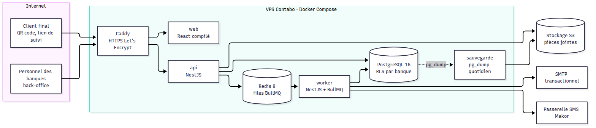
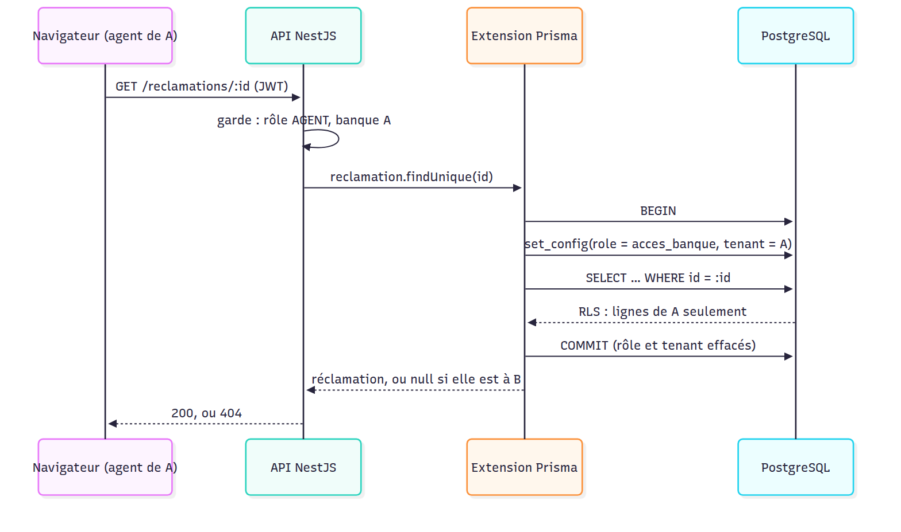

# Étape 3 — Architecture et migration SQL

Plateforme de gestion des réclamations · Makor Telecoms · Solution 1
Version du 25/09/2026 · **Statut : validé le 25/09/2026** (décisions A1 à A10 retenues telles que proposées)

Livrables :

- [`backend/prisma/migrations/`](../backend/prisma/migrations/) : deux migrations, le modèle validé à l'étape 2 puis la sécurité de la base ;
- [`backend/src/infrastructure/base-de-donnees/`](../backend/src/infrastructure/base-de-donnees/contexte.ts) : l'accès contextuel à la base (banque, plateforme, système) ;
- [`backend/scripts/verifier-securite.ts`](../backend/scripts/verifier-securite.ts) : 60 vérifications, en plus des 32 de l'étape 2 ;
- [`docker-compose.yml`](../docker-compose.yml) : PostgreSQL 16 avec ses rôles, Redis 8, service de vérification.

## 1. En bref

| Contrôle | Résultat |
|---|---|
| Migrations appliquées sur PostgreSQL 16 (tri ICU fr-FR) | 2 migrations : 19 tables, 24 politiques RLS, 30 contraintes CHECK, 9 triggers |
| Vérification d'intégrité (étape 2) | 32 / 32 |
| Vérification de sécurité (étape 3) | **60 / 60** |
| Dérive entre migrations et schéma Prisma | Aucune : `prisma migrate dev` générerait une migration vide |
| Coût de l'isolation, mesuré sur 2 000 tickets | ≈ 7 ms par lecture ; 25 ms pour 5 lectures groupées (exigence : < 1 s) |

Le principe : **l'application se connecte avec un rôle qui n'a aucun droit**. Chaque requête doit d'abord déclarer son contexte (une banque, la plateforme ou le système). Une requête qui l'oublie échoue avec « permission denied » ; elle ne peut pas fuiter.

## 2. Décisions à valider

| N° | Sujet | Proposition |
|---|---|---|
| A1 | Rôles PostgreSQL | Trois rôles d'accès (`acces_banque`, `acces_plateforme`, `acces_systeme`) et un rôle de connexion `reclamations_app` sans droit propre. Le rôle et la banque sont fixés au début de chaque transaction et s'effacent au COMMIT |
| A2 | Arbitrage 7 tenu par la base | Le Super Admin n'a le droit de lire que certaines colonnes des réclamations (numéro, catégorie, statut, dates, indicateurs). Description, client, jeton de suivi, messages et historique lui sont refusés par PostgreSQL |
| A3 | Secrets du personnel | Hash du mot de passe et secret TOTP illisibles hors authentification (droits par colonne + omission par défaut dans Prisma) |
| A4 | Colonnes figées | Après le dépôt, on ne peut plus modifier le numéro, le jeton de suivi, le client, le point de dépôt, le canal, la description, le consentement ni le délai cible. La catégorie et l'agence restent modifiables (requalification), sans toucher au délai cible |
| A5 | Cloisonnement à l'intérieur d'une banque | La RLS sépare les banques. Qu'un agent ne voie que ses tickets et un client que les siens relève de l'API (étape 7) |
| A6 | Journal d'audit | UPDATE, DELETE et TRUNCATE refusés même au propriétaire des tables. Seul un superutilisateur qui désactive les triggers peut altérer une ligne ; la vérification de la chaîne le détecte. Pour détecter aussi une suppression en fin de chaîne : copie quotidienne de la dernière empreinte hors du VPS (étape 9) |
| A7 | Index | Index simples sur les files et les tâches planifiées. Les index partiels sont écartés : gain négligeable à ce volume, et Prisma ne les gère qu'en préversion |
| A8 | Processus | Un seul code NestJS, deux points d'entrée : `api` (HTTP) et `worker` (files BullMQ et tâches planifiées) |
| A9 | Production sur Contabo | Un VPS, Docker Compose : Caddy (HTTPS automatique), web, api, worker, PostgreSQL, Redis, sauvegarde. Seuls les ports 80 et 443 sont publiés ; PostgreSQL et Redis restent sur le réseau interne de Docker |
| A10 | Une transaction par requête HTTP | À l'étape 7, chaque requête de l'API ouvrira une seule transaction contextuelle (≈ 25 ms au lieu de ≈ 40 ms pour 5 lectures) |

## 3. Vue d'ensemble



Source : [`etape-3-topologie.mmd`](etape-3-topologie.mmd). En développement, `docker-compose.yml` ne lance que PostgreSQL et Redis ; l'API, le worker et le frontend y entrent aux étapes 7 et 8. Le fichier de production (`docker-compose.prod.yml`) est livré avec eux, car il a besoin des images de l'application.

Le worker traite tout ce qui ne doit pas ralentir l'API : envois d'e-mails et de SMS, alertes SLA, clôture automatique après 5 jours, dépassement du plafond de tickets. L'API ne fait que déposer des tâches dans Redis.

## 4. Modules NestJS

| Module | Rôle | Contexte d'accès | Étape |
|---|---|---|---|
| `infrastructure/base-de-donnees` | Client Prisma, contextes banque / plateforme / système | — | 3 (livré) |
| `infrastructure/contexte-requete` | Contexte de la requête (utilisateur, banque) propagé sans paramètre | — | 7 |
| `infrastructure/files` | Files BullMQ et tâches répétées (les tâches SLA elles-mêmes sont livrées à l'étape 4) | — | 7 |
| `infrastructure/stockage` | Pièces jointes : disque en développement, S3 en production | — | 7 |
| `infrastructure/notifications` | Adaptateurs e-mail (SMTP), SMS (passerelle Makor), in-app | système | 9 |
| `infrastructure/audit` | Écriture et vérification du journal | selon l'appelant | 7 |
| `domaine/temps-ouvre` | Calcul en minutes ouvrées (horaires, jours fériés, fuseau) | — (code pur) | 4 (livré) |
| `auth-personnel` | Connexion, TOTP, refresh token, invitation, réinitialisation | système | 7 |
| `auth-client` | Lien de suivi, code OTP, session client | système puis banque | 7 |
| `plateforme` | Banques, plans, statistiques et journal de toutes les banques | plateforme | 7 |
| `parametrage` | Agences, points de dépôt et QR codes, catégories, horaires, jours fériés, personnel, équipes, apparence | banque | 7 |
| `depot` | Formulaire public, numérotation, accusé de réception | système (résolution du point) puis banque | 7 |
| `reclamations` | Files, assignation, statuts, messages, pièces jointes, escalade, clôture forcée | banque | 7 |
| `portail-client` | Chronologie, détail, messages, confirmation ou contestation | banque | 7 |
| `domaine/reclamation` + `application/reclamations` | Machine d'états, SLA, cycle de vie, tâches planifiées | banque, système pour le worker | 4 (livré) |
| `reporting` | Indicateurs du §6.6, export CSV | banque ou plateforme | 9 |

Quand un contexte « système » est nécessaire (retrouver la banque à partir du code d'un QR code, par exemple), il sert à une lecture ciblée ; tout le reste de la requête repasse en contexte banque.

## 5. Isolation d'une requête



Source : [`etape-3-isolation.mmd`](etape-3-isolation.mmd).

```ts
const enBanqueA = clientEn(base, contexte.banque(tenantId));
await enBanqueA.reclamation.findUnique({ where: { id } }); // null si le ticket est à une autre banque → 404

await transactionEn(base, contexte.banque(tenantId), async (tx) => {
  // plusieurs écritures atomiques, ou du SQL brut, toujours sous RLS
});
```

| Contexte | Rôle PostgreSQL | Utilisé par | Voit |
|---|---|---|---|
| banque | `acces_banque` | Personnel d'une banque, portail client | Les lignes de sa banque, sans les secrets du personnel |
| plateforme | `acces_plateforme` | Super Admin | Banques, plans, personnel, journal de toutes les banques ; des réclamations, les métadonnées seulement |
| système | `acces_systeme` (BYPASSRLS) | Worker, authentification, résolution d'un QR code ou d'un lien de suivi | Toutes les banques ; ne peut pas modifier ce qui est immuable |

## 6. Droits par table

L = lecture, E = écriture (insertion), M = modification, S = suppression. « col. » : limité à certaines colonnes. Tout ce qui n'est pas listé est refusé.

| Table | banque | plateforme | système |
|---|---|---|---|
| plan | L | L E M | L E M |
| banque | L, M col. (couleurs, logo, contact) | L E M | L E M |
| agence, categorie | L E M | L | L E M |
| point_depot | L E, M col. (le code ne change jamais) | — | L E M |
| horaire_ouvre, jour_ferie | L E M S | — | L E M |
| utilisateur | L E M col. (sans secrets) | L E M col. (sans secrets) | L E M |
| session_utilisateur, jeton_utilisateur | — | — | L E M S |
| client_final | L E, M col. | — | L E M |
| code_otp | L E, M col. | — | L E M S |
| reclamation | L E, M col. (colonnes figées exclues) | L col. (métadonnées) | L E, M col. |
| compteur_numero | L E M | — | L E M |
| commentaire, piece_jointe, reclamation_evenement | L E | — | L E |
| notification | L E, M col. (lecture in-app) | L, M col. (les siennes) | L E M |
| journal_audit | L E (sa chaîne) | L (tout), E (chaîne plateforme) | L E |

## 7. Journal d'audit

- **Chaînage** : un trigger calcule, à chaque insertion, la chaîne (`banque:<uuid>` ou `plateforme`), le rang, l'horodatage et `empreinte = SHA-256(empreinte précédente ‖ contenu canonique)`. Les valeurs envoyées par l'application pour ces colonnes sont ignorées.
- **Concurrence** : un verrou par chaîne sérialise les écritures d'une même banque ; 60 écritures simultanées sur trois chaînes donnent trois chaînes valides, sans trou.
- **Écriture seule** : UPDATE, DELETE et TRUNCATE sont refusés par trigger, y compris au propriétaire des tables.
- **Vérification** : `SELECT * FROM verifier_chaine_audit('banque:<uuid>')` renvoie `valide`, le nombre de lignes et la première ligne rompue. Elle tourne avec les droits de l'appelant : l'Admin Entreprise vérifie sa banque, le Super Admin toutes.
- **Contenu** : ni contenu de réclamation, ni coordonnées de client, ni secret. Le Super Admin lit ce journal pour toutes les banques.

## 8. Contraintes CHECK (30)

| Groupe | Contraintes |
|---|---|
| Retenues par le CDC | Super Admin ⇔ sans banque ; client avec e-mail ou téléphone |
| Formats | Préfixe (2 à 10 majuscules ou chiffres), slug, couleurs `#RRGGBB`, e-mails en minuscules, téléphone E.164, numéro `PRÉFIXE-AAAA-NNNNNN`, empreintes hexadécimales |
| Bornes | Seuil d'alerte 1–99 %, délai de clôture 1–60 jours, plafonds positifs, délais cibles positifs, plages horaires 00:00–24:00 dans l'ordre, taille de fichier, tentatives OTP |
| Cohérences métier | QR code avec agence ; OTP par e-mail ou SMS ; auteur d'un message cohérent avec son type ; message non vide ; déposant d'une pièce jointe ; acteur d'un événement ; statut « Clôturée » ⇔ date et mode de clôture ; clôture forcée ⇒ motif, précision et superviseur ; motif seulement pour une clôture forcée ; date de clôture automatique seulement en « Résolue » ; notification de plateforme sans réclamation ni client ; segments seulement pour un SMS |

Les contraintes liées au SLA (pause, échéance) attendent l'étape 4, qui fixe la machine d'états.

## 9. Docker

**Développement** (livré) :

```bash
docker compose up -d                    # PostgreSQL 16 + Redis 8
docker compose run --rm verification    # base jetable : migrations + 92 vérifications
cd backend && npm install && npm run migrate:deploy   # applique les migrations sur reclamations_dev
```

Au premier démarrage, `docker/postgres/init/02-roles.sh` crée les rôles et le rôle de connexion (mot de passe : `APP_DB_PASSWORD`). Ces scripts ne tournent qu'à la création du volume : **si PostgreSQL a déjà été lancé à l'étape 2, faire une fois `docker compose down -v` puis `docker compose up -d`**.

`DATABASE_URL` (propriétaire des tables) ne sert qu'aux migrations ; l'application utilise `APP_DATABASE_URL` (`reclamations_app`).

**Production sur le VPS Contabo** (fichier livré à l'étape 7) :

| Service | Image | Exposé | Rôle |
|---|---|---|---|
| caddy | caddy 2 | 80, 443 | HTTPS Let's Encrypt, fichiers du frontend, proxy vers l'API |
| api | image de l'application | non | API NestJS |
| worker | même image | non | Files BullMQ, tâches planifiées |
| migrations | même image | non | `prisma migrate deploy` avant chaque démarrage de l'API |
| postgres | postgres:16 | non | Base, volume persistant |
| redis | redis:8 | non | Files, persistance AOF |
| sauvegarde | postgres:16 + client S3 | non | `pg_dump` chiffré chaque nuit, copié hors du VPS |

Docker contourne le pare-feu UFW pour les ports qu'il publie : c'est pour cela que PostgreSQL et Redis ne publient aucun port en production.

## 10. Rejouer la vérification

```bash
docker compose up -d
docker compose run --rm verification
```

Résultat attendu : `32 vérifications réussies, 0 en échec.` puis `60 vérifications réussies, 0 en échec.`

Ce que couvrent les 60 contrôles de sécurité :

- **Cloisonnement (12)** : liste, lecture par identifiant (→ 404), même lecture en SQL direct, modification et création croisées, tenant absent ou invalide, requête sans contexte, contexte qui ne déborde pas sur la connexion suivante, garde-fou sur toutes les tables à `tenant_id`.
- **Super Admin (11)** : statistiques et listes de métadonnées autorisées ; description, réclamation complète, jeton de suivi, clients, messages et historique refusés ; notifications de plateforme seulement ; pas d'écriture dans l'audit d'une banque.
- **Secrets et colonnes figées (10)** : hash et secret TOTP invisibles hors authentification ; numéro, délai cible, description, préfixe et code de QR non modifiables.
- **Contraintes CHECK (14)**.
- **Journal d'audit (7)** : concurrence, valeurs forgées ignorées, vérification par l'Admin Entreprise, UPDATE / DELETE / TRUNCATE refusés, altération détectée.
- **Immuabilité (3)** et **transactions (3)** : dépôt atomique, annulation complète en cas d'échec, pas d'accès croisé dans une transaction.

## 11. Ce qui arrive à l'étape 4

Machine d'états et moteur SLA : transitions autorisées par statut et par rôle, calcul en minutes ouvrées (horaires, jours fériés, fuseau), pause et reprise en « En attente client », alerte à 75 %, dépassement et escalade, clôture automatique, avec leurs contraintes SQL et leurs tests.
