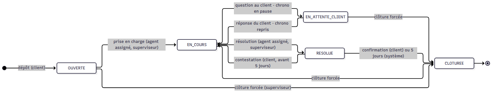

# Étape 4 — Machine d'états et moteur SLA

Plateforme de gestion des réclamations · Makor Telecoms · Solution 1
Version du 25/09/2026 · **Statut : validé le 25/09/2026** (décisions S1 à S12 retenues telles que proposées)

Livrables :

- [`backend/src/domaine/`](../backend/src/domaine/) : temps ouvré, machine d'états, règles SLA, normalisation des coordonnées. Code pur, sans base, couvert par 98 tests unitaires ;
- [`backend/src/application/reclamations/`](../backend/src/application/reclamations/) : le service du cycle de vie (dépôt, traitement, clôture) et les tâches planifiées du SLA ;
- [`backend/prisma/migrations/20260925140000_cycle_de_vie_sla/`](../backend/prisma/migrations/20260925140000_cycle_de_vie_sla/migration.sql) : transitions et cohérence SLA garanties par la base ;
- [`backend/scripts/verifier-cycle-de-vie.ts`](../backend/scripts/verifier-cycle-de-vie.ts) : 45 vérifications sur PostgreSQL, avec une horloge simulée.

## 1. En bref

| Contrôle | Résultat |
|---|---|
| Tests unitaires (temps ouvré, machine d'états, SLA, coordonnées) | **98 / 98** |
| Cycle de vie sur PostgreSQL (étape 4) | **45 / 45** |
| Intégrité (étape 2) et sécurité (étape 3), rejouées avec la nouvelle migration | 32 / 32 et 60 / 60 |
| Dérive entre migrations et schéma Prisma | Aucune |
| Temps mesurés (environnement de test) | Dépôt ≈ 18 ms · action de traitement ≈ 14 ms · tâches planifiées ≈ 12 ms par ticket · calcul d'une échéance ≈ 0,03 ms |

Le parcours vérifié de bout en bout : dépôt par QR code → assignation → réponse → question au client (chrono en pause) → réponse du client (reprise) → alerte à 75 % → dépassement et escalade → résolution → contestation → nouvelle résolution → clôture automatique 5 jours plus tard. Chaque alerte ne part qu'une fois, même avec deux workers en parallèle.

## 2. Décisions à valider

| N° | Sujet | Proposition |
|---|---|---|
| S1 | Prise en charge | Explicite, ou implicite à la première réponse de l'agent. Elle exige un agent assigné : le superviseur assigne d'abord |
| S2 | Rôle du superviseur | Il peut faire tout ce que fait l'agent (répondre, questionner, résoudre), en plus d'assigner, de changer la priorité et de clôturer de force |
| S3 | Admin Entreprise | Consulte les tickets de sa banque, n'agit pas dessus |
| S4 | Contestation | Le chrono reprend avec le temps qui restait à la résolution, pas un nouveau délai complet. Le verdict SLA est recalculé à la résolution suivante |
| S5 | Délai de résolution (§6.6) | De la création à la dernière résolution, pauses comprises, comme le définit le CDC. Seul le chrono SLA exclut les pauses |
| S6 | Clôture forcée | Un ticket clôturé de force sans avoir été résolu n'entre pas dans le taux de respect du SLA |
| S7 | Banque sans horaires | Le temps s'écoule en continu (24 h/24), pour ne jamais bloquer un dépôt. À la création d'une banque (étape 7), horaires par défaut lun–ven 08:00–17:00 |
| S8 | Destinataires des alertes | Alerte préventive : l'agent, ou les superviseurs si le ticket n'est pas assigné. Dépassement : l'agent et son superviseur (à défaut, tous les superviseurs) |
| S9 | Notifications ajoutées au §6.5 | Message du client → agent ; contestation → agent ; escalade manuelle → superviseur (e-mail + in-app) |
| S10 | Contenu des e-mails et SMS au client | Numéro et lien de suivi seulement, jamais le texte de la réclamation ni des réponses (le détail exige le code OTP) |
| S11 | Messages du client | Possibles tant que le ticket n'est pas résolu. Une fois résolu, le client confirme ou conteste (la contestation porte son message) |
| S12 | Horodatage | Toutes les dates d'une action viennent de l'horloge du service, y compris la date de création. La base vérifie que les jalons suivent la création |

## 3. Machine d'états



Source : [`etape-4-etats.mmd`](etape-4-etats.mmd).

| Action | De | Vers | Qui | Condition |
|---|---|---|---|---|
| Prendre en charge | Ouverte | En cours | Agent assigné, superviseur | Un agent est assigné |
| Questionner le client | En cours | En attente client | Agent assigné, superviseur | Accompagne une réponse au client |
| Réponse du client | En attente client | En cours | Client du ticket | Automatique à son message |
| Résoudre | En cours | Résolue | Agent assigné, superviseur | Réponse finale obligatoire |
| Confirmer | Résolue | Clôturée | Client du ticket | — |
| Contester | Résolue | En cours | Client du ticket | Avant la clôture automatique ; motif obligatoire |
| Clôture automatique | Résolue | Clôturée | Système | Délai de la banque écoulé (5 jours) |
| Clôture forcée | Tout statut sauf Clôturée | Clôturée | Superviseur | Motif (doublon, hors périmètre, abus, autre) + précision |

| Opération sans changement de statut | Statuts | Qui |
|---|---|---|
| Assigner | Tous sauf Clôturée | Superviseur |
| Changer la priorité | Tous sauf Clôturée | Agent assigné, superviseur |
| Escalader | Ouverte, En cours, En attente client | Agent assigné |
| Note interne | Tous | Agent assigné, superviseur |
| Répondre au client | Ouverte (prise en charge implicite), En cours, En attente client | Agent assigné, superviseur |
| Message du client | Ouverte, En cours, En attente client | Client du ticket |
| Consulter | Tous | Agent assigné, superviseur, Admin Entreprise, client du ticket |

Un agent non assigné et le Super Admin n'ont aucune action sur un ticket. Les tests couvrent la matrice complète : 5 statuts × 8 actions × 8 profils d'acteurs, plus les 7 opérations.

## 4. Moteur SLA

**Temps ouvré** : seules comptent les plages horaires de la banque (plusieurs par jour possibles), dans son fuseau, hors jours fériés (ponctuels ou récurrents). Le calcul gère l'heure d'été pour une banque hors de Côte d'Ivoire.

| Moment | Effet sur le chrono |
|---|---|
| Dépôt | Délai de la catégorie copié sur le ticket ; échéance = dépôt + délai ouvré ; alerte = dépôt + 75 % du délai |
| Question au client | Pause : minutes restantes figées, échéance et alerte effacées |
| Réponse du client | Reprise : échéance et alerte recalculées depuis maintenant |
| Résolution | Verdict SLA (résolue avant l'échéance ?) ; temps restant figé ; clôture automatique programmée |
| Contestation | Reprise avec le temps restant à la résolution ; réouverture comptée |
| Clôture | Plus rien à surveiller |

**Exemple vérifié** (catégorie à 16 h ouvrées, horaires lun–ven 08:00–12:00 et 14:00–17:30) :

| Quand | Événement | Chrono |
|---|---|---|
| Ven. 25/09 10:00 | Dépôt | Alerte lun. 16:30, échéance mar. 11:00 |
| Lun. 28/09 09:00 | Question au client | 390 min consommées, **570 min figées** |
| Mar. 29/09 12:00 | Passage des tâches | Rien : chrono en pause, même après l'échéance initiale |
| Mer. 30/09 10:00 | Réponse du client | Alerte mer. 17:30, échéance jeu. 12:00 |
| Mer. 30/09 17:31 | Passage des tâches | Alerte préventive à l'agent (une seule fois) |
| Jeu. 01/10 12:01 | Passage des tâches | Dépassement : agent + superviseur, ticket escaladé |
| Jeu. 01/10 14:30 | Résolution | SLA non respecté ; clôture auto mar. 06/10 14:30 |
| Ven. 02/10 10:00 | Contestation | Ticket rouvert ; pas de seconde alerte |
| Ven. 02/10 11:00 | Nouvelle résolution | Clôture auto mer. 07/10 11:00 |
| Mer. 07/10 11:01 | Passage des tâches | Clôture automatique |

**Tâches planifiées** : alerte préventive, dépassement + escalade, clôture automatique. Chacune repère les tickets échus de toutes les banques (contexte système), puis traite chaque ticket dans une transaction de sa banque, verrouillé (`FOR UPDATE SKIP LOCKED`), en revérifiant la condition. Le branchement sur BullMQ, toutes les minutes, se fait à l'étape 7 avec le processus worker.

## 5. Notifications émises

Chaque action écrit ses notifications dans la table `notification` (statut « En attente »), dans la même transaction. L'envoi réel (SMTP, passerelle SMS, relances, segments facturés) est l'objet de l'étape 9.

| Événement | Destinataires | Canaux |
|---|---|---|
| Dépôt | Client | E-mail + SMS |
| Prise en charge | Client | E-mail + SMS (option de la banque) |
| Réponse d'un agent | Client | E-mail + SMS (option) |
| Question au client | Client | E-mail + SMS (option) |
| Résolution (confirmer / contester) | Client | E-mail + SMS |
| Clôture (confirmée, automatique ou forcée) | Client | E-mail + SMS (option) |
| Assignation | Agent | E-mail + in-app |
| Message du client, contestation | Agent | E-mail + in-app |
| Alerte préventive | Agent (sinon superviseurs) | E-mail + in-app, une fois |
| Dépassement et escalade | Agent + superviseur | E-mail + in-app, une fois |
| Escalade manuelle | Superviseur | E-mail + in-app |
| Réclamation urgente (dépôt ou passage en urgent) | Agent, superviseur, Admin Entreprise | E-mail + in-app, une fois par personne |
| Réclamation urgente | Super Admin | E-mail + in-app : « banque · numéro · catégorie · heure » |
| Plafond de tickets dépassé | Super Admin | E-mail + in-app, une fois par mois |

L'option de la banque est `sms_chaque_changement_statut` (point ouvert n° 5), activée par défaut. Un client sans e-mail n'a que le SMS, un client sans téléphone que l'e-mail.

## 6. Ce que la base garantit en plus

- **Transitions** : un trigger refuse toute transition hors du graphe du §6.3, et toute modification d'un ticket clôturé. Les rôles de l'application ne peuvent créer une réclamation qu'au statut « Ouverte ».
- **Cohérence SLA** : en « Ouverte » ou « En cours », échéance et alerte sont connues ; en « En attente client », le chrono est suspendu avec un temps restant ; en « Résolue », date de résolution, verdict SLA et clôture automatique sont renseignés ; en « Résolue » ou « Clôturée », plus d'échéance.
- **Jalons** : prise en charge absente en « Ouverte », présente avec un agent ensuite ; jalons postérieurs à la création ; compteurs et durées positifs.

## 7. Rejouer la vérification

```bash
docker compose up -d
docker compose run --rm verification
```

Résultat attendu : `98 passed`, puis `32`, `60` et `45 vérifications réussies`, chacune avec `0 en échec`.

Couverture des 45 contrôles du cycle de vie : dépôt (numéro, échéance, normalisation, accusé de réception, client reconnu, audit sans donnée personnelle, refus), assignation et droits (agent non assigné, autre banque → 404), résolution au premier contact, pause et reprise, alerte unique, dépassement unique et escalade, contestation et clôture automatique, urgence (quatre destinataires, Super Admin en métadonnées), clôture forcée et escalade manuelle, refus par la base, jour férié, plafond de tickets, workers concurrents, intégrité du journal d'audit.

## 8. Ce qui arrive à l'étape 5

Contrat d'API : endpoints par rôle (portail client, back-office, plateforme), schémas d'entrée et de sortie, codes d'erreur (les refus métier de cette étape donnent déjà 403, 404, 409 ou 422), documentation Swagger.
