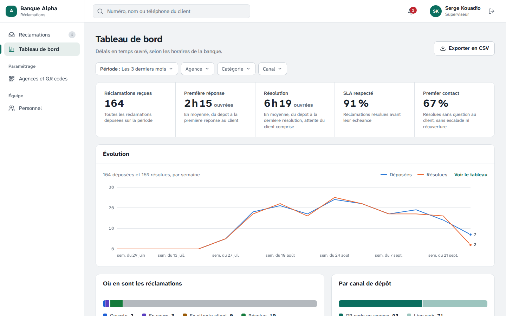
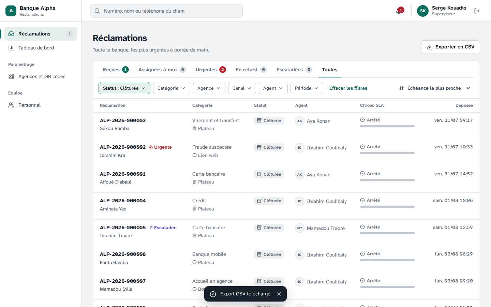
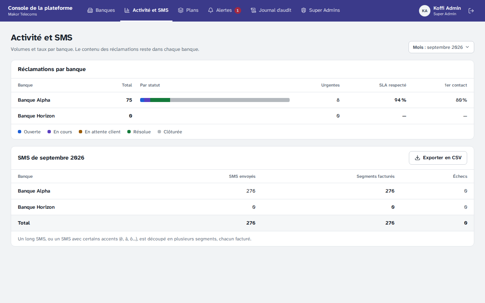
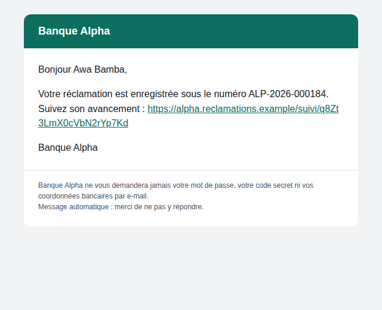

# Étape 9 — Reporting et notifications

Plateforme de gestion des réclamations · Makor Telecoms · Solution 1
Version du 29/09/2026 · **Statut : validé le 29/09/2026** (décisions R1 à R10 retenues telles que proposées).

> Mise à jour du 30/09/2026 : à la demande de Michael, l'agent a désormais son tableau de bord et son export CSV, limités à ses réclamations. Cela révise R3 et R4 ; voir les décisions H10 à H12 de l'[étape 11](etape-11-anti-robot-qr-code.md).

Livrables :

- [`backend/src/modules/reporting/`](../backend/src/modules/reporting/) : les **4 dernières opérations du contrat** — tableau de bord de la banque, export CSV, statistiques de toutes les banques, facturation des SMS. L'API sert maintenant les 83 opérations ;
- [`backend/prisma/migrations/20260929120000_reporting/`](../backend/prisma/migrations/20260929120000_reporting/migration.sql) : la fonction SQL de facturation des SMS, seul accès du Super Admin aux SMS des banques (des totaux) ;
- [`backend/src/infrastructure/envois/`](../backend/src/infrastructure/envois/) : la **passerelle SMS HTTP** (à la place du journal, quand elle est configurée) et les **e-mails HTML** au nom et aux couleurs de chaque banque ;
- la console : **tableau de bord** avec sa courbe d'évolution, **exports CSV** depuis les files et le tableau de bord, page **Activité et SMS** de la plateforme ;
- un **historique de démonstration** de 60 jours pour la Banque Alpha, traité par le vrai cycle de vie ;
- les tests : critères de recette 8 et 11, performance, sécurité de la base, navigateur.

## 1. En bref

| Contrôle | Résultat |
|---|---|
| Opérations du contrat servies par l'API | **83 / 83**, toutes appelées par les tests de bout en bout |
| Critère 8 : résolution au premier contact conforme au §6.6 | vérifié sur un scénario de 5 réclamations : une résolue directement, une après question au client, une escaladée, une rouverte puis résolue, une ouverte → **25 %** |
| Critère 11 : les listes s'exportent en CSV | export des files et du tableau de bord (mêmes filtres que la liste), vérifié ligne à ligne ; facturation SMS exportable |
| Critère 10 : moins d'une seconde sur 1 000 réclamations | tableau de bord du mois p95 42 ms ; sur un an, par semaine, 25 ms ; export CSV de toute la banque 157 ms |
| Tests de bout en bout de l'API | **88 / 88** (76 + 9 de reporting + 3 mesures de performance) |
| Tests unitaires | backend 162 / 162 ; frontend 136 / 136 |
| Vérifications sur PostgreSQL | 32, **62** (2 nouvelles : facturation SMS) et 45 réussies, 0 en échec |
| Tests dans Chromium, sur la vraie API | **26 / 26** (22 + 4 de reporting), sous la CSP de production, 0 ressource refusée |
| Poids de la console | 168 Ko compressés (+7 Ko : courbe, périodes, exports) ; portail inchangé (125 Ko) |

## 2. Décisions à valider

| N° | Sujet | Proposition |
|---|---|---|
| R1 | Définitions des indicateurs (§6.6) | Période : réclamations **déposées** entre deux dates ; par défaut le mois en cours, dans le fuseau de la banque. Délais : ceux que le cycle de vie fige, en minutes ouvrées (première réponse ; résolution, attente du client comprise). « Résolues » : résolues et non rouvertes depuis ; une clôture forcée sans résolution n'en fait pas partie. SLA respecté et premier contact se calculent sur ces résolues ; premier contact = **sans attente du client, sans escalade, sans réouverture** (critère 8). Sans résolue, les taux restent vides (« — »), jamais 0 % |
| R2 | Courbe d'évolution | Déposées et résolues (à leur date de résolution) par jour, semaine (du lundi) ou mois, dans le fuseau de la banque : jour jusqu'à 62 jours, semaine jusqu'à 26 semaines, mois au-delà (400 points au plus). Deux séries sur un seul axe, couleurs d'une palette vérifiée pour le daltonisme, lecture au clavier, et « Voir le tableau » pour toutes les valeurs sans survol. C'est la courbe laissée ouverte par la décision E7 de l'étape 6 |
| R3 | Tableau de bord | Pour le superviseur et l'Admin Entreprise, sur toute la banque (pas pour l'agent). Filtres sur une rangée : période (ce mois-ci, le mois dernier, 7 ou 30 derniers jours, 3 ou 12 derniers mois, cette année), agence, catégorie, canal ; gardés dans l'adresse (F4). Relu toutes les 30 secondes (F6) ; pendant un rechargement, les chiffres affichés restent, atténués |
| R4 | Export CSV | Depuis une file (la file et les filtres affichés, toutes pages) ou depuis le tableau de bord (sa période et ses filtres). Fichier prêt pour Excel en français : UTF-8 avec BOM, « ; », dates dans le fuseau de la banque. 21 colonnes : numéro, dates, statut, priorité, catégorie, agence, canal, agent, échéance, délais, SLA, premier contact, réouvertures, escalade, clôture. **Ni description, ni nom, ni coordonnées du client** : le fichier sort de la plateforme (messagerie, poste de travail), le numéro suffit pour retrouver la réclamation. Une cellule qui commence par = + - @ est neutralisée (injection de formule). 50 000 lignes au plus par export. **Chaque export est inscrit au journal d'audit** (qui, combien de lignes, quels filtres, sans le texte recherché). Le journal d'audit et le personnel restent consultables à l'écran (export possible plus tard, si une banque le demande) |
| R5 | Plateforme | Statistiques par banque (volumes par statut, urgentes, taux) avec les seules colonnes de métadonnées déjà ouvertes au Super Admin à l'étape 3. Facturation des SMS par mois civil (temps universel) : SMS remis à la passerelle, segments facturés, échecs, toutes les banques existantes, même à zéro ; exportable en CSV. Le Super Admin ne lit toujours aucun SMS : une fonction SQL (migration 4) ne lui rend que des totaux par banque |
| R6 | Passerelle SMS | Adaptateur HTTP : `POST` JSON (`from`, `to`, `text`, `reference`), clé d'API en `Authorization: Bearer`, clé d'idempotence = identifiant de la notification, 10 secondes au plus, 5 tentatives (étape 7). Réglages : `SMS_MODE=journal|http`, `SMS_URL` (https en production), `SMS_CLE`, `SMS_EXPEDITEUR` (11 caractères). Segments : ceux que renvoie la passerelle, sinon comptés comme elle les facture. **Le format exact reste à confirmer avec l'équipe de la passerelle de Makor** (point ouvert) : l'adaptateur s'y aligne sans toucher au reste. Tant que `SMS_MODE=journal`, aucun SMS ne part, et le worker le rappelle à chaque démarrage en production |
| R7 | E-mails | Chaque e-mail part en texte et en HTML : un bandeau à la couleur et au nom de la banque (celui de Makor Telecoms pour le Super Admin), le texte, chaque lien affiché tel qu'il s'ouvre, et pour les clients un rappel : « la banque ne vous demandera jamais votre mot de passe, votre code secret ni vos coordonnées bancaires ». Aucune image (souvent bloquées par les messageries). Le contenu ne change pas : jamais de description ni de message (étape 4) |
| R8 | Jeu de démonstration | `npm run semer` (et le serveur des tests navigateur) ajoute 60 jours d'historique à la Banque Alpha : environ 160 réclamations déposées par QR code ou lien web, traitées par le vrai cycle de vie (assignation, réponse, parfois question au client, escalade ou contestation, résolution, confirmation). Tableau de bord, exports et facturation SMS ont ainsi des chiffres réalistes. Les notifications de cet historique sont marquées envoyées : le worker ne les renvoie pas |
| R9 | Ajouts au contrat | Sans rupture : `evolution` dans les indicateurs (schémas `Evolution` et `Regroupement`), paramètre `regroupement`, code d'erreur `EXPORT_TROP_VOLUMINEUX`, descriptions des 4 opérations (période par défaut, colonnes de l'export, règles de la facturation). Toujours 83 opérations. Types du frontend et documentation hors ligne régénérés |
| R10 | Notifications | Rien ne change dans les règles de l'étape 7 : qui est prévenu, par quel canal, et quand (§6.5, alertes urgentes au Super Admin sans nom ni description). L'étape 9 ajoute l'envoi réel des SMS (R6) et la version HTML des e-mails (R7) |

## 3. Tableau de bord


| | |
|---|---|
|  |  |
| 02 · La courbe lue au clavier (flèches) : les deux valeurs du jour | 03 · Les 3 derniers mois : un point par semaine |

Les cinq chiffres du haut suivent R1. « Où en sont les réclamations », « Par canal », « Par catégorie » et « Par agence » portent sur les mêmes réclamations. Le bouton « Exporter en CSV » exporte les réclamations de la période et des filtres choisis.

## 4. Exports CSV



Dans une file, l'export reprend la file (Reçues, Toutes…) et les filtres affichés, sur toutes les pages. Un export trop volumineux (plus de 50 000 lignes) est refusé avec un message qui invite à affiner les filtres.

## 5. Plateforme : activité et facturation SMS



Le mois se choisit parmi les 12 derniers. Le tableau des SMS s'exporte en CSV pour la refacturation (une ligne par banque, et le total). Un SMS long, ou écrit avec des caractères hors de l'alphabet GSM, compte plusieurs segments.

## 6. Envois

**E-mail au client** (HTML ; la version texte l'accompagne) :



**SMS** : en développement et tant que la passerelle n'est pas configurée, les SMS s'écrivent dans le journal du worker (`docker compose logs -f worker`). Pour brancher la passerelle, en production :

```bash
# .env.production
SMS_MODE=http
SMS_URL=https://<passerelle de Makor>/…
SMS_CLE=<clé d'API>
SMS_EXPEDITEUR=Reclamation
```

puis `docker compose -f docker-compose.prod.yml --env-file .env.production up -d`. Au démarrage, le worker affiche la passerelle utilisée.

## 7. Ce que vérifient les tests

| Fichier | Contrôles |
|---|---|
| `backend/test/e2e/reporting` | critère 8 sur le scénario de la section 1 ; volumes, délais comparés à ceux figés en base ; courbe par jour, semaine du lundi, mois ; période par défaut ; période inversée et pas trop fin refusés ; agent refusé. Export : BOM, colonnes, une ligne par réclamation, **mêmes réclamations que la liste**, formule neutralisée, aucune donnée du client, trace au journal sans le texte recherché. Plateforme : totaux égaux à la base, aucun contenu ; facturation : +3 SMS, +4 segments, +1 échec après envoi, un e-mail ne compte pas |
| `backend/test/e2e/performance` | tableau de bord et export sur 1 000 réclamations, moins d'une seconde |
| `backend/test/e2e/worker` | l'e-mail au client part aussi en HTML, au nom de la banque, avec le lien de suivi |
| `backend/scripts/verifier-securite` | le Super Admin obtient les totaux SMS par la fonction, sans lire un seul SMS ; une banque ne peut pas l'appeler |
| `backend/src/…/reporting.test`, `envois.test`, `configuration.test` | CSV (guillemets, formules), périodes et pas dans le fuseau, passerelle SMS simulée (en-têtes, corps, refus, délai), e-mail HTML (échappement, liens, contraste du bandeau), réglages SMS |
| `frontend/tests/reporting.test` | périodes dans le fuseau (changement d'heure compris), CSV du navigateur, graduations et libellés de la courbe |
| `frontend/tests/navigateur/7-reporting` | tableau de bord, clavier, tableau, filtres dans l'adresse ; exports téléchargés et relus ; agent sans tableau ni export ; activité et facturation SMS exportée |

Les tests s'exécutent comme aux étapes 7 et 8 :

```bash
docker compose run --rm verification    # contrat, 162 tests unitaires, 139 vérifications, 88 tests de bout en bout
docker compose run --rm maquettes       # 136 tests, applications, maquettes et démo
docker compose run --rm navigateur      # 26 tests dans Chromium
```

Le volume PostgreSQL de développement reçoit la nouvelle migration au prochain `docker compose up -d` (service `backend-installation`). Pour avoir l'historique de démonstration dans une base déjà semée : `docker compose down -v`, puis `docker compose up -d` et `docker compose exec api npm run semer`.

## 8. Points ouverts qui touchent le reporting et les envois

- **Passerelle SMS de Makor** : adresse, authentification et format des messages à confirmer (R6) ; accusés de réception (statut « délivré ») si la passerelle en fournit.
- **Nom d'expéditeur des SMS** : un nom commun (« Reclamation ») ou un nom par banque, à enregistrer auprès des opérateurs.
- **SMS à chaque changement de statut** (point ouvert du CDC) : l'option existe par banque ; son coût se lit maintenant dans la facturation.
- **Prestataire d'e-mail transactionnel** : inchangé, il suffit de renseigner `SMTP_URL`.
- **Export du journal d'audit** : à ajouter si la conformité d'une banque le demande (R4).

## 9. Ce qui arrive à l'étape 10

Tests et déploiement : recette des 11 critères sur l'environnement de démonstration avec deux banques, mise en production sur le VPS Contabo (images Docker, HTTPS, sauvegarde quotidienne chiffrée de PostgreSQL hors du VPS, supervision), et l'environnement de démonstration pour les rendez-vous commerciaux.
